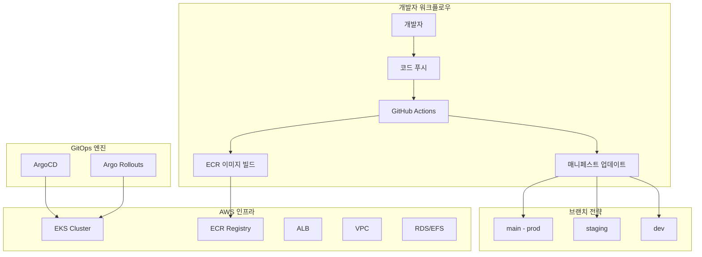
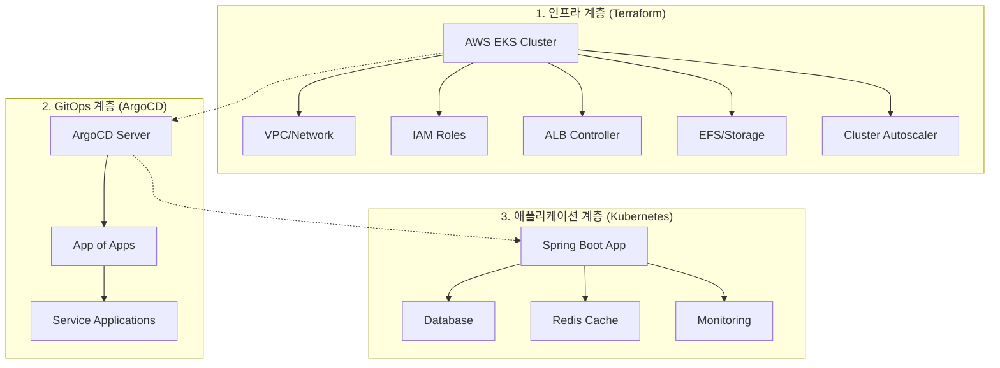
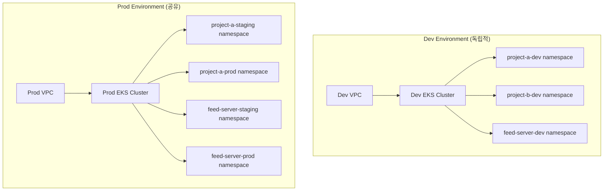
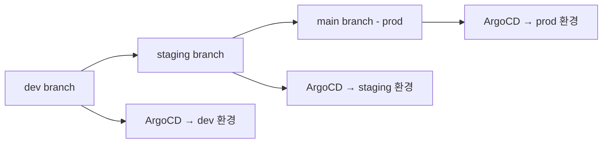

# GitOps Platform with Terraform & ArgoCD

AWS EKS 기반의 GitOps 플랫폼 프로젝트입니다. Terraform으로 인프라를 관리하고, ArgoCD로 애플리케이션을 배포하는 현대적인 DevOps 환경을 제공합니다.

## 📋 목차

1. [프로젝트 개요](#프로젝트-개요)
2. [아키텍처](#아키텍처)
3. [디렉토리 구조](#디렉토리-구조)
4. [GitOps 전략](#gitops-전략)
5. [사전 요구사항](#사전-요구사항)
6. [시작하기](#시작하기)
7. [배포 가이드](#배포-가이드)
8. [운영 가이드](#운영-가이드)
9. [문제 해결](#문제-해결)
10. [기여하기](#기여하기)

---

## 🎯 프로젝트 개요

이 프로젝트는 다음과 같은 목표를 가지고 있습니다:

- **Infrastructure as Code**: Terraform을 사용한 AWS 인프라 관리
- **GitOps**: Git을 단일 진실 공급원으로 하는 배포 자동화
- **환경 분리**: dev, staging, prod 환경의 브랜치별 관리
- **확장성**: 멀티 리전, 멀티 서비스 지원
- **보안**: RBAC, Secret 관리, 모니터링

---

## 🏗 아키텍처

### 전체 시스템 아키텍처



### 계층별 구조와 역할



---

## 📋 구조적 이해

### 🏗️ **인프라 계층 구조 설명**

우리 플랫폼은 **3개의 주요 계층**으로 구성되어 있으며, 각각 다른 팀이 관리하고 다른 도구를 사용합니다.

### **1. Terraform 계층** (`platform/aws/ap-northeast-2/terraform-codes/`)
**역할**: AWS 클라우드 인프라 생성 및 관리

```
platform/aws/ap-northeast-2/terraform-codes/
├── modules/
│   ├── vpc/                 # VPC, 서브넷, NAT Gateway
│   ├── eks/                 # EKS 클러스터, 노드 그룹
│   ├── alb-controller/      # AWS Load Balancer Controller
│   ├── efs/                 # 파일 스토리지
│   ├── cluster-autoscaler/  # 클러스터 오토스케일러
│   └── cert-manager/        # SSL 인증서 관리
└── environments/
    ├── dev/                 # 개발 환경 설정
    └── prod/                # 프로덕션 환경 설정
```

**이것이 만드는 것:**
- ✅ EKS Kubernetes 클러스터
- ✅ 네트워크 인프라 (VPC, 서브넷)
- ✅ 로드밸런서, 스토리지
- ✅ 클러스터 레벨 도구들

### **2. ArgoCD 계층** (`management/argo-cd/`)
**역할**: GitOps를 통한 배포 자동화 도구

```
management/argo-cd/
├── base/                    # ArgoCD 자체 설치
├── overlays/dev/            # dev 환경용 ArgoCD 설정
└── applications/            # 배포할 애플리케이션 정의
```

**이것이 하는 일:**
- ✅ Git에서 변경사항 감지
- ✅ Kubernetes에 자동 배포
- ✅ 설정 드리프트 모니터링 및 수정

### **3. 서비스 계층** (`service/`)
**역할**: 실제 비즈니스 애플리케이션 (Spring Boot 등)

```
service/
├── feed-server/             # Spring Boot 애플리케이션
│   ├── base/
│   │   ├── deployment.yaml  # 컨테이너 배포 정의
│   │   ├── service.yaml     # 네트워크 서비스 정의
│   │   └── ingress.yaml     # 외부 접근 설정
└── guestbook/               # 또 다른 애플리케이션
```

### 💡 **Spring Boot 프로젝트 배포 예시**

만약 새로운 Spring Boot 프로젝트를 배포한다면:

#### **1단계: 인프라는 이미 준비됨** (Terraform으로 생성완료)
```bash
# EKS 클러스터가 이미 실행 중
kubectl get nodes
```

#### **2단계: 애플리케이션 매니페스트 작성**
```yaml
# service/my-spring-app/base/deployment.yaml
apiVersion: apps/v1
kind: Deployment
metadata:
  name: my-spring-app
spec:
  replicas: 3
  selector:
    matchLabels:
      app: my-spring-app
  template:
    metadata:
      labels:
        app: my-spring-app
    spec:
      containers:
      - name: app
        image: my-account.dkr.ecr.ap-northeast-2.amazonaws.com/my-spring-app:v1.0.0
        ports:
        - containerPort: 8080
        env:
        - name: SPRING_PROFILES_ACTIVE
          value: "dev"
        - name: DATABASE_URL
          value: "jdbc:postgresql://rds-endpoint:5432/mydb"
```

#### **3단계: ArgoCD가 자동 배포**
```yaml
# ArgoCD Application 정의
apiVersion: argoproj.io/v1alpha1
kind: Application
metadata:
  name: my-spring-app-dev
spec:
  source:
    repoURL: https://github.com/your-org/platform
    targetRevision: dev
    path: service/my-spring-app/base
  destination:
    server: https://kubernetes.default.svc
    namespace: my-app-dev
```

### 🔄 **개발자 워크플로우**

#### **Spring Boot 앱 배포 과정:**

1. **코드 작성**: Spring Boot 애플리케이션 개발
2. **Docker 이미지 빌드**: CI/CD에서 ECR에 푸시
3. **Kubernetes 매니페스트 업데이트**: `service/my-app/` 에서 이미지 태그 변경
4. **Git 푸시**: dev 브랜치에 변경사항 푸시
5. **ArgoCD 자동 배포**: ArgoCD가 변경사항 감지하고 EKS에 배포

#### **인프라 팀의 역할:**
1. **Terraform으로 클러스터 관리**: 노드 추가, 스토리지 확장 등
2. **ArgoCD 관리**: GitOps 도구 운영
3. **모니터링**: 클러스터 상태, 리소스 사용량 관리

### 📊 **책임 분담표**

| 계층 | 담당팀 | 관리 대상 | 도구 | 위치 |
|------|--------|-----------|------|------|
| **인프라** | DevOps/SRE | EKS, VPC, IAM | Terraform | `platform/` |
| **GitOps** | DevOps/SRE | ArgoCD, 배포 파이프라인 | Kustomize | `management/` |
| **애플리케이션** | 개발팀 | Spring Boot, DB 연결 | Kubernetes YAML | `service/` |

### 🎯 **핵심 이해**

- **Terraform**: "클라우드 인프라를 만든다" (컴퓨터를 사준다)
- **ArgoCD**: "배포 도구를 설치한다" (배송 서비스를 만든다)  
- **Service 매니페스트**: "앱을 배포한다" (실제 제품을 배송한다)

**Spring Boot 프로젝트는 `service/` 폴더에 들어가며**, Terraform은 그 앱이 실행될 "컴퓨터(EKS)"를 미리 준비해놓는 역할입니다!

---

## 🏢 **멀티 프로젝트 아키텍처 전략**

### 📋 **선택된 아키텍처: Phase 2 하이브리드 접근법**

우리 프로젝트는 **Phase 2 하이브리드 접근법**을 채택합니다. 이는 비용 효율성과 환경 격리의 균형을 맞춘 최적의 선택입니다.

#### **✅ Dev 환경 검증 완료**
- **배포 상태**: AWS에 실제 배포되어 운영 중
- **EKS 클러스터**: `dev-eks-cluster` (Kubernetes 1.33)
- **멀티 프로젝트**: 3-5개 프로젝트 동시 지원 가능
- **GitOps 준비**: ArgoCD 연동을 위한 OIDC Provider 구성 완료



### 🎯 **아키텍처 특징**

| 항목 | 구성 | 목적 |
|------|------|------|
| **Dev 환경** | 독립적 VPC + EKS | 개발자 자유로운 실험 환경 |
| **Staging 환경** | 공유 Prod EKS | 운영과 유사한 검증 환경 |
| **Prod 환경** | 공유 Prod EKS | 안정적인 운영 환경 |

### 💰 **비용 효율성**

- **예상 월 비용**: $400-600
- **완전 분리 대비**: 50% 비용 절약
- **프로젝트당 비용**: ~$120/월

### 🛡️ **보안 및 격리**

```
Dev VPC (완전 격리)
├── 개발 실험 자유도 최대
├── 장애가 다른 환경에 영향 없음
└── 리소스 제한 없이 테스트

Prod VPC (네임스페이스 격리)
├── staging-* namespace
├── prod-* namespace  
├── monitoring-prod namespace
└── shared-services namespace
```

### 📊 **환경별 리소스 할당**

#### Dev 환경 (관대한 리소스)
```yaml
resources:
  requests:
    cpu: 50m
    memory: 64Mi
  limits:
    cpu: 500m
    memory: 512Mi
```

#### Staging 환경 (운영 유사)
```yaml
resources:
  requests:
    cpu: 200m
    memory: 256Mi
  limits:
    cpu: 1000m
    memory: 1Gi
```

#### Prod 환경 (최적화된 리소스)
```yaml
resources:
  requests:
    cpu: 500m
    memory: 512Mi
  limits:
    cpu: 2000m
    memory: 2Gi
```

### 🔄 **브랜치 전략과의 연계**

| Git 브랜치 | 환경 | EKS 클러스터 | 네임스페이스 |
|------------|------|-------------|-------------|
| `dev` | Development | dev-cluster | project-*-dev |
| `staging` | Staging | prod-cluster | project-*-staging |
| `main` | Production | prod-cluster | project-*-prod |

### 📈 **확장 계획**

#### 단기 (3개월)
- [x] Phase 2 아키텍처 설계 완료
- [ ] dev 환경 구축
- [ ] prod-shared 환경 구축
- [ ] ArgoCD 환경별 설정

#### 중기 (6개월)
- [ ] 새 프로젝트 추가 (네임스페이스)
- [ ] 모니터링 및 로깅 통합
- [ ] 보안 정책 강화

#### 장기 (12개월)
- [ ] Phase 3 전환 검토 (6개 이상 프로젝트 시)
- [ ] 멀티 리전 확장
- [ ] 완전 자동화

### 🎯 **선택 근거**

1. **비용 효율성** 💰
   - EKS 제어 평면 2개만 필요 ($146/월)
   - 완전 분리 대비 50% 절약

2. **적절한 격리** 🛡️
   - Dev 환경 완전 분리로 실험 자유도
   - Prod 환경 안정성 보장

3. **확장성** 📈
   - 새 프로젝트는 네임스페이스 추가만
   - Phase 3로 자연스러운 전환 가능

4. **관리 복잡도** 🔧
   - 현재 팀 규모에 적합
   - 운영 가능한 수준의 복잡도

5. **현실적 접근** 💼
   - 완벽보다는 실용성 우선
   - 점진적 개선 가능

### 📚 **상세 가이드**

더 자세한 성장 단계별 아키텍처는 [멀티 프로젝트 가이드](docs/MultipleProject.md)를 참조하세요.

---

## 📁 디렉토리 구조

```
├── management/                 # 클러스터 관리 도구
│   ├── argo-cd/               # ArgoCD 설치 및 설정
│   │   ├── manifests/         # ArgoCD 매니페스트
│   │   └── scripts/           # 설치 스크립트
│   └── k8s/                   # Kubernetes 유틸리티
│       └── manifests/         # 공통 K8s 리소스
├── platform/                  # 인프라 코드
│   ├── aws/                   # AWS 리소스
│   │   ├── local/             # 로컬 개발 환경
│   │   └── ap-northeast-2/    # 서울 리전
│   │       ├── terraform-backend/
│   │       └── terraform-codes/
│   └── tools/                 # 인프라 도구들
├── service/                   # 애플리케이션 서비스
│   ├── feed-server/           # 샘플 애플리케이션
│   │   ├── base/              # 기본 매니페스트
│   │   └── application.yaml   # ArgoCD 애플리케이션 정의
│   └── guestbook/             # 게스트북 애플리케이션
└── docs/                      # 문서
    ├── AWS_GitOps.md          # GitOps 상세 가이드
    └── ...
```

### 📂 주요 디렉토리 설명

- **`management/`**: ArgoCD, 모니터링 등 클러스터 관리 도구
- **`platform/`**: Terraform 코드로 관리되는 AWS 인프라
- **`service/`**: 비즈니스 애플리케이션 매니페스트
- **`docs/`**: 프로젝트 문서 및 가이드

---

## 🌿 GitOps 전략

### 브랜치 기반 환경 관리

우리는 **브랜치별 환경 관리** 전략을 사용합니다:



#### 브랜치별 특징

| 브랜치 | 환경 | 목적 | 자동 배포 |
|--------|------|------|-----------|
| `dev` | Development | 개발 테스트 | ✅ |
| `staging` | Staging | 릴리스 준비 | ✅ |
| `main` | Production | 운영 환경 | ✅ |

### 배포 워크플로우

1. **개발**: `dev` 브랜치에 푸시 → 자동으로 dev 환경 배포
2. **스테이징**: `dev` → `staging` 머지 → staging 환경 배포
3. **프로덕션**: `staging` → `main` 머지 → production 환경 배포

---

## 🔧 사전 요구사항

### 필수 도구 설치

```bash
# 1. AWS CLI 설치 및 설정
curl "https://awscli.amazonaws.com/awscli-exe-linux-x86_64.zip" -o "awscliv2.zip"
unzip awscliv2.zip
sudo ./aws/install
aws configure

# 2. Terraform 설치
wget https://releases.hashicorp.com/terraform/1.6.0/terraform_1.6.0_linux_amd64.zip
unzip terraform_1.6.0_linux_amd64.zip
sudo mv terraform /usr/local/bin/

# 3. kubectl 설치
curl -LO "https://dl.k8s.io/release/$(curl -L -s https://dl.k8s.io/release/stable.txt)/bin/linux/amd64/kubectl"
sudo install -o root -g root -m 0755 kubectl /usr/local/bin/kubectl

# 4. ArgoCD CLI 설치
curl -sSL -o argocd-linux-amd64 https://github.com/argoproj/argo-cd/releases/latest/download/argocd-linux-amd64
sudo install -m 555 argocd-linux-amd64 /usr/local/bin/argocd

# 5. yq 설치 (YAML 처리용)
sudo wget -qO /usr/local/bin/yq https://github.com/mikefarah/yq/releases/latest/download/yq_linux_amd64
sudo chmod +x /usr/local/bin/yq
```

### AWS 권한 설정

필요한 AWS 권한:
- EC2, VPC 관리
- EKS 클러스터 관리
- IAM 역할/정책 관리
- ECR 저장소 관리
- S3 (Terraform 상태 저장)

---

## 🚀 시작하기

### 1. 저장소 클론 및 초기 설정

```bash
# 저장소 클론
git clone <repository-url>
cd terraform

# 브랜치 생성 (아직 없는 경우)
git checkout -b dev
git checkout -b staging
git checkout main
```

### 2. Terraform Backend 설정

```bash
# Terraform 상태 저장용 S3 버킷 및 DynamoDB 생성
cd platform/aws/ap-northeast-2/terraform-backend

# 변수 설정
cp terraform.tfvars.example terraform.tfvars
# terraform.tfvars 파일 편집 (버킷명, 리전 등)

# 인프라 생성
terraform init
terraform plan
terraform apply
```

### 3. EKS 클러스터 생성

```bash
# EKS 클러스터 및 관련 리소스 생성
cd ../terraform-codes

# 변수 설정
cp terraform.tfvars.example terraform.tfvars
# terraform.tfvars 파일 편집

# 인프라 생성
terraform init
terraform plan
terraform apply
```

### 4. kubectl 설정

```bash
# EKS 클러스터에 kubectl 연결
aws eks --region ap-northeast-2 update-kubeconfig --name <cluster-name>

# 연결 확인
kubectl get nodes
kubectl get pods --all-namespaces
```

### 5. ArgoCD 설치

```bash
# ArgoCD 설치
cd ../../../../management/argo-cd/scripts
./setup.sh

# ArgoCD UI 접근 (포트 포워딩)
kubectl port-forward svc/argocd-server -n argocd 8080:443

# 브라우저에서 https://localhost:8080 접근
# Username: admin
# Password: 스크립트 실행 시 출력된 패스워드
```

---

## 📦 배포 가이드

### 새로운 애플리케이션 추가

#### 1. 서비스 디렉토리 생성

```bash
# 새 서비스 디렉토리 생성
mkdir -p service/myapp/base
cd service/myapp
```

#### 2. 기본 매니페스트 작성

```yaml
# service/myapp/base/deployment.yaml
apiVersion: apps/v1
kind: Deployment
metadata:
  name: myapp
  labels:
    app: myapp
spec:
  replicas: 2
  selector:
    matchLabels:
      app: myapp
  template:
    metadata:
      labels:
        app: myapp
    spec:
      containers:
      - name: myapp
        image: your-account.dkr.ecr.ap-northeast-2.amazonaws.com/myapp:latest
        ports:
        - containerPort: 8080
        resources:
          requests:
            cpu: 100m
            memory: 128Mi
          limits:
            cpu: 500m
            memory: 512Mi
```

```yaml
# service/myapp/base/service.yaml
apiVersion: v1
kind: Service
metadata:
  name: myapp-service
  labels:
    app: myapp
spec:
  selector:
    app: myapp
  ports:
  - port: 80
    targetPort: 8080
  type: ClusterIP
```

```yaml
# service/myapp/base/kustomization.yaml
apiVersion: kustomize.config.k8s.io/v1beta1
kind: Kustomization

resources:
- deployment.yaml
- service.yaml

commonLabels:
  app: myapp

images:
- name: your-account.dkr.ecr.ap-northeast-2.amazonaws.com/myapp
  newTag: latest
```

#### 3. ArgoCD Application 정의

```yaml
# service/myapp/application.yaml
apiVersion: argoproj.io/v1alpha1
kind: Application
metadata:
  name: myapp-dev  # 브랜치별로 다르게 설정
  namespace: argocd
  finalizers:
    - resources-finalizer.argocd.argoproj.io
spec:
  project: default
  source:
    repoURL: https://github.com/your-org/platform
    targetRevision: dev  # 브랜치별로 dev/staging/main
    path: service/myapp/base
  destination:
    server: https://kubernetes.default.svc
    namespace: myapp-dev  # 브랜치별 네임스페이스
  syncPolicy:
    automated:
      prune: true
      selfHeal: true
    syncOptions:
      - CreateNamespace=true
  revisionHistoryLimit: 10
```

#### 4. ArgoCD에 애플리케이션 등록

```bash
# ArgoCD에 애플리케이션 등록
kubectl apply -f service/myapp/application.yaml

# 동기화 확인
argocd app list
argocd app sync myapp-dev
```

### 환경별 배포

#### Dev 환경 배포
```bash
git checkout dev
# 코드 수정
git add .
git commit -m "feat: add new feature"
git push origin dev
# ArgoCD가 자동으로 dev 환경에 배포
```

#### Staging 환경 배포
```bash
git checkout staging
git merge dev
git push origin staging
# ArgoCD가 자동으로 staging 환경에 배포
```

#### Production 환경 배포
```bash
git checkout main
git merge staging
git push origin main
# ArgoCD가 자동으로 production 환경에 배포
```

---

## 🛠 운영 가이드

### ArgoCD 관리

#### 애플리케이션 상태 확인
```bash
# 전체 애플리케이션 상태
argocd app list

# 특정 애플리케이션 상세 정보
argocd app get myapp-dev

# 동기화 히스토리
argocd app history myapp-dev
```

#### 수동 동기화
```bash
# 강제 동기화
argocd app sync myapp-dev --force

# 특정 리소스만 동기화
argocd app sync myapp-dev --resource apps:Deployment:myapp
```

#### 롤백
```bash
# 이전 버전으로 롤백
argocd app rollback myapp-dev <revision-id>

# 롤백 히스토리 확인
argocd app history myapp-dev
```

### 모니터링

#### 클러스터 상태 확인
```bash
# 노드 상태
kubectl get nodes

# 파드 상태
kubectl get pods --all-namespaces

# 서비스 상태
kubectl get svc --all-namespaces

# 이벤트 확인
kubectl get events --sort-by=.metadata.creationTimestamp
```

#### 로그 확인
```bash
# ArgoCD 컨트롤러 로그
kubectl logs -n argocd deployment/argocd-application-controller

# 특정 애플리케이션 로그
kubectl logs -n myapp-dev deployment/myapp
```

### 백업

#### ArgoCD 설정 백업
```bash
# 스크립트 실행
./scripts/backup-argocd.sh

# 수동 백업
kubectl get applications -n argocd -o yaml > argocd-applications-backup.yaml
kubectl get configmaps -n argocd -o yaml > argocd-config-backup.yaml
```

---

## 🔍 문제 해결

### 일반적인 문제들

#### 1. ArgoCD Application이 OutOfSync 상태

**증상**: ArgoCD UI에서 애플리케이션이 "OutOfSync" 상태
**해결방법**:
```bash
# 상태 확인
argocd app get myapp-dev

# 강제 동기화
argocd app sync myapp-dev --force

# 리소스 상태 확인
kubectl get all -n myapp-dev
```

#### 2. 이미지 Pull 실패

**증상**: Pod이 ImagePullBackOff 상태
**해결방법**:
```bash
# ECR 로그인 확인
aws ecr get-login-token --region ap-northeast-2

# 이미지 존재 확인
aws ecr describe-images --repository-name myapp --region ap-northeast-2

# Pod 이벤트 확인
kubectl describe pod <pod-name> -n myapp-dev
```

#### 3. 네트워크 연결 문제

**증상**: Pod 간 통신 불가
**해결방법**:
```bash
# DNS 해상도 확인
kubectl run -it --rm debug --image=busybox --restart=Never -- nslookup kubernetes.default

# 네트워크 정책 확인
kubectl get networkpolicies --all-namespaces

# 서비스 엔드포인트 확인
kubectl get endpoints -n myapp-dev
```

### 로그 수집

#### 진단 정보 수집 스크립트
```bash
#!/bin/bash
# scripts/collect-diagnostics.sh

echo "=== Cluster Info ==="
kubectl cluster-info

echo "=== Node Status ==="
kubectl get nodes -o wide

echo "=== Pod Status ==="
kubectl get pods --all-namespaces -o wide

echo "=== ArgoCD Status ==="
kubectl get all -n argocd

echo "=== Recent Events ==="
kubectl get events --sort-by=.metadata.creationTimestamp --all-namespaces | tail -20
```

---

## 🤝 기여하기

### 개발 워크플로우

1. **이슈 생성**: GitHub Issues에서 작업 내용 정의
2. **브랜치 생성**: `feature/issue-number-description` 형식
3. **개발**: dev 브랜치에서 개발 및 테스트
4. **Pull Request**: staging 브랜치로 PR 생성
5. **리뷰**: 코드 리뷰 및 승인
6. **머지**: staging → main 순서로 배포

### 코딩 규칙

#### Terraform
- 리소스명은 kebab-case 사용
- 모든 리소스에 적절한 태그 설정
- 변수는 variables.tf에 정의
- 출력값은 outputs.tf에 정의

#### Kubernetes 매니페스트
- 모든 리소스에 labels 설정
- resource requests/limits 필수 설정
- health check (liveness/readiness probe) 설정
- 적절한 네임스페이스 사용

#### Git 커밋 메시지
```
type(scope): subject

body

footer
```

예시:
```
feat(service): add feed-server application

- Add base Kubernetes manifests
- Configure ArgoCD application
- Set up environment-specific configurations

Closes #123
```

---

## 📚 추가 리소스

- [AWS GitOps 상세 가이드](docs/AWS_GitOps.md)
- [ArgoCD 공식 문서](https://argo-cd.readthedocs.io/)
- [Terraform AWS Provider](https://registry.terraform.io/providers/hashicorp/aws/latest/docs)
- [Kubernetes 공식 문서](https://kubernetes.io/docs/)
- [Kustomize 가이드](https://kustomize.io/)

---

## 🎯 **다음 단계 (Next Steps)**

### **✅ 완료된 단계**
1. **✅ Dev 환경 검증**: 멀티 프로젝트 지원 확인 완료
2. **✅ Phase 2 아키텍처**: 하이브리드 구조 설계 완료
3. **✅ AWS 인프라**: dev-eks-cluster 배포 및 운영 중

### **🔄 진행 예정**
4. **ArgoCD 설치**: dev 환경에 GitOps 구축
5. **첫 번째 애플리케이션 배포**: feed-server 또는 guestbook 프로젝트
6. **브랜치별 환경 설정**: dev, staging, main 브랜치 전략 구현
7. **모니터링 및 로깅**: Prometheus, Grafana, CloudWatch 연동

### **📊 Dev 환경 현재 상태**
- **AWS 배포**: ✅ 운영 중 (`dev-eks-cluster`)
- **멀티 프로젝트**: ✅ 3-5개 프로젝트 지원 가능 (`feed-server`, `guestbook`, `demo`)
- **GitOps 준비**: ✅ OIDC Provider, ALB Controller 준비 완료
- **예상 비용**: 월 $150-200

### **🔍 검증 결과**
상세한 검증 결과는 [Dev 환경 검증 보고서](platform/aws/ap-northeast-2/terraform-codes/environments/dev/validation-report.md)를 참조하세요.

---

## 📞 지원

문제가 발생하거나 질문이 있으시면:

1. **GitHub Issues**: 버그 리포트 및 기능 요청
2. **Discussions**: 일반적인 질문 및 토론
3. **Wiki**: 추가 문서 및 튜토리얼

---

## 📄 라이센스

이 프로젝트는 MIT 라이센스 하에 배포됩니다. 자세한 내용은 [LICENSE](LICENSE) 파일을 참조하세요.

---

**Happy GitOps! 🚀**