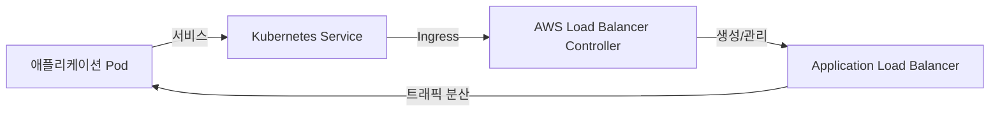

# AWS Load Balancer Controller 가이드

## 📌 AWS Load Balancer Controller란?

**AWS Load Balancer Controller**는 쿠버네티스에서 Application Load Balancer(ALB)를 관리하기 위한 컨트롤러입니다. 이전의 AWS ALB Ingress Controller를 대체하는 차세대 솔루션입니다.

> 📘 **공식 문서**: [AWS Load Balancer Controller](https://docs.aws.amazon.com/eks/latest/userguide/aws-load-balancer-controller.html)

## 🏗 아키텍처



## 🔍 주요 기능

### 1. Ingress 리소스 지원
- 쿠버네티스 Ingress 리소스를 사용하여 ALB 구성
- 경로 기반 라우팅, 호스트 기반 라우팅 지원

### 2. 서비스 타입 LoadBalancer 지원
- LoadBalancer 타입 서비스에 대한 ALB 자동 프로비저닝
- IP 타겟 그룹을 사용한 효율적인 트래픽 라우팅

### 3. 고급 라우팅 기능
- 호스트/경로 기반 라우팅
- HTTP/HTTPS 리디렉션
- SSL/TLS 종료
- WebSocket/HTTP/2 지원

> 📘 **기능 상세**: [ALB Ingress Controller에서 마이그레이션](https://kubernetes-sigs.github.io/aws-load-balancer-controller/v2.4/guide/upgrade/migrate/)

## 🛠 설치 방법

### 1. IAM 정책 다운로드 및 생성

```bash
curl -O https://raw.githubusercontent.com/kubernetes-sigs/aws-load-balancer-controller/v2.4.4/docs/install/iam_policy.json

aws iam create-policy \
    --policy-name AWSLoadBalancerControllerIAMPolicy \
    --policy-document file://iam_policy.json
```

### 2. IAM 역할 생성 및 정책 연결

```bash
export CLUSTER_NAME=my-cluster
export ACCOUNT_ID=$(aws sts get-caller-identity --query "Account" --output text)

eksctl create iamserviceaccount \
  --cluster=${CLUSTER_NAME} \
  --namespace=kube-system \
  --name=aws-load-balancer-controller \
  --attach-policy-arn=arn:aws:iam::${ACCOUNT_ID}:policy/AWSLoadBalancerControllerIAMPolicy \
  --override-existing-serviceaccounts \
  --approve
```

### 3. Helm을 사용한 Controller 설치

```bash
helm repo add eks https://aws.github.io/eks-charts
helm repo update

helm install aws-load-balancer-controller eks/aws-load-balancer-controller \
  -n kube-system \
  --set clusterName=${CLUSTER_NAME} \
  --set serviceAccount.create=false \
  --set serviceAccount.name=aws-load-balancer-controller
```

> 📘 **설치 가이드**: [AWS Load Balancer Controller 설치](https://docs.aws.amazon.com/eks/latest/userguide/aws-load-balancer-controller.html)

## 📝 사용 예시

### Ingress 예시

```yaml
apiVersion: networking.k8s.io/v1
kind: Ingress
metadata:
  name: my-app
  annotations:
    kubernetes.io/ingress.class: alb
    alb.ingress.kubernetes.io/scheme: internet-facing
    alb.ingress.kubernetes.io/target-type: ip
spec:
  rules:
    - host: myapp.example.com
      http:
        paths:
          - path: /*
            pathType: Prefix
            backend:
              service:
                name: my-service
                port:
                  number: 80
```

### 서비스 타입 LoadBalancer 예시

```yaml
apiVersion: v1
kind: Service
metadata:
  name: my-service
  annotations:
    service.beta.kubernetes.io/aws-load-balancer-type: external
    service.beta.kubernetes.io/aws-load-balancer-nlb-target-type: ip
    service.beta.kubernetes.io/aws-load-balancer-scheme: internet-facing
spec:
  selector:
    app: my-app
  ports:
    - protocol: TCP
      port: 80
      targetPort: 80
  type: LoadBalancer
```

## 🔄 고급 구성

### 인증 구성 (OIDC)

```yaml
apiVersion: networking.k8s.io/v1
kind: Ingress
metadata:
  name: my-secure-app
  annotations:
    kubernetes.io/ingress.class: alb
    alb.ingress.kubernetes.io/scheme: internet-facing
    alb.ingress.kubernetes.io/auth-type: oidc
    alb.ingress.kubernetes.io/auth-idp-oidc: '{
      "issuer": "https://auth.example.com",
      "authorizationEndpoint": "https://auth.example.com/authorize",
      "tokenEndpoint": "https://auth.example.com/oauth/token",
      "userInfoEndpoint": "https://auth.example.com/userinfo",
      "secretName": "oidc-secret"
    }'
```

### SSL/TLS 구성

```yaml
apiVersion: networking.k8s.io/v1
kind: Ingress
metadata:
  name: my-tls-app
  annotations:
    kubernetes.io/ingress.class: alb
    alb.ingress.kubernetes.io/certificate-arn: arn:aws:acm:region:account:certificate/xxxx
    alb.ingress.kubernetes.io/ssl-policy: ELBSecurityPolicy-TLS-1-2-2017-01
spec:
  tls:
    - hosts:
        - myapp.example.com
  rules:
    - host: myapp.example.com
      http:
        paths:
          - path: /*
            pathType: Prefix
            backend:
              service:
                name: my-service
                port:
                  number: 80
```

## 🚨 문제 해결

### 일반적인 문제점

1. **ALB 생성 실패**
   - IAM 권한 확인
   - 서브넷 태그 확인 (kubernetes.io/role/elb: 1)
   
2. **타겟 그룹 상태 이상**
   - 노드 보안 그룹이 30000-32767 포트 허용 확인
   - 노드 IAM 역할에 필요한 권한 확인

### 로그 확인

```bash
kubectl logs -n kube-system deployment.apps/aws-load-balancer-controller
```

### 이벤트 확인

```bash
kubectl describe ingress <ingress-name>
```

## 📚 추가 자료

- [AWS Load Balancer Controller GitHub](https://github.com/kubernetes-sigs/aws-load-balancer-controller)
- [EKS Best Practices - Ingress](https://aws.github.io/aws-eks-best-practices/networking/ingress/)
- [AWS Load Balancer Controller 문서](https://kubernetes-sigs.github.io/aws-load-balancer-controller/v2.4/)
- [EKS Workshop - ALB Ingress](https://www.eksworkshop.com/beginner/130_exposing-service/ingress_controller_alb/)

---
*문서 최종 업데이트: 2025년 7월 16일*
