# AWS EBS CSI Driver 가이드

## 📌 EBS CSI Driver란?

**EBS CSI Driver**(Amazon Elastic Block Store Container Storage Interface Driver)는 쿠버네티스에서 AWS EBS(Elastic Block Storage) 볼륨을 동적으로 관리하기 위한 표준 인터페이스입니다.

> 📘 **공식 문서**: [Amazon EBS CSI driver - Amazon EKS](https://docs.aws.amazon.com/eks/latest/userguide/ebs-csi.html)

## 🏗 아키텍처

```mermaid
graph LR
    A[애플리케이션 Pod] -->|볼륨 요청| B[EBS CSI Driver]
    B -->|API 호출| C[AWS EBS 서비스]
    C -->|볼륨 생성| D[EBS 볼륨]
    B -->|볼륨 연결| A
```



## 🔍 주요 기능

### 1. 동적 볼륨 프로비저닝
- 필요 시 자동으로 EBS 볼륨 생성 및 연결
- 수동 프로비저닝 불필요

### 2. 다양한 EBS 볼륨 유형 지원
- **gp3/gp2**: 범용 SSD
- **io1/io2**: 프로비저닝된 IOPS SSD
- **st1**: 처리량 최적화 HDD
- **sc1**: 콜드 HDD

> 📘 **EBS 볼륨 유형 비교**: [Amazon EBS 볼륨 유형](https://docs.aws.amazon.com/ko_kr/AWSEC2/latest/UserGuide/ebs-volume-types.html)

## 🛠 설치 방법

### EKS에 EBS CSI Driver 설치

```bash
# EKS 애드온으로 설치
aws eks create-addon \
    --cluster-name my-cluster \
    --addon-name aws-ebs-csi-driver \
    --service-account-role-arn arn:aws:iam::ACCOUNT_ID:role/AmazonEKS_EBS_CSI_DriverRole
```

> 📘 **설치 가이드**: [EBS CSI Driver 설치](https://docs.aws.amazon.com/eks/latest/userguide/managing-ebs-csi.html)

## 📝 사용 예시

### StorageClass 예시

```yaml
apiVersion: storage.k8s.io/v1
kind: StorageClass
metadata:
  name: ebs-sc
provisioner: ebs.csi.aws.com
volumeBindingMode: WaitForFirstConsumer
parameters:
  type: gp3
  encrypted: "true"
```

### PVC 예시

```yaml
apiVersion: v1
kind: PersistentVolumeClaim
metadata:
  name: ebs-claim
spec:
  accessModes:
    - ReadWriteOnce
  storageClassName: ebs-sc
  resources:
    requests:
      storage: 10Gi
```

## 🔄 주요 작업

### 볼륨 스냅샷 생성

```yaml
apiVersion: snapshot.storage.k8s.io/v1
kind: VolumeSnapshot
metadata:
  name: ebs-volume-snapshot
spec:
  volumeSnapshotClassName: csi-aws-vsc
  source:
    persistentVolumeClaimName: ebs-claim
```

> 📘 **스냅샷 가이드**: [EBS 스냅샷으로 작업](https://docs.aws.amazon.com/ko_kr/ebs/latest/ebs-creating-snapshot.html)

## 🚨 주의사항

1. **리전 제한**: EBS 볼륨은 동일한 가용 영역 내에서만 마운트 가능
2. **성능 고려사항**: 애플리케이션의 I/O 요구사항에 맞는 볼륨 유형 선택 필요
3. **비용 관리**: 사용하지 않는 볼륨은 반드시 삭제하여 불필요한 비용 발생 방지

## 📚 추가 자료

- [AWS EBS CSI Driver GitHub](https://github.com/kubernetes-sigs/aws-ebs-csi-driver)
- [쿠버네티스 스토리지 개념](https://kubernetes.io/ko/docs/concepts/storage/)
- [EBS CSI Driver 성능 최적화](https://aws.amazon.com/ko/blogs/containers/deep-dive-on-ebs-csi-performance-optimization/)

---
*문서 최종 업데이트: 2025년 7월 16일*
