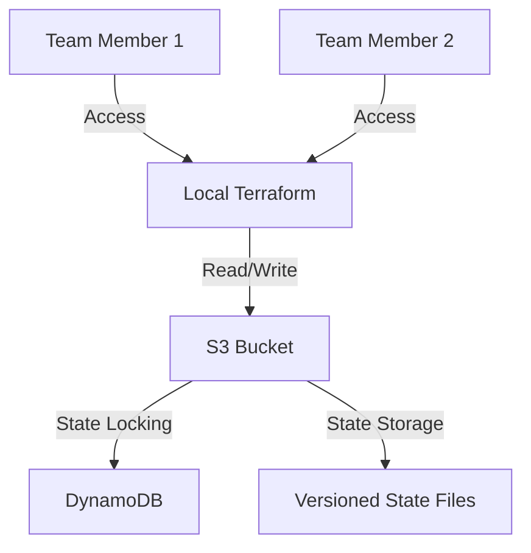

# AWS 환경에서의 Terraform 협업 가이드

## 목차
- [1. 개요](#1-개요)
- [2. 문제점](#2-문제점)
- [3. 해결 방안](#3-해결-방안)
- [4. 아키텍처 다이어그램](#4-아키텍처-다이어그램)
- [5. 구현 단계](#5-구현-단계)
- [6. 모범 사례](#6-모범-사례)

## 1. 개요
이 문서는 여러 팀원이 AWS 환경에서 Terraform을 사용하여 인프라를 협업하는 방법에 대해 설명합니다.

## 2. 문제점

### 2.1 로컬 State 관리의 한계
- 테라폼 실행 시 State 파일이 로컬에만 생성되어 팀원 간 공유 불가
- 버전 관리 시스템에 State 파일을 공유할 경우 충돌 발생 위험

### 2.2 동시성 문제
- 여러 명이 동시에 테라폼을 실행할 경우 상태 충돌 발생
- 동일한 인프라에 대한 중복 작업 실행으로 인한 오류 가능성

## 3. 해결 방안

### 3.1 원격 State 관리 (S3)
- Terraform State를 AWS S3에 안전하게 저장
- 버전 관리 및 상태 이력 추적 가능
- 팀원 간 State 공유 용이

### 3.2 상태 잠금 (DynamoDB)
- DynamoDB를 사용한 State Locking 구현
- 동시 작업으로 인한 상태 충돌 방지
- 안전한 협업 환경 구축

## 4. 아키텍처 다이어그램



## 5. 구현 단계

### 5.1 AWS 인프라 설정
1. **S3 버킷 생성**
   - 버전 관리 활성화
   - 암호화 설정 (SSE-S3 또는 KMS)
   - 적절한 IAM 정책 설정

2. **DynamoDB 테이블 생성**
   - LockID를 파티션 키로 사용
   - 필요한 IAM 권한 설정

### 5.2 Terraform Backend 구성
```hcl
terraform {
  backend "s3" {
    bucket         = "your-terraform-state-bucket"
    key            = "global/s3/terraform.tfstate"
    region         = "ap-northeast-2"
    dynamodb_table = "terraform-locks"
    encrypt        = true
  }
}
```

### 5.3 기존 인프라 코드화 (Terraformer)
1. EKS Autoscaling 그룹 추출
2. 네트워크 리소스 (VPC, 서브넷, 라우팅 테이블 등) 추출
3. 추출된 코드 검토 및 리팩토링

## 6. 모범 사례

### 6.1 State 관리
- State 파일은 절대 버전 관리 시스템에 커밋하지 않음
- 민감한 정보는 변수나 AWS Secrets Manager 사용
- 정기적인 State 백업 수행

### 6.2 협업 규칙
- 항상 `terraform plan`으로 변경사항 확인 후 적용
- 작업 전 반드시 `terraform pull`로 최신 상태 동기화
- 작업 완료 후 팀원들과 변경사항 공유

### 6.3 보안
- 최소 권한 원칙에 따른 IAM 정책 구성
- S3 버킷에 대한 적절한 버저닝 및 암호화 적용
- State 파일 접근 로깅 활성화

## 7. 문제 해결

### 7.1 State 잠금 오류
```bash
# 상태 잠금 해제 (주의: 다른 작업이 없는지 확인 후 실행)
terraform force-unlock LOCK_ID
```

### 7.2 State 충돌 시
1. `terraform state pull > backup.tfstate`로 백업
2. `terraform state rm` 또는 `terraform state mv`로 충돌 해결
3. 필요한 경우 `terraform import`로 리소스 재연결

### 1. AWS내 Terraform Backend 저장소 생성
1. 로컬에 있는 Terraform 상태파일을 S3 Backend Bucket으로 전송
$ aws s3 cp terraform.state s3://<S3 Backend Bucket명>/<저장할 파일명>
2. Terraform 상태파일 내 오브젝트 현황 확인
$ terraform state list
3. Terraformer로 AWS 추출 가능한 대상 확인
- 참고 링크 :
https://github.com/GoogleCloudPlatform/terraformer/blob/master/docs/aws.md

### 2. Terraformer를 활용한 기존 EKS Autoscaling 자원 대상 IaC 코드 추출

1. Terraformer를 활용한 기존 EKS Autoscaling 자원 대상 IaC 코드 추출
$ terraformer import aws --regions=<리전명> --resources=<자원명> --path-pattern=<추출한 파일 저장 디렉토리명>

2. 추출된 Terraform 상태파일 내 오브젝트 현황 확인
$ terraform state list

3. 추출 Terraform 상태파일을 기존 Terraform Backend 상태파일에 Import 방법
$ terraform state mv -state-out=<기존 Terraform Backend 상태파일 저장 경로> <추출Terraform Object명> <Import되서 저장될 Terraform Object명>


### 3. 추출 IaC 코드를 활용한 2번째 EKS NodeGroup 생성 및 확인

1. 로컬에 있는 Terraform 상태파일을 S3 Backend Bucket으로 업로드
$ aws s3 cp terraform.state s3://<S3 Backend Bucket명>/<업로드할 파일명>

2. 초기화 전 AWS Provider로 전환
$ terraform state replace-provider -auto-approve registry.terraform.io/-/aws
hashicorp/aws

3. 프로비저닝을 통한 생성 및 확인
$ terraform init
$ terraform plan
$ terraform apply


### 4. Terraformer를 활용한 기존 AWS 네트워크 자원 대상 IaC 코드 추출

1. S3 Backend Bucket에 있는 Terraform 상태파일을 로컬로 다운로드
$ aws s3 cp s3://<S3 Backend Bucket명>/<저장된 파일명> <로컬의 다운로드 위치>
2. Terraformer를 활용한 기존 EKS Autoscaling 자원 대상 IaC 코드 추출
$ terraformer import aws --regions=<리전명> --resources=<자원명> --path-pattern=
<추출한 파일 저장 디렉토리명>

3. 추출된 Terraform 상태파일 내 오브젝트 현황 확인
$ terraform state list
4. 추출 Terraform 상태파일을 기존 Terraform Backend 상태파일에 Import 방법
$ terraform state mv -state-out=<기존 Terraform Backend 상태파일 저장 경로> <추출
Terraform Object명> <Import되서 저장될 Terraform Object명>


### 5. 추출 IaC 코드를 활용한 Terraform 상태 및 형상 파일에 저장, 관리

1. 로컬에 있는 Terraform 상태파일을 S3 Backend Bucket으로 업로드
$ aws s3 cp terraform.state s3://<S3 Backend Bucket명>/<업로드할 파일명>
2. 초기화 전 AWS Provider로 전환
$ terraform state replace-provider -auto-approve registry.terraform.io/-/aws
hashicorp/aws
3. 프로비저닝을 통한 생성 및 확인
$ terraform init
$ terraform plan
$ terraform apply


