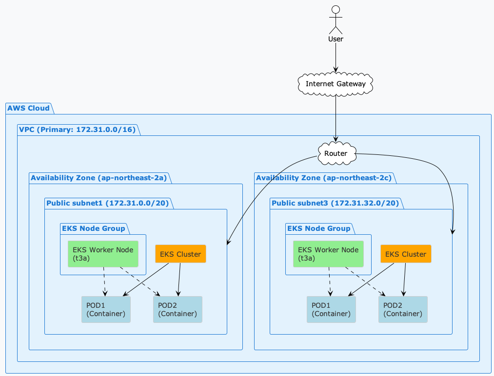

# AWS 구성

## AWS EKS 구성도

---

## AWS 사전 설정

- [AWS 사전설정](./AWS_PREPARED.md)

## 1. 보안그룹 생성

- 이름 : test-sg-eks-cluster
- 설명 : Security group for eks cluster

- 인바운드 규칙
  - Ingress (인그레스) = 인바운드 트래픽 = 외부에서 내부로 들어오는 트래픽
  - 모든트래픽, 0.0.0.0/0, Inbound
- 아웃바운드 규칙
  - Egress (이그레스) = 아웃바운드 트래픽 = 내부에서 외부로 나가는 트래픽
  - 모든트래픽, 0.0.0.0/0, Outbound
- TAG
  - Name : test-sg-eks-cluster
  

## 2. IAM Role 및 Policy

> Custom Role 추가
> 
> 역할생성 -> 사용자 지정 신뢰정책

  - EC2 인스턴스용 IAM 역할 생성 시
  - EC2가 다른 AWS 서비스(S3, RDS 등)에 접근할 때
  - 쿠버네티스 워커 노드용 IAM 역할

### 최근 변경사항 (2024년) :
  - IAM 역할이 더 이상 자기 자신을 암묵적으로 신뢰하지 않음 
  - VPC and Subnet Considerations - EKS Best Practices Guides
  - 하지만 EC2 서비스용 Trust Policy는 변경 없음

### 정책추가
 - [EKS Cluster 정책](../configs/aws-iam/assume-role-eks-cluster.json)
 - [EKS Node Group 정책](../configs/aws-iam/assume-role-eks-nodegroup.json)

### 역할 세부 정보
- EKS Cluster
  - 이름 : test-iam-role-eks-cluster
  - 설명 : iam role for eks cluster
  
  - AmazonEKSClusterPolicy
  - AmazonEKSVPCResourceController

  - EKS 자율 모드를 사용하려면 클러스터 역할에 다음 관리형 정책 또는 이와 동등한 권한이 있어야 합니다.
    - AmazonEKSBlockStoragePolicy
    - AmazonEKSComputePolicy
    - AmazonEKSLoadBalancingPolicy
    - AmazonEKSNetworkingPolicy
  
  
- EKS Node Group
  - 이름 : test-iam-role-eks-nodegroup
  - 설명 : iam role for eks nodegroup

  - AmazonEKSWorkerNodePolicy
  - AmazonEKS_CNI_Policy
  - AmazonEC2ContainerRegistryReadOnly
  

- EKS Node
  - 이름 : test-iam-role-eks-node
  - 설명 : iam role for eks node
  - AmazonEC2ContainerRegistryPullOnly
  - AmazonEKSWorkerNodeMinimalPolicy

## 3. EKS Cluster 생성

> 검색에 kubernetes 입력
> 
> Amazon Elastic Kubernetes Service > EKS 클러스터 생성

  - 이름 : test-eks-cluster
  - 클러스터 IAM역할 : test-iam-role-eks-cluster
  - 

## 4. EKS Node Group 생성

  - 이름 : test-eks-nodegroup
  - 역할 : test-iam-role-eks-nodegroup
  - 노드그룹 조정 : 원하는크기2, 최소1, 최대3
  - 

## 5. AWS Configure 및 Kubeconfig 설정

> aws configure
> 
> aws eks update-kubeconfig --region ap-northeast-2 --name test-eks-cluster

### AWS Access Key ID 

  - AWS 콘솔 → IAM 서비스
  - 사용자(Users) → 본인 사용자 선택
  - 보안 자격 증명(Security credentials) 탭
  - 액세스 키(Access keys) 섹션에서 확인

## 6. POD (container) 배포