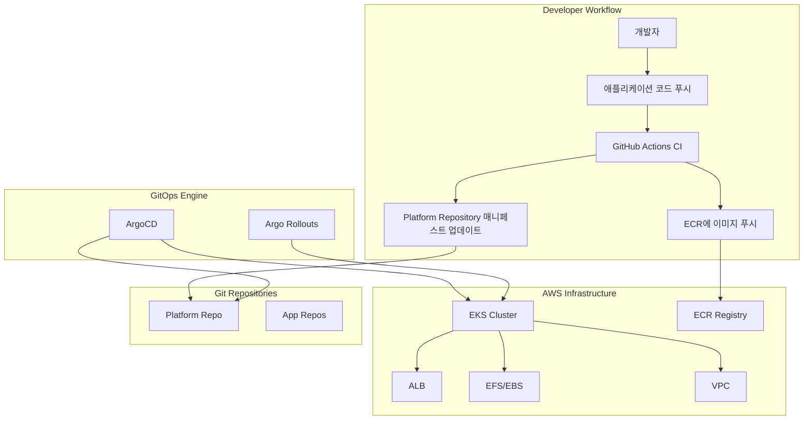

# AWS GitOps 구축 가이드

## 목차
1. [GitOps 개요](#gitops-개요)
2. [Repository 구성 전략](#repository-구성-전략)
3. [AWS EKS GitOps 아키텍처](#aws-eks-gitops-아키텍처)
4. [디렉토리 구조 설계](#디렉토리-구조-설계)
5. [ArgoCD 설치 및 구성](#argocd-설치-및-구성)
6. [실제 구현 예시](#실제-구현-예시)
7. [모범 사례](#모범-사례)
8. [문제 해결](#문제-해결)

---

## GitOps 개요

**GitOps**는 Git을 단일 진실 공급원(Single Source of Truth)으로 사용하여 인프라와 애플리케이션을 선언적으로 관리하는 운영 모델입니다. AWS 환경에서 EKS(Elastic Kubernetes Service)와 함께 사용하면 강력한 자동화 및 배포 플랫폼을 구축할 수 있습니다.

### GitOps 핵심 원칙

1. **선언적(Declarative)**: 시스템의 원하는 상태를 선언적으로 정의
2. **버전 관리(Versioned)**: Git을 통한 모든 변경사항 추적
3. **자동 동기화(Automatically Pulled)**: GitOps 에이전트가 자동으로 변경사항 적용
4. **지속적 조정(Continuously Reconciled)**: 실제 상태와 원하는 상태의 지속적 비교/수정

---

## Repository 구성 전략

### 패턴 비교

#### 1. Monorepo 패턴
```
awesome-company/
├── infrastructure/          # Terraform 코드
│   ├── environments/
│   │   ├── dev/
│   │   ├── staging/
│   │   └── prod/
│   └── modules/
├── k8s-manifests/          # Kubernetes 매니페스트
│   ├── management/
│   ├── services/
│   └── environments/
└── applications/           # 애플리케이션 소스
    ├── bubblepool/
    └── another-service/
```

**장점**: 단일 저장소로 관리 편의, 의존성 관리 용이
**단점**: 저장소 크기 증가, 팀간 권한 분리 어려움

#### 2. Multi-repo 패턴
```
# 저장소별 분리
awesome-company/infrastructure      # 인프라 전용
awesome-company/k8s-manifests      # GitOps 매니페스트 전용
awesome-company/bubblepool          # 애플리케이션별 분리
awesome-company/another-service
```

**장점**: 팀별 권한 분리 명확, 독립적 CI/CD
**단점**: 의존성 관리 복잡, 여러 저장소 동기화 필요

#### 3. 하이브리드 패턴 (추천)
```
# Platform Repository
awesome-company/platform
├── infrastructure/         # Terraform
├── k8s-manifests/         # GitOps 매니페스트
└── docs/

# Application Repositories
awesome-company/bubblepool
awesome-company/another-service
```

**장점**: 플랫폼과 애플리케이션 분리, 적절한 권한 관리
**단점**: 중간 복잡도

---

## AWS EKS GitOps 아키텍처

### 전체 아키텍처



### 컴포넌트 설명

- **EKS Cluster**: Kubernetes 클러스터 (Control Plane)
- **ArgoCD**: GitOps 컨트롤러, Git에서 변경사항을 모니터링하고 클러스터에 적용
- **Argo Rollouts**: 고급 배포 전략 (Blue/Green, Canary)
- **ECR**: 컨테이너 이미지 저장소
- **ALB Controller**: AWS Application Load Balancer 관리
- **EFS/EBS CSI Driver**: 스토리지 관리

---

## 디렉토리 구조 설계

### 권장 구조

```
platform/
├── management/
│   ├── argo-cd/
│   │   ├── manifests/
│   │   │   ├── install.yaml
│   │   │   ├── ingress.yaml
│   │   │   └── kustomization.yaml
│   │   └── scripts/
│   │       └── setup.sh
│   └── argo-rollout/
│       ├── manifests/
│       │   └── kustomization.yaml
│       └── scripts/
│           └── setup.sh
├── platform/
│   └── aws/
│       └── ap-northeast-2/
│           ├── terraform-backend/
│           │   └── iac.tf
│           └── terraform-codes/
│               └── iac.tf
└── service/
    ├── bubblepool/
    │   ├── base/
    │   │   ├── deployment.yaml
    │   │   ├── service.yaml
    │   │   └── kustomization.yaml
    │   └── overlays/
    │       ├── dev/
    │       │   ├── application.yaml
    │       │   └── kustomization.yaml
    │       ├── staging/
    │       └── prod/
    └── guestbook/
        ├── base/
        └── overlays/
```

### 환경별 확장 구조

```
platform/
├── aws/
│   ├── ap-northeast-2/        # 서울 리전
│   │   ├── shared/            # 공통 리소스
│   │   │   ├── vpc/
│   │   │   ├── iam/
│   │   │   └── ecr/
│   │   ├── dev/
│   │   │   ├── eks/
│   │   │   └── rds/
│   │   ├── staging/
│   │   └── prod/
│   ├── us-west-2/             # 추가 리전
│   └── eu-west-1/
└── scripts/
    ├── deploy.sh
    ├── destroy.sh
    └── validate.sh
```

---

## ArgoCD 설치 및 구성

### 1. ArgoCD 설치 스크립트

```bash
#!/bin/bash
# management/argo-cd/scripts/setup.sh

set -e

echo "🚀 Installing ArgoCD..."

# Namespace 생성
kubectl create namespace argocd --dry-run=client -o yaml | kubectl apply -f -

# ArgoCD 설치
kubectl apply -n argocd -f https://raw.githubusercontent.com/argoproj/argo-cd/stable/manifests/install.yaml

# ALB Ingress 설정 (옵션)
kubectl apply -f ../manifests/ingress.yaml

echo "⏳ Waiting for ArgoCD to be ready..."
kubectl wait --for=condition=ready pod -l app.kubernetes.io/name=argocd-server -n argocd --timeout=300s

echo "🔑 Getting initial admin password..."
ARGOCD_PASSWORD=$(kubectl -n argocd get secret argocd-initial-admin-secret -o jsonpath="{.data.password}" | base64 -d)
echo "ArgoCD Admin Password: $ARGOCD_PASSWORD"

echo "🌐 Port forwarding to access ArgoCD UI..."
echo "Run: kubectl port-forward svc/argocd-server -n argocd 8080:443"
echo "Access: https://localhost:8080"
echo "Username: admin"
echo "Password: $ARGOCD_PASSWORD"

echo "✅ ArgoCD installation completed!"
```

### 2. ArgoCD Ingress 설정

```yaml
# management/argo-cd/manifests/ingress.yaml
apiVersion: networking.k8s.io/v1
kind: Ingress
metadata:
  name: argocd-server-ingress
  namespace: argocd
  annotations:
    kubernetes.io/ingress.class: alb
    alb.ingress.kubernetes.io/scheme: internet-facing
    alb.ingress.kubernetes.io/target-type: ip
    alb.ingress.kubernetes.io/certificate-arn: arn:aws:acm:ap-northeast-2:123456789012:certificate/your-cert-arn
    alb.ingress.kubernetes.io/ssl-redirect: '443'
    alb.ingress.kubernetes.io/backend-protocol: HTTPS
    alb.ingress.kubernetes.io/healthcheck-protocol: HTTPS
    alb.ingress.kubernetes.io/healthcheck-path: /healthz
spec:
  rules:
  - host: argocd.your-domain.com
    http:
      paths:
      - path: /
        pathType: Prefix
        backend:
          service:
            name: argocd-server
            port:
              number: 443
  tls:
  - hosts:
    - argocd.your-domain.com
```

### 3. ArgoCD 설정 ConfigMap

```yaml
# management/argo-cd/manifests/argocd-cm.yaml
apiVersion: v1
kind: ConfigMap
metadata:
  name: argocd-cm
  namespace: argocd
data:
  # Git 저장소 설정
  repositories: |
    - url: https://github.com/your-org/platform
      type: git
      name: platform-repo
    - url: https://github.com/your-org/helm-charts
      type: helm
      name: helm-charts
  
  # OIDC 설정 (옵션)
  oidc.config: |
    name: AWS Cognito
    issuer: https://cognito-idp.ap-northeast-2.amazonaws.com/ap-northeast-2_XXXXXXXXX
    clientId: your-client-id
    clientSecret: $oidc.cognito.clientSecret
    requestedScopes: ["openid", "profile", "email"]
    requestedIDTokenClaims: {"groups": {"essential": true}}
  
  # URL 설정
  url: https://argocd.your-domain.com
  
  # 자동 동기화 설정
  application.instanceLabelKey: argocd.argoproj.io/instance
```

---

## 실제 구현 예시

### 1. Terraform으로 EKS 클러스터 구성

```hcl
# platform/aws/ap-northeast-2/terraform-codes/iac.tf
terraform {
  required_version = ">= 1.0"
  required_providers {
    aws = {
      source  = "hashicorp/aws"
      version = "~> 5.0"
    }
  }
  
  backend "s3" {
    bucket         = "your-terraform-state-bucket"
    key            = "platform/ap-northeast-2/terraform.tfstate"
    region         = "ap-northeast-2"
    dynamodb_table = "terraform-state-lock"
    encrypt        = true
  }
}

# 기존 terraform-codes 모듈 활용
module "vpc" {
  source = "../../../../terraform-codes/modules/vpc"
  
  vpc_name = "gitops-vpc"
  vpc_cidr = "10.0.0.0/16"
  
  public_subnet_cidrs  = ["10.0.1.0/24", "10.0.2.0/24"]
  private_subnet_cidrs = ["10.0.11.0/24", "10.0.12.0/24"]
  
  enable_nat_gateway = true
  enable_vpn_gateway = false
  
  tags = {
    Environment = "dev"
    Project     = "gitops-platform"
  }
}

module "eks" {
  source = "../../../../terraform-codes/modules/eks"
  
  cluster_name    = "gitops-cluster"
  cluster_version = "1.28"
  
  vpc_id          = module.vpc.vpc_id
  subnet_ids      = module.vpc.private_subnet_ids
  
  node_groups = {
    main = {
      desired_capacity = 3
      max_capacity     = 10
      min_capacity     = 2
      
      instance_types = ["t3.medium"]
      capacity_type  = "ON_DEMAND"
      
      k8s_labels = {
        Environment = "dev"
        NodeGroup   = "main"
      }
    }
  }
  
  tags = {
    Environment = "dev"
    Project     = "gitops-platform"
  }
}

module "alb_controller" {
  source = "../../../../terraform-codes/modules/alb-controller"
  
  cluster_name = module.eks.cluster_name
  oidc_issuer_url = module.eks.cluster_oidc_issuer_url
  
  depends_on = [module.eks]
}

module "efs" {
  source = "../../../../terraform-codes/modules/efs"
  
  vpc_id     = module.vpc.vpc_id
  subnet_ids = module.vpc.private_subnet_ids
  
  tags = {
    Environment = "dev"
    Project     = "gitops-platform"
  }
}
```

### 2. 애플리케이션 정의

#### Base 매니페스트

```yaml
# service/bubblepool/base/deployment.yaml
apiVersion: apps/v1
kind: Deployment
metadata:
  name: bubblepool
  labels:
    app: bubblepool
spec:
  replicas: 2
  selector:
    matchLabels:
      app: bubblepool
  template:
    metadata:
      labels:
        app: bubblepool
    spec:
      containers:
      - name: bubblepool
        image: your-account.dkr.ecr.ap-northeast-2.amazonaws.com/bubblepool:latest
        ports:
        - containerPort: 8080
        env:
        - name: SPRING_PROFILES_ACTIVE
          value: "prod"
        resources:
          requests:
            cpu: 100m
            memory: 256Mi
          limits:
            cpu: 500m
            memory: 512Mi
        livenessProbe:
          httpGet:
            path: /actuator/health
            port: 8080
          initialDelaySeconds: 30
          periodSeconds: 10
        readinessProbe:
          httpGet:
            path: /actuator/health/readiness
            port: 8080
          initialDelaySeconds: 5
          periodSeconds: 5
```

```yaml
# service/bubblepool/base/service.yaml
apiVersion: v1
kind: Service
metadata:
  name: bubblepool-service
  labels:
    app: bubblepool
spec:
  selector:
    app: bubblepool
  ports:
  - name: http
    port: 80
    targetPort: 8080
    protocol: TCP
  type: ClusterIP
```

```yaml
# service/bubblepool/base/kustomization.yaml
apiVersion: kustomize.config.k8s.io/v1beta1
kind: Kustomization

resources:
- deployment.yaml
- service.yaml

commonLabels:
  app: bubblepool
  version: v1.0.0

images:
- name: your-account.dkr.ecr.ap-northeast-2.amazonaws.com/bubblepool
  newTag: latest
```

#### 환경별 오버레이

```yaml
# service/bubblepool/overlays/dev/kustomization.yaml
apiVersion: kustomize.config.k8s.io/v1beta1
kind: Kustomization

namespace: bubblepool-dev

resources:
- ../../base

namePrefix: dev-

replicas:
- name: bubblepool
  count: 1

images:
- name: your-account.dkr.ecr.ap-northeast-2.amazonaws.com/bubblepool
  newTag: dev-latest

patchesStrategicMerge:
- patch.yaml

configMapGenerator:
- name: bubblepool-config
  literals:
  - DATABASE_URL=postgresql://dev-db:5432/bubblepool
  - REDIS_URL=redis://dev-redis:6379
```

```yaml
# service/bubblepool/overlays/dev/patch.yaml
apiVersion: apps/v1
kind: Deployment
metadata:
  name: bubblepool
spec:
  template:
    spec:
      containers:
      - name: bubblepool
        env:
        - name: SPRING_PROFILES_ACTIVE
          value: "dev"
        resources:
          requests:
            cpu: 50m
            memory: 128Mi
          limits:
            cpu: 200m
            memory: 256Mi
```

#### ArgoCD Application 정의

```yaml
# service/bubblepool/overlays/dev/application.yaml
apiVersion: argoproj.io/v1alpha1
kind: Application
metadata:
  name: bubblepool-dev
  namespace: argocd
  finalizers:
    - resources-finalizer.argocd.argoproj.io
spec:
  project: default
  source:
    repoURL: https://github.com/your-org/platform
    targetRevision: HEAD
    path: service/bubblepool/overlays/dev
  destination:
    server: https://kubernetes.default.svc
    namespace: bubblepool-dev
  syncPolicy:
    automated:
      prune: true
      selfHeal: true
    syncOptions:
      - CreateNamespace=true
    retry:
      limit: 5
      backoff:
        duration: 5s
        factor: 2
        maxDuration: 3m
  revisionHistoryLimit: 10
```

### 3. Argo Rollouts를 이용한 고급 배포 전략

```yaml
# service/bubblepool/base/rollout.yaml
apiVersion: argoproj.io/v1alpha1
kind: Rollout
metadata:
  name: bubblepool-rollout
spec:
  replicas: 5
  strategy:
    canary:
      steps:
      - setWeight: 20
      - pause: {}
      - setWeight: 40
      - pause: {duration: 10}
      - setWeight: 60
      - pause: {duration: 10}
      - setWeight: 80
      - pause: {duration: 10}
      canaryService: bubblepool-canary
      stableService: bubblepool-stable
      trafficRouting:
        alb:
          ingress: bubblepool-ingress
          servicePort: 80
  selector:
    matchLabels:
      app: bubblepool
  template:
    metadata:
      labels:
        app: bubblepool
    spec:
      containers:
      - name: bubblepool
        image: your-account.dkr.ecr.ap-northeast-2.amazonaws.com/bubblepool:latest
        ports:
        - containerPort: 8080
```

---

## CI/CD 파이프라인 통합

### GitHub Actions 워크플로우

```yaml
# .github/workflows/deploy.yml (애플리케이션 저장소)
name: Build and Deploy

on:
  push:
    branches: [main, develop]
  pull_request:
    branches: [main]

env:
  ECR_REPOSITORY: bubblepool
  EKS_CLUSTER_NAME: gitops-cluster
  AWS_REGION: ap-northeast-2

jobs:
  build:
    runs-on: ubuntu-latest
    outputs:
      image-tag: ${{ steps.meta.outputs.tags }}
      image-digest: ${{ steps.build.outputs.digest }}
    
    steps:
    - name: Checkout
      uses: actions/checkout@v4
    
    - name: Configure AWS credentials
      uses: aws-actions/configure-aws-credentials@v4
      with:
        role-to-assume: ${{ secrets.AWS_ROLE_ARN }}
        role-session-name: GitHubActions
        aws-region: ${{ env.AWS_REGION }}
    
    - name: Login to Amazon ECR
      id: login-ecr
      uses: aws-actions/amazon-ecr-login@v2
    
    - name: Extract metadata
      id: meta
      uses: docker/metadata-action@v5
      with:
        images: ${{ steps.login-ecr.outputs.registry }}/${{ env.ECR_REPOSITORY }}
        tags: |
          type=ref,event=branch
          type=ref,event=pr
          type=sha,prefix={{branch}}-
    
    - name: Build and push Docker image
      id: build
      uses: docker/build-push-action@v5
      with:
        context: .
        push: true
        tags: ${{ steps.meta.outputs.tags }}
        labels: ${{ steps.meta.outputs.labels }}
    
    - name: Update GitOps repository
      if: github.ref == 'refs/heads/main'
      run: |
        # Platform 저장소 클론
        git clone https://${{ secrets.GITOPS_TOKEN }}@github.com/your-org/platform.git
        cd platform
        
        # 환경에 따른 이미지 태그 업데이트
        ENV_PATH="service/bubblepool/overlays"
        if [[ "${{ github.ref }}" == "refs/heads/main" ]]; then
          ENV="prod"
        else
          ENV="dev"
        fi
        
        # Kustomization.yaml에서 이미지 태그 업데이트
        yq e ".images[0].newTag = \"${{ github.sha }}\"" -i "${ENV_PATH}/${ENV}/kustomization.yaml"
        
        # 변경사항 커밋 및 푸시
        git config user.name "github-actions[bot]"
        git config user.email "github-actions[bot]@users.noreply.github.com"
        git add .
        git commit -m "Update ${{ env.ECR_REPOSITORY }} image to ${{ github.sha }}"
        git push
  
  security-scan:
    runs-on: ubuntu-latest
    needs: build
    steps:
    - name: Run Trivy vulnerability scanner
      uses: aquasecurity/trivy-action@master
      with:
        image-ref: ${{ needs.build.outputs.image-tag }}
        format: 'sarif'
        output: 'trivy-results.sarif'
    
    - name: Upload Trivy scan results
      uses: github/codeql-action/upload-sarif@v2
      with:
        sarif_file: 'trivy-results.sarif'
```

---

## 모범 사례

### 1. 보안

#### RBAC 설정
```yaml
# management/argo-cd/manifests/rbac-config.yaml
apiVersion: v1
kind: ConfigMap
metadata:
  name: argocd-rbac-cm
  namespace: argocd
data:
  scopes: '[groups]'
  policy.default: role:readonly
  policy.csv: |
    # Admin 그룹
    p, role:admin, applications, *, */*, allow
    p, role:admin, clusters, *, *, allow
    p, role:admin, repositories, *, *, allow
    g, argocd-admins, role:admin
    
    # Developer 그룹
    p, role:developer, applications, get, */*, allow
    p, role:developer, applications, sync, */*, allow
    p, role:developer, logs, get, */*, allow
    g, developers, role:developer
    
    # 환경별 제한
    p, role:dev-admin, applications, *, */dev, allow
    p, role:prod-admin, applications, *, */prod, allow
```

#### Secret 관리
```yaml
# management/argo-cd/manifests/external-secrets.yaml
apiVersion: external-secrets.io/v1beta1
kind: SecretStore
metadata:
  name: aws-secrets-manager
  namespace: argocd
spec:
  provider:
    aws:
      service: SecretsManager
      region: ap-northeast-2
      auth:
        serviceAccountRef:
          name: external-secrets-sa

---
apiVersion: external-secrets.io/v1beta1
kind: ExternalSecret
metadata:
  name: argocd-repo-secret
  namespace: argocd
spec:
  refreshInterval: 1h
  secretStoreRef:
    name: aws-secrets-manager
    kind: SecretStore
  target:
    name: repo-secret
    creationPolicy: Owner
  data:
  - secretKey: username
    remoteRef:
      key: gitops/github
      property: username
  - secretKey: password
    remoteRef:
      key: gitops/github
      property: token
```

### 2. 모니터링 및 관찰성

#### Prometheus 메트릭
```yaml
# management/monitoring/prometheus-config.yaml
apiVersion: v1
kind: ConfigMap
metadata:
  name: prometheus-config
  namespace: monitoring
data:
  prometheus.yml: |
    global:
      scrape_interval: 15s
    
    scrape_configs:
    - job_name: 'argocd-metrics'
      static_configs:
      - targets: ['argocd-metrics.argocd:8082']
    
    - job_name: 'argocd-server-metrics'
      static_configs:
      - targets: ['argocd-server-metrics.argocd:8083']
    
    - job_name: 'kubernetes-pods'
      kubernetes_sd_configs:
      - role: pod
      relabel_configs:
      - source_labels: [__meta_kubernetes_pod_annotation_prometheus_io_scrape]
        action: keep
        regex: true
```

#### Grafana 대시보드
```json
{
  "dashboard": {
    "title": "ArgoCD GitOps Dashboard",
    "panels": [
      {
        "title": "Application Health Status",
        "type": "stat",
        "targets": [
          {
            "expr": "argocd_app_health_status{health_status=\"Healthy\"}"
          }
        ]
      },
      {
        "title": "Sync Status",
        "type": "stat",
        "targets": [
          {
            "expr": "argocd_app_sync_total"
          }
        ]
      },
      {
        "title": "Application Count by Project",
        "type": "piechart",
        "targets": [
          {
            "expr": "count by (project) (argocd_app_info)"
          }
        ]
      }
    ]
  }
}
```

### 3. 알림 설정

```yaml
# management/argo-cd/manifests/notifications.yaml
apiVersion: v1
kind: ConfigMap
metadata:
  name: argocd-notifications-cm
  namespace: argocd
data:
  service.slack: |
    token: $slack-token
    channel: gitops-alerts
  
  template.app-deployed: |
    message: |
      ✅ Application {{.app.metadata.name}} successfully deployed to {{.app.spec.destination.namespace}}
      🔗 [View Application]({{.context.argocdUrl}}/applications/{{.app.metadata.name}})
      📋 Sync Revision: {{.app.status.sync.revision}}
  
  template.app-sync-failed: |
    message: |
      ❌ Application {{.app.metadata.name}} sync failed
      🔗 [View Application]({{.context.argocdUrl}}/applications/{{.app.metadata.name}})
      📋 Error: {{.app.status.operationState.message}}
  
  trigger.on-deployed: |
    - description: Application synced and healthy
      send:
      - app-deployed
      when: app.status.operationState.phase in ['Succeeded'] and app.status.health.status == 'Healthy'
  
  trigger.on-sync-failed: |
    - description: Application sync failed
      send:
      - app-sync-failed
      when: app.status.operationState.phase in ['Error', 'Failed']
```

### 4. 백업 및 재해 복구

```bash
#!/bin/bash
# scripts/backup-argocd.sh

set -e

BACKUP_DATE=$(date +%Y%m%d_%H%M%S)
BACKUP_DIR="./backups/argocd_${BACKUP_DATE}"

echo "🔄 Creating ArgoCD backup..."

# ArgoCD 설정 백업
mkdir -p ${BACKUP_DIR}/config
kubectl get configmaps -n argocd -o yaml > ${BACKUP_DIR}/config/configmaps.yaml
kubectl get secrets -n argocd -o yaml > ${BACKUP_DIR}/config/secrets.yaml

# Application 백업
mkdir -p ${BACKUP_DIR}/applications
kubectl get applications -n argocd -o yaml > ${BACKUP_DIR}/applications/applications.yaml

# AppProjects 백업
kubectl get appprojects -n argocd -o yaml > ${BACKUP_DIR}/applications/appprojects.yaml

# 백업 파일 S3 업로드
aws s3 cp ${BACKUP_DIR} s3://your-backup-bucket/argocd-backups/ --recursive

echo "✅ Backup completed: ${BACKUP_DIR}"
```

---

## 문제 해결

### 일반적인 문제들

#### 1. Application이 OutOfSync 상태
```bash
# 강제 동기화
argocd app sync bubblepool-dev --force

# 리소스 상태 확인
kubectl get all -n bubblepool-dev

# ArgoCD 로그 확인
kubectl logs -n argocd deployment/argocd-application-controller
```

#### 2. 이미지 Pull 실패
```bash
# ECR 권한 확인
aws ecr describe-repositories --repository-names bubblepool

# ServiceAccount 권한 확인
kubectl describe serviceaccount default -n bubblepool-dev

# Pod 이벤트 확인
kubectl describe pod -n bubblepool-dev
```

#### 3. 네트워크 문제
```bash
# DNS 해상도 확인
kubectl run -it --rm debug --image=busybox --restart=Never -- nslookup kubernetes.default

# SecurityGroup 규칙 확인
aws ec2 describe-security-groups --group-ids sg-xxxxx

# VPC 엔드포인트 확인
aws ec2 describe-vpc-endpoints
```

### 성능 최적화

#### ArgoCD 설정 튜닝
```yaml
# management/argo-cd/manifests/argocd-cmd-params-cm.yaml
apiVersion: v1
kind: ConfigMap
metadata:
  name: argocd-cmd-params-cm
  namespace: argocd
data:
  # 동시 실행 애플리케이션 수 증가
  application.operation.processors: "20"
  
  # 동기화 timeout 증가  
  controller.operation.processors: "20"
  controller.status.processors: "20"
  controller.repo.server.timeout.seconds: "180"
  
  # 리소스 추적 최적화
  application.resourceTrackingMethod: "annotation+label"
```

---

## 결론

이 가이드를 통해 AWS EKS 환경에서 GitOps를 구축하는 전체적인 방법을 알아보았습니다. 핵심 포인트는:

1. **적절한 Repository 구조 선택**: 팀 규모와 요구사항에 맞는 패턴 선택
2. **Infrastructure as Code**: Terraform을 통한 인프라 관리
3. **Progressive Delivery**: Argo Rollouts를 통한 안전한 배포
4. **보안 및 규정 준수**: RBAC, Secret 관리, 모니터링
5. **자동화**: CI/CD 파이프라인과 GitOps 통합

GitOps는 단순한 배포 도구가 아니라 전체적인 운영 철학입니다. 점진적으로 도입하여 팀의 DevOps 성숙도를 높여나가시기 바랍니다.

---

## 참고 자료

- [ArgoCD 공식 문서](https://argo-cd.readthedocs.io/)
- [Argo Rollouts 문서](https://argoproj.github.io/argo-rollouts/)
- [AWS EKS 모범 사례](https://aws.github.io/aws-eks-best-practices/)
- [Kustomize 가이드](https://kustomize.io/)
- [GitOps Principles](https://opengitops.dev/) 