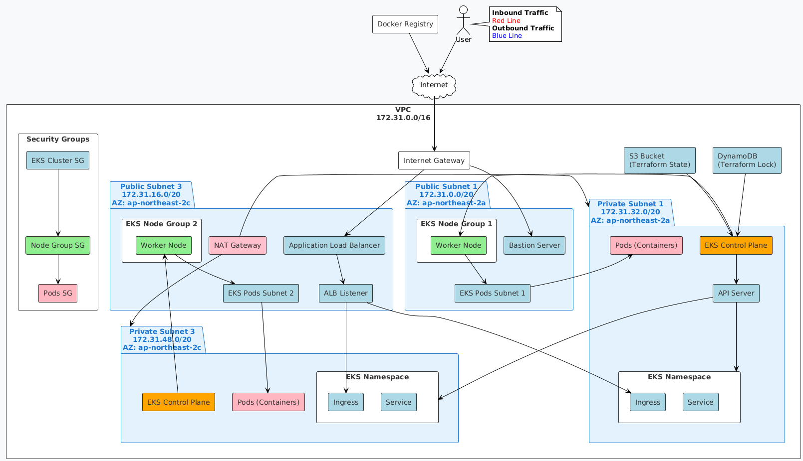

# AWS Network Architecture with EKS

## Network Diagram



## Bastion Server Overview

The Bastion 서버(점프 서버)는 보안이 강화된 네트워크 아키텍처에서 중요한 역할을 하는 서버입니다.

### 주요 기능

1. **보안 게이트웨이**
   - 프라이빗 서브넷에 위치한 리소스(예: EKS 노드, 데이터베이스)에 안전하게 접근하기 위한 유일한 진입점
   - 외부 인터넷에서 직접 프라이빗 리소스에 접근하는 대신 Bastion 서버를 경유

2. **네트워크 아키텍처**
   - **위치**: Public Subnet 1 (172.31.0.0/20)에 위치
   - **가용 영역**: ap-northeast-2a
   - **연결성**:
     - 외부 인터넷에서 SSH 접속 가능
     - 내부 프라이빗 서브넷으로의 아웃바운드 연결 가능

3. **보안 특징**
   - **최소 권한 원칙**: 필요한 최소한의 네트워크 접근만 허용
   - **강화된 보안 그룹**: SSH(22번 포트) 접속만 허용
   - **SSH 키 기반 인증**: 공개 키 인증을 통한 보안 강화

4. **사용 시나리오**
   ```bash
   # 사용자 → Bastion 서버 → 프라이빗 서브넷의 EKS 노드 접속 예시
   ssh -i key.pem ec2-user@<Bastion_Public_IP>
   ssh -i key.pem ec2-user@<Private_Node_IP>
   ```

5. **모범 사례**
   - 반드시 필요한 경우에만 사용
   - IP 화이트리스트로 접속 제한
   - 정기적인 보안 업데이트
   - 모든 접속 로깅 및 모니터링

6. **대안**
   - AWS Systems Manager Session Manager: SSH 없이 안전한 인스턴스 접근 가능
   - VPN/직접 연결: 더 안전한 내부 네트워크 확장

## ALB Listener

Application Load Balancer (ALB) Listener는 들어오는 연결 요청을 검사하고 정의된 규칙에 따라 요청을 적절한 대상 그룹으로 라우팅하는 구성 요소입니다.

### 주요 기능

1. **트래픽 라우팅**
   - HTTP/HTTPS 요청을 수신하여 사전 정의된 규칙에 따라 적절한 서비스로 라우팅
   - 경로 기반 라우팅(Path-based routing) 지원
   - 호스트 기반 라우팅(Host-based routing) 지원

2. **리스너 규칙**
   - 기본 규칙: 기본 대상 그룹 지정
   - 우선순위 기반 규칙: 조건에 따른 세분화된 라우팅
   - 리다이렉션 및 고정 응답 처리

3. **보안 기능**
   - SSL/TLS 종료
   - AWS WAF(Web Application Firewall) 통합
   - 보안 그룹을 통한 접근 제어

4. **상태 확인**
   - 대상 그룹의 상태 모니터링
   - 비정상 대상 자동 제외

### 구성 예시
```hcl
resource "aws_lb_listener" "https" {
  load_balancer_arn = aws_lb.main.arn
  port              = 443
  protocol          = "HTTPS"
  ssl_policy        = "ELBSecurityPolicy-2016-08"
  certificate_arn   = aws_acm_certificate.main.arn

  default_action {
    type             = "forward"
    target_group_arn = aws_lb_target_group.main.arn
  }
}
```

## EKS Namespace

Kubernetes 네임스페이스는 클러스터 내의 리소스를 논리적으로 분리하는 가상 클러스터입니다.

### 주요 기능

1. **리소스 격리**
   - 팀, 프로젝트, 환경별로 리소스 격리
   - 리소스 할당량(Quota) 관리
   - 접근 제어(RBAC)의 기본 단위

2. **일반적인 네임스페이스**
   - `kube-system`: Kubernetes 시스템 컴포넌트
   - `kube-public`: 모든 사용자가 읽을 수 있는 리소스
   - `kube-node-lease`: 노드 하트비트 체크
   - `default`: 기본 네임스페이스
   - `ingress-nginx`: Ingress 컨트롤러
   - `monitoring`: 모니터링 도구(Prometheus, Grafana 등)

3. **네임스페이스 관리**
```bash
# 네임스페이스 생성
kubectl create namespace my-namespace

# 네임스페이스 목록 조회
kubectl get namespaces

# 특정 네임스페이스의 리소스 조회
kubectl get pods -n my-namespace
```

4. **리소스 할당량 설정 예시**
```yaml
apiVersion: v1
kind: ResourceQuota
metadata:
  name: compute-resources
  namespace: my-namespace
spec:
  hard:
    requests.cpu: "4"
    requests.memory: 8Gi
    limits.cpu: "8"
    limits.memory: 16Gi
```

## 아키텍처 개요

### 주요 구성 요소
1. **VPC (172.31.0.0/16)**
   - 인터넷 게이트웨이를 통한 외부 연결
   - 퍼블릭/프라이빗 서브넷으로 분리된 네트워크

2. **퍼블릭 서브넷**
   - Public Subnet 1 (ap-northeast-2a)
     - Bastion 서버
     - EKS Node Group 1
   - Public Subnet 3 (ap-northeast-2c)
     - NAT Gateway
     - Application Load Balancer
     - EKS Node Group 2

3. **보안 그룹**
   - Bastion: SSH(22) 접근 제한
   - EKS 노드: 필요한 포트만 개방

## 접근 제어
- Bastion 서버를 통한 SSH 접근만 허용
- IAM 정책을 통한 세분화된 권한 관리
- 네트워크 ACL을 통한 추가적인 보안 계층 구성
