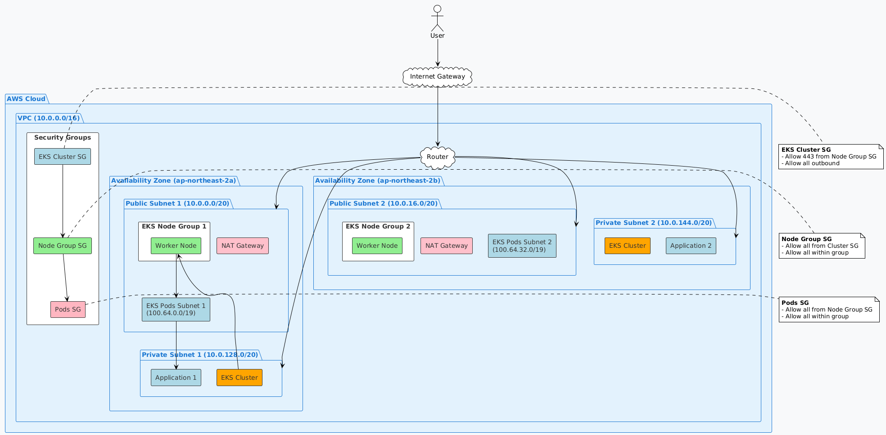

# AWS 네트워크 아키텍처

## 개요
이 문서는 AWS EKS 클러스터를 위한 네트워크 아키텍처를 설명합니다. 퍼블릭 서브넷 2개와 프라이빗 서브넷 2개로 구성되어 있으며, 각각 다른 가용 영역(AZ)에 배치되어 고가용성을 보장합니다.

## 네트워크 다이어그램

  

## 네트워크 구성 요소

### 1. VPC
- **CIDR**: 10.0.0.0/16
- **리전**: ap-northeast-2 (서울)

### 2. 서브넷

#### 퍼블릭 서브넷 (Public Subnets)
| 서브넷 이름 | CIDR | 가용 영역 | 용도 |
|------------|------|-----------|------|
| Public Subnet 1 | 10.0.0.0/20 | ap-northeast-2a | 인터넷 게이트웨이 연결 |
| Public Subnet 2 | 10.0.16.0/20 | ap-northeast-2b | 인터넷 게이트웨이 연결 |

#### 프라이빗 서브넷 (Private Subnets)
| 서브넷 이름 | CIDR | 가용 영역 | 용도 |
|------------|------|-----------|------|
| Private Subnet 1 | 10.0.128.0/20 | ap-northeast-2a | 워커 노드 |
| Private Subnet 2 | 10.0.144.0/20 | ap-northeast-2b | 워커 노드 |

#### EKS Pods 서브넷
| 서브넷 이름 | CIDR | 가용 영역 | 용도 |
|------------|------|-----------|------|
| EKS Pods Subnet 1 | 100.64.0.0/19 | ap-northeast-2a | EKS 파드 네트워킹 |
| EKS Pods Subnet 2 | 100.64.32.0/19 | ap-northeast-2b | EKS 파드 네트워킹 |

### 3. 라우팅 테이블
- **퍼블릭 라우트 테이블**: 인터넷 게이트웨이로의 라우팅 (0.0.0.0/0 -> igw-xxxxx)
- **프라이빗 라우트 테이블**: NAT 게이트웨이를 통한 아웃바운드 인터넷 액세스 (0.0.0.0/0 -> nat-xxxxx)

### 4. 보안 그룹
- **EKS Cluster SG**: 컨트롤 플레인 보안 그룹
- **Node Group SG**: 워커 노드 보안 그룹
- **Pods SG**: 파드 간 통신을 위한 보안 그룹

## 네트워크 흐름
1. **아웃바운드 인터넷 트래픽**:
   - 퍼블릭 서브넷: 인터넷 게이트웨이를 통해 직접 인터넷 연결
   - 프라이빗 서브넷: NAT 게이트웨이를 통해 인터넷 연결

2. **인바운드 트래픽**:
   - 퍼블릭 로드 밸런서를 통한 웹 트래픽 수신
   - 보안 그룹을 통한 세분화된 접근 제어

3. **내부 통신**:
   - VPC 내부에서는 모든 서브넷 간 자유로운 통신 가능
   - 보안 그룹을 통한 세분화된 접근 제어 적용
