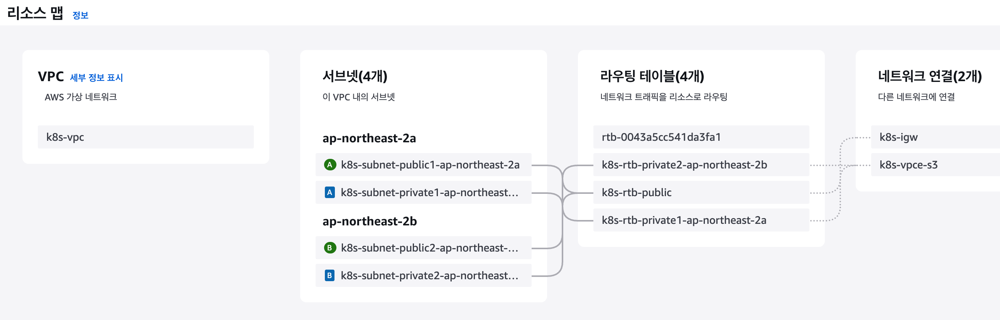

# [Index](./README.md)

## AWS 사전 설정

> EKS Cluster 및 NodeGroup 실행은 반드시 Subnet에 동일 TAG지정이 필요함
> TAG명 : kubernetes.io/cluster/<EKS Cluster명>
> TAG값 : shared

### 1. VPC 생성

### 2. Subnet 생성

> EKS 클러스터를 위한 서브넷에는 다음과 같은 태그가 필요합니다:

#### 필수 태그:
    - Key: kubernetes.io/cluster/<cluster-name>
    - Value: shared
#### Public 서브넷용 추가 태그:
  - Key: kubernetes.io/role/elb
  - Value: 1
#### Private 서브넷용 추가 태그:
  - Key: kubernetes.io/role/internal-elb
  - Value: 1

#### 왜 이 태그들이 필요한가:

1. kubernetes.io/cluster/<cluster-name>: shared
   - EKS가 클러스터에서 사용할 서브넷을 자동으로 발견하기 위해 필요
   - Load Balancer Controller가 서브넷을 찾기 위해 사용 VPC Configuration - eksctl

2. kubernetes.io/role/elb: 1 (Public 서브넷)
   - 인터넷 연결 로드밸런서(ALB/NLB)가 Public 서브넷을 찾기 위해 사용 VPC Configuration - eksctl

3. kubernetes.io/role/internal-elb: 1 (Private 서브넷)
   - 내부 로드밸런서가 Private 서브넷을 찾기 위해 사용 VPC Configuration - eksctl

### 3. Internet Gateway 생성

### 4. Route Table 생성
