# AWS Persistent Volumes (PV) 가이드

## 📌 PV(PersistentVolume)란?

**PersistentVolume(PV)**은 쿠버네티스 클러스터에서 관리하는 스토리지 리소스로, 파드의 생명주기와 독립적으로 데이터를 영구적으로 저장할 수 있게 해줍니다.

> 📘 **공식 문서**: [Amazon EKS Persistent Volumes](https://docs.aws.amazon.com/eks/latest/userguide/efs-csi.html)

## 🏗 아키텍처

```mermaid
graph LR
    A[애플리케이션 Pod] -->|볼륨 마운트| B[PersistentVolumeClaim]
    B -->|바인딩| C[PersistentVolume]
    C -->|연결| D[AWS 스토리지 서비스]
    D -->|EBS/EFS/FSx| E[데이터 지속성 보장]
```



## 🔍 주요 기능

### 1. 영구 데이터 저장
- 파드가 삭제되어도 데이터 보존
- 컨테이너 재시작 시 데이터 유지

### 2. 다양한 스토리지 백엔드 지원
- **EBS (Elastic Block Store)**: 블록 스토리지
- **EFS (Elastic File System)**: 완전관리형 NFS
- **FSx for Lustre**: 고성능 파일 시스템
- **S3**: 객체 스토리지 (CSI 드라이버 통해)

### 3. 액세스 모드
- **ReadWriteOnce (RWO)**: 단일 노드 읽기-쓰기
- **ReadOnlyMany (ROX)**: 다중 노드 읽기 전용
- **ReadWriteMany (RWX)**: 다중 노드 읽기-쓰기

> 📘 **스토리지 클래스 비교**: [Amazon EKS 스토리지 클래스](https://docs.aws.amazon.com/eks/latest/userguide/storage-classes.html)

## 🛠 설치 방법

### EBS CSI Driver 설치 (EKS 애드온)

```bash
# EBS CSI 드라이버 설치
aws eks create-addon \
    --cluster-name my-cluster \
    --addon-name aws-ebs-csi-driver \
    --service-account-role-arn arn:aws:iam::ACCOUNT_ID:role/AmazonEKS_EBS_CSI_DriverRole
```

### StorageClass 생성

```yaml
apiVersion: storage.k8s.io/v1
kind: StorageClass
metadata:
  name: ebs-sc
provisioner: ebs.csi.aws.com
volumeBindingMode: WaitForFirstConsumer  # 노드 스케줄링 후 볼륨 생성
parameters:
  type: gp3
  encrypted: "true"  # 암호화 활성화
  iopsPerGB: "10"   # IOPS 설정 (gp3 전용)
  throughput: "125"  # 처리량(MiB/s) (gp3 전용)
```

> 📘 **설치 가이드**: [EBS CSI Driver 설치](https://docs.aws.amazon.com/eks/latest/userguide/ebs-csi.html)

## 📝 사용 예시

### 동적 프로비저닝 예시 (PVC)

```yaml
apiVersion: v1
kind: PersistentVolumeClaim
metadata:
  name: ebs-claim
spec:
  accessModes:
    - ReadWriteOnce
  storageClassName: ebs-sc  # 위에서 생성한 StorageClass
  resources:
    requests:
      storage: 10Gi
```

### 파드에서 PVC 사용 예시

```yaml
apiVersion: v1
kind: Pod
metadata:
  name: app-with-pv
spec:
  containers:
  - name: app
    image: nginx
    volumeMounts:
    - name: storage
      mountPath: /data
  volumes:
  - name: storage
    persistentVolumeClaim:
      claimName: ebs-claim  # 위에서 생성한 PVC 사용
```

## 🔄 고급 구성

### 볼륨 스냅샷

```yaml
apiVersion: snapshot.storage.k8s.io/v1
kind: VolumeSnapshot
metadata:
  name: ebs-volume-snapshot
spec:
  volumeSnapshotClassName: csi-aws-vsc
  source:
    persistentVolumeClaimName: ebs-claim
```

### 볼륨 확장 (EBS만 해당)

```yaml
apiVersion: v1
kind: PersistentVolumeClaim
metadata:
  name: ebs-claim
spec:
  accessModes:
    - ReadWriteOnce
  resources:
    requests:
      storage: 20Gi  # 10Gi에서 20Gi로 확장
  storageClassName: ebs-sc
```

## 🚨 문제 해결

### 일반적인 문제점

1. **볼륨 마운트 실패**
   - 노드 IAM 역할에 EBS 권한 확인
   - 보안 그룹이 필요한 포트 허용 확인

2. **볼륨 용량 부족**
   - EBS 볼륨 확장 후 파일 시스템 확장 필요
   ```bash
   # 파일 시스템 확장 (ext4 기준)
   sudo resize2fs /dev/xvdf
   ```

### 로그 확인

```bash
# EBS CSI 드라이버 로그 확인
kubectl logs -n kube-system -l app=ebs-csi-controller

# 노드 드라이버 로그 확인
kubectl logs -n kube-system -l app=ebs-csi-node
```

## 📚 추가 자료

- [쿠버네티스 공식 문서 - PV](https://kubernetes.io/ko/docs/concepts/storage/persistent-volumes/)
- [Amazon EBS CSI 드라이버 GitHub](https://github.com/kubernetes-sigs/aws-ebs-csi-driver)
- [EKS 스토리지 모범 사례](https://aws.github.io/aws-eks-best-practices/storage/)
- [EBS 볼륨 성능 최적화](https://docs.aws.amazon.com/ko_kr/AWSEC2/latest/UserGuide/EBSPerformance.html)

---
*문서 최종 업데이트: 2025년 7월 16일*
