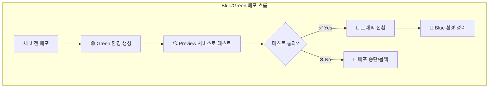
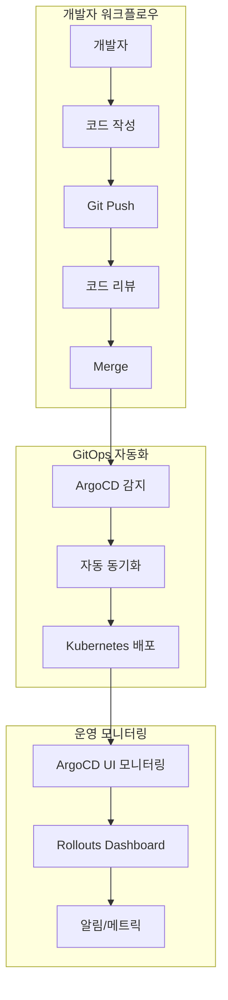

# 🚀 ArgoCD GitOps 배포 전략 가이드

**Kubernetes 환경에서 ArgoCD를 활용한 효율적인 GitOps 배포 전략과 모범 사례**


---

## 📋 **목차**

- [개요](#개요)
- [프로젝트 구조 이해](#프로젝트-구조-이해)
- [배포 전략 분석](#배포-전략-분석)
- [ArgoCD 설정 방식 비교](#argocd-설정-방식-비교)
- [GitOps 모범 사례](#gitops-모범-사례)
- [실무 적용 가이드](#실무-적용-가이드)
- [트러블슈팅](#트러블슈팅)

---

## 🎯 **개요**

본 가이드는 ArgoCD를 활용한 GitOps 기반 배포 전략을 다룹니다. 특히 **웹 UI vs 파일 기반 설정**의 차이점과 **블루그린 배포** 구현 방법을 중심으로 설명합니다.

### **핵심 질문들**
1. **ArgoCD 웹 UI에서 직접 설정하면 안 되나요?**
2. **서비스 폴더는 배포 설정일 뿐인가요?**
3. **언제 어떤 방식을 사용해야 하나요?**

---

## 📁 **프로젝트 구조 이해**

### **🔍 현재 프로젝트 분석**

```
terraform/
├── management/                     # 🛠️ 관리 도구들
│   ├── argo-cd/                   # ArgoCD GitOps 플랫폼
│   └── argo-rollout/              # 고급 배포 전략 (Blue/Green, Canary)
└── service/                       # 🚀 실제 서비스들
    └── feed-server/               # 데모 애플리케이션
        ├── src/                   # 👈 실제 소스코드 (현재 비어있음)
        └── k8s/                   # 👈 Kubernetes 배포 설정
```

### **🔑 핵심 이해사항**

#### **1. 서비스 폴더의 성격**

```yaml
# ❌ 오해: "서비스 폴더 = 실제 애플리케이션"
# ✅ 정답: "서비스 폴더 = 배포 환경 + 소스코드"

service/feed-server/
├── src/           # 🔧 실제 애플리케이션 소스코드 영역
│   └── (비어있음)  # 현재는 nginx 이미지로 데모
└── k8s/           # ☸️ Kubernetes 배포 환경 설정
    ├── base/      # 기본 설정 (공통)
    └── overlays/  # 환경별 설정 (dev/staging/prod)
```

#### **2. 현재 상태**

| 구분 | 현재 상태 | 의도된 사용법 |
|------|-----------|---------------|
| **소스코드** | `nginx:1.22-alpine` 이미지 | `src/`에 실제 앱 개발 |
| **배포설정** | ✅ 완벽한 GitOps 구조 | 그대로 유지 |
| **목적** | Argo Rollouts 데모/테스트 | 실제 운영 환경 |

---

## 🎯 **배포 전략 분석**

### **🔵🟢 블루그린 배포 확인**

**예, 현재 프로젝트는 블루그린 배포방식입니다!**

```yaml
# service/feed-server/k8s/base/rollout.yaml
strategy:
  blueGreen:
    activeService: feed-server         # 🔵 현재 운영 (Blue)
    previewService: feed-server-preview # 🟢 새 버전 테스트 (Green)
    autoPromotionEnabled: false       # 수동 승인 필요
    scaleDownDelaySeconds: 30         # 이전 버전 정리 대기
```

### **🔄 배포 프로세스**



### **📊 배포 전략 비교**

| 전략 | 장점 | 단점 | 적용 시나리오 |
|------|------|------|---------------|
| **Rolling Update** | 리소스 효율적, 간단 | 롤백 복잡, 버전 혼재 | 개발/테스트 환경 |
| **Blue/Green** | 무중단, 빠른 롤백 | 리소스 2배 필요 | 프로덕션 환경 |
| **Canary** | 리스크 최소화, 점진적 | 복잡한 설정, 긴 배포 시간 | 대규모 서비스 |

---

## ⚖️ **ArgoCD 설정 방식 비교**

### **🤔 핵심 질문: "웹 UI에서 설정하면 안 되나요?"**

**답변: 둘 다 가능하지만, 목적에 따라 선택해야 합니다!**

### **📊 상세 비교표**

| 기준 | 🌐 웹 UI 방식 | 📁 파일 기반 방식 (현재) |
|------|---------------|-------------------------|
| **⚡ 즉시성** | ✅ 즉시 생성/수정 가능 | ❌ Git 워크플로우 필요 |
| **🔄 GitOps 철학** | ❌ Git에 기록되지 않음 | ✅ 완전한 GitOps 구현 |
| **📝 버전 관리** | ❌ 변경 이력 추적 어려움 | ✅ Git으로 완벽 추적 |
| **👥 협업** | ❌ 코드 리뷰 불가 | ✅ PR/MR 기반 협업 |
| **🌍 환경 관리** | ❌ 환경별 설정 복잡 | ✅ Kustomize 환경 분리 |
| **💾 백업/복구** | ❌ 수동 백업 필요 | ✅ Git = 자동 백업 |
| **🤖 자동화** | ❌ CI/CD 연동 제한적 | ✅ 완전 자동화 지원 |
| **📋 재사용성** | ❌ 매번 수동 작성 | ✅ 템플릿 기반 재사용 |
| **🔐 보안/규정** | ❌ 감사 추적 어려움 | ✅ 완벽한 감사 로그 |

### **🎯 언제 어떤 방식을 사용할까?**

#### **🌐 웹 UI 권장 시나리오**

```yaml
✅ 적합한 경우:
  - 빠른 실험/프로토타입
  - 일회성 디버깅
  - 설정 값 확인
  - 동기화 상태 모니터링
  - 긴급 상황 대응

🚨 주의사항:
  - 프로덕션 환경에서는 신중히 사용
  - 변경사항을 나중에 파일로 백포트 필요
  - 팀 내 공유/협의 필수
```

**예시: 빠른 테스트**
```bash
# ArgoCD UI에서 즉시 테스트 앱 생성
New App → 
  Name: test-feature
  Repo: https://github.com/user/test
  Path: k8s/dev/
  → Save → Sync
```

#### **📁 파일 기반 권장 시나리오 (현재 방식)**

```yaml
✅ 적합한 경우:
  - 프로덕션 환경
  - 팀 협업 프로젝트
  - 다중 환경 관리 (dev/staging/prod)
  - 복잡한 애플리케이션
  - 규정 준수 필요한 조직
  - 장기 운영 서비스

🎯 핵심 장점:
  - GitOps 철학 완전 구현
  - 모든 변경사항 추적 가능
  - 코드 리뷰 기반 품질 관리
  - 자동화 파이프라인 연동
```

---

## 🏗️ **GitOps 모범 사례**

### **📐 권장 아키텍처**



### **🎯 하이브리드 접근법 (권장)**

```yaml
# 🏗️ 기본 설정: 파일 기반 (GitOps)
관리 방식:
  - 애플리케이션 정의: YAML 파일
  - 환경 설정: Kustomize
  - 배포 전략: Argo Rollouts
  - 버전 관리: Git

# ⚡ 운영/모니터링: 웹 UI 활용
사용 목적:
  - 실시간 상태 확인
  - 긴급 수동 조작 (Sync/Rollback)
  - 로그 및 이벤트 확인
  - 배포 승인/중단
```

### **📁 파일 구조 모범 사례**

```
service/your-app/
├── src/                           # 🔧 애플리케이션 소스코드
│   ├── Dockerfile                 # 컨테이너 이미지 빌드
│   ├── package.json               # 의존성 관리
│   └── ...                        # 실제 애플리케이션 코드
└── k8s/                           # ☸️ Kubernetes 매니페스트
    ├── base/                      # 📦 기본 설정 (환경 무관)
    │   ├── deployment.yaml        # 또는 rollout.yaml
    │   ├── service.yaml
    │   ├── configmap.yaml
    │   └── kustomization.yaml
    └── overlays/                  # 🌍 환경별 오버라이드
        ├── dev/
        │   ├── kustomization.yaml
        │   ├── ingress.yaml
        │   └── patches/
        ├── staging/
        └── prod/
```

---

## 🚀 **실무 적용 가이드**

### **1️⃣ 신규 프로젝트 시작하기**

```bash
# 1. 서비스 디렉토리 생성
mkdir -p service/my-app/{src,k8s/{base,overlays/{dev,staging,prod}}}

# 2. 기본 매니페스트 작성
cd service/my-app/k8s/base/
# rollout.yaml, service.yaml, kustomization.yaml 작성

# 3. 환경별 설정
cd ../overlays/dev/
# kustomization.yaml, ingress.yaml, patches/ 작성

# 4. ArgoCD Application 등록
# management/argo-cd/applications/에 앱 정의 추가
```

### **2️⃣ 기존 프로젝트 마이그레이션**

```yaml
# Before: 웹 UI로 관리되던 앱
문제점:
  - Git에 기록 없음
  - 환경별 설정 중복
  - 팀 협업 어려움

# After: 파일 기반으로 전환
해결책:
  1. 현재 설정 YAML 내보내기
  2. Git 리포지토리에 정리
  3. Kustomize로 환경 분리
  4. ArgoCD에서 새 소스 연결
```

### **3️⃣ 블루그린 배포 구현**

```yaml
# rollout.yaml 예시
apiVersion: argoproj.io/v1alpha1
kind: Rollout
metadata:
  name: my-app-rollout
spec:
  replicas: 3
  strategy:
    blueGreen:
      activeService: my-app-active
      previewService: my-app-preview
      autoPromotionEnabled: false    # 수동 승인
      scaleDownDelaySeconds: 30
      prePromotionAnalysis:          # 선택적: 자동 테스트
        templates:
        - templateName: success-rate
  selector:
    matchLabels:
      app: my-app
  template:
    metadata:
      labels:
        app: my-app
    spec:
      containers:
      - name: app
        image: my-app:latest
        # ... 컨테이너 설정
```

### **4️⃣ 운영 워크플로우**

```bash
# 📝 일상 개발 (파일 기반)
1. 코드 수정 → Git Push
2. PR 생성 → 코드 리뷰
3. Merge → ArgoCD 자동 동기화

# 🌐 운영 모니터링 (웹 UI)
1. ArgoCD UI에서 상태 확인
2. Rollouts Dashboard에서 배포 진행률 확인
3. 필요시 수동 승인/롤백

# 🚨 긴급 상황 (하이브리드)
1. 웹 UI에서 즉시 롤백
2. 원인 파악 후 파일 수정
3. 정상 프로세스로 재배포
```

---

## 🔧 **트러블슈팅**

### **❌ 자주 발생하는 문제들**

#### **1. "WebUI로 만든 앱이 Git에 없어요"**

```yaml
증상: ArgoCD UI에서 생성한 앱이 Git 리포지토리에 반영되지 않음

원인: WebUI 설정은 etcd에만 저장됨

해결책:
  1. kubectl get application -n argocd -o yaml > backup.yaml
  2. YAML을 Git 리포지토리로 이동
  3. 기존 앱 삭제 후 파일 기반으로 재생성
```

#### **2. "환경별 설정이 복잡해요"**

```yaml
증상: dev/staging/prod 환경마다 다른 설정 관리 어려움

해결책: Kustomize 활용
  base/: 공통 설정
  overlays/dev/: 개발 환경 오버라이드
  overlays/prod/: 운영 환경 오버라이드
```

#### **3. "블루그린 배포가 실패해요"**

```bash
# 일반적인 확인 사항
kubectl describe rollout my-app-rollout -n my-namespace
kubectl get rs -n my-namespace  # ReplicaSet 상태 확인
kubectl logs -f deployment/my-app -n my-namespace

# 서비스 셀렉터 확인
kubectl get svc my-app-active -o yaml | grep selector -A 5
```

---

## 📈 **다음 단계**

### **🎯 단기 개선 사항**
- [ ] **메트릭 기반 자동 승인** (Prometheus 연동)
- [ ] **알림 시스템** 구축 (Slack/Teams)
- [ ] **Canary 배포** 전략 추가
- [ ] **보안 정책** 강화 (OPA Gatekeeper)

### **🚀 장기 로드맵**
- [ ] **멀티 클러스터** GitOps
- [ ] **Progressive Delivery** 고도화
- [ ] **A/B 테스트** 프레임워크
- [ ] **자동화된 성능 테스트**

---

## 💡 **핵심 요약**

### **✅ 기억할 핵심 사항**

1. **GitOps 원칙**
   - Git이 단일 진실 소스 (Single Source of Truth)
   - 모든 변경사항은 Git을 통해 추적
   - 선언적 설정으로 일관성 보장

2. **하이브리드 접근법**
   - **기본 설정**: 파일 기반 (GitOps)
   - **운영 모니터링**: 웹 UI 활용
   - **긴급 대응**: 상황에 맞는 유연한 선택

3. **현재 프로젝트는 모범 사례**
   - ✅ 블루그린 배포 구현
   - ✅ 환경별 설정 분리 (Kustomize)
   - ✅ GitOps 기반 자동화
   - ✅ 확장 가능한 구조

---

## 📞 **추가 자료**

| 주제 | 관련 문서 | 설명 |
|------|-----------|------|
| **ArgoCD** | [`management/argo-cd/`](../management/argo-cd/) | GitOps 플랫폼 설정 |
| **Argo Rollouts** | [`management/argo-rollout/`](../management/argo-rollout/) | 고급 배포 전략 |
| **Kustomize** | [`docs/Kustomize.md`](./Kustomize.md) | 환경별 설정 관리 |
| **GitOps** | [`docs/GitOps.md`](./GitOps.md) | GitOps 개념과 실습 |
| **Helm vs Kustomize** | [`docs/HelmVsKustomize.md`](./HelmVsKustomize.md) | 도구 비교 분석 |

---

<div align="center">

**🚀 GitOps와 ArgoCD로 안전하고 효율적인 배포를 실현하세요!**

[](https://argoproj.github.io/cd/)
[](https://www.gitops.tech/)
[](https://kubernetes.io/)

</div> 