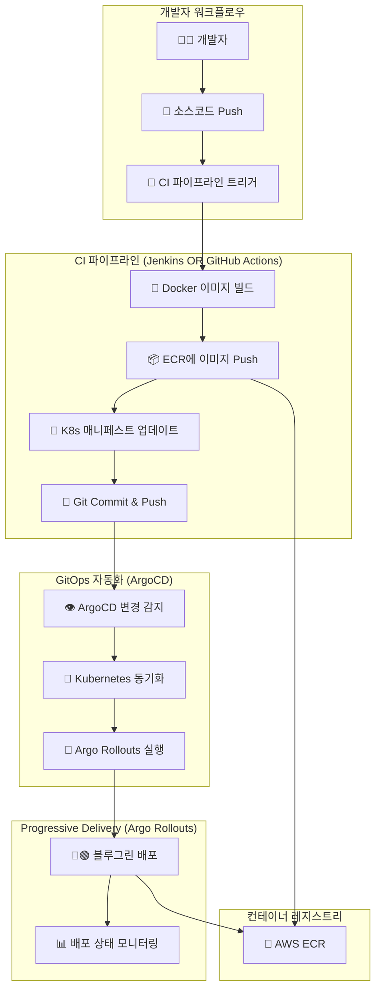
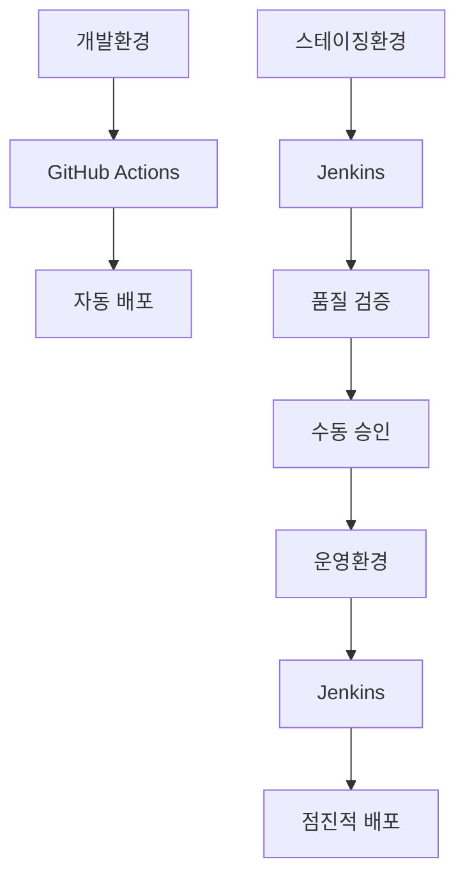

# 🚀 CI/CD 도구 선택 가이드

**Jenkins vs GitHub Actions - 프로젝트 상황에 맞는 최적 도구 선택 전략**


---

## 📋 **목차**

- [개요](#개요)
- [CI/CD 아키텍처 이해](#cicd-아키텍처-이해)
- [Jenkins vs GitHub Actions 비교](#jenkins-vs-github-actions-비교)
- [도구 선택 기준](#도구-선택-기준)
- [현재 프로젝트 분석](#현재-프로젝트-분석)
- [실제 사용 사례](#실제-사용-사례)
- [마이그레이션 전략](#마이그레이션-전략)
- [실무 권장사항](#실무-권장사항)

---

## 🎯 **개요**

본 가이드는 CI/CD 도구 선택에 대한 실무적 관점을 제시합니다. 특히 **Jenkins와 GitHub Actions의 차이점**을 명확히 하고, **언제 어떤 도구를 사용해야 하는지** 구체적인 기준을 제공합니다.

### **🔑 핵심 질문들**
1. **Jenkins는 언제 필요한가?**
2. **GitHub Actions로 충분한 경우는?**
3. **현재 프로젝트에 최적인 도구는?**
4. **미래 확장을 고려한 전략은?**

---

## 🏗️ **CI/CD 아키텍처 이해**

### **🔄 GitOps + ArgoCD + Argo Rollouts 전체 흐름**



### **📋 각 컴포넌트 역할 정리**

| 컴포넌트 | 역할 | Jenkins/GitHub Actions |
|----------|------|------------------------|
| **CI 파이프라인** | 빌드, 테스트, 이미지 생성 | ✅ 이 부분을 담당 |
| **ArgoCD** | Git → K8s 동기화 | ❌ 별개 도구 |
| **Argo Rollouts** | 고급 배포 전략 | ❌ 별개 도구 |
| **ECR** | 이미지 저장소 | ❌ 별개 서비스 |

### **🔑 핵심 이해사항**
```yaml
중요한 포인트:
  ✅ Jenkins/GitHub Actions는 CI 부분만 담당
  ✅ ArgoCD는 ECR 업로드하지 않음!
  ✅ 각 도구는 명확히 분리된 책임
  ✅ GitOps 패턴에서 CI와 CD는 독립적
```

---

## ⚖️ **Jenkins vs GitHub Actions 비교**

### **📊 종합 비교표**

| 기준 | 🔧 Jenkins | 🚀 GitHub Actions |
|------|------------|-------------------|
| **🏗️ 호스팅** | 자체 호스팅 필요 | GitHub 클라우드 |
| **💰 초기 비용** | 서버 + 설정 비용 | 무료 (2,000분/월) |
| **🔧 설정 복잡도** | 높음 (Java, 플러그인) | 낮음 (YAML) |
| **👨‍💻 학습 곡선** | 가파름 | 완만함 |
| **🔌 확장성** | 무제한 플러그인 | GitHub 생태계 |
| **🛡️ 보안 관리** | 자체 관리 필요 | GitHub 관리 |
| **📊 모니터링** | 상세한 제어 가능 | 기본 제공 |
| **🏢 엔터프라이즈** | 완벽 지원 | 제한적 |
| **🌍 멀티 SCM** | 모든 SCM 지원 | Git 중심 |
| **🔄 복잡한 워크플로우** | 무제한 | 제한적 |

### **🎯 GitHub Actions 장점**

#### **1. 즉시 사용 가능**
```yaml
장점:
  ⚡ 서버 설치/관리 불필요
  🔧 설정 파일 하나로 시작
  💰 운영 비용 제로
  🔄 Git 이벤트와 완벽 통합

현재 프로젝트 예시:
  # .github/workflows/deploy.yml
  name: Deploy to EKS
  on:
    push:
      branches: [main]
  jobs:
    deploy:
      runs-on: ubuntu-latest
      steps:
      - uses: actions/checkout@v4
      - name: Deploy
        run: |
          docker build -t app .
          aws ecr get-login-password | docker login
          docker push $ECR_REGISTRY/app
```

#### **2. AWS 생태계 통합**
```yaml
네이티브 통합:
  ✅ aws-actions/configure-aws-credentials
  ✅ aws-actions/amazon-ecr-login
  ✅ 자동 IAM 역할 연동
  ✅ AWS CLI/SDK 사전 설치

vs Jenkins:
  ❌ 플러그인 설치 필요
  ❌ 복잡한 자격 증명 관리
  ❌ 버전 호환성 이슈
```

### **🏢 Jenkins 장점**

#### **1. 엔터프라이즈 기능**
```groovy
// 복잡한 파이프라인 예시
pipeline {
    agent none
    
    stages {
        stage('Multi-Environment Matrix') {
            matrix {
                axes {
                    axis {
                        name 'ENVIRONMENT'
                        values 'dev', 'staging', 'prod'
                    }
                    axis {
                        name 'REGION'
                        values 'us-east-1', 'ap-northeast-2'
                    }
                }
                stages {
                    stage('Deploy') {
                        steps {
                            script {
                                deployToEnvironment(
                                    env: "${ENVIRONMENT}",
                                    region: "${REGION}"
                                )
                            }
                        }
                    }
                }
            }
        }
        
        stage('Quality Gates') {
            parallel {
                stage('SonarQube') {
                    steps {
                        script {
                            def qg = waitForQualityGate()
                            if (qg.status != 'OK') {
                                error "Quality Gate failed"
                            }
                        }
                    }
                }
                
                stage('Security Scan') {
                    steps {
                        checkmarxScan()
                    }
                }
                
                stage('Performance Test') {
                    steps {
                        jmeterTest()
                    }
                }
            }
        }
        
        stage('Approval Process') {
            when {
                environment name: 'ENVIRONMENT', value: 'prod'
            }
            steps {
                script {
                    def approvers = ['release-manager', 'security-team']
                    input message: 'Deploy to Production?',
                          submitter: approvers.join(','),
                          parameters: [
                              choice(name: 'STRATEGY', 
                                   choices: ['rolling', 'blue-green'],
                                   description: 'Deployment Strategy')
                          ]
                }
            }
        }
    }
    
    post {
        always {
            // JIRA 티켓 자동 업데이트
            updateJiraTickets()
            
            // Slack 알림
            slackSend channel: '#deployments',
                     message: "Deployment ${currentBuild.result}"
            
            // 상세 리포트 생성
            publishHTML([
                allowMissing: false,
                reportDir: 'reports',
                reportFiles: 'index.html',
                reportName: 'Deployment Report'
            ])
        }
    }
}
```

#### **2. 무제한 플러그인 생태계**
```yaml
Jenkins 플러그인 예시:
  📊 SonarQube: 코드 품질 분석
  🔍 Checkmarx: 보안 취약점 스캔
  📈 JMeter: 성능 테스트
  🎫 JIRA: 이슈 추적 연동
  💬 Slack: 알림 통합
  🐘 Ansible: 인프라 자동화
  🏗️ Terraform: IaC 관리
  📋 BlueOcean: 시각적 파이프라인
```

---

## 🎯 **도구 선택 기준**

### **✅ GitHub Actions 선택 기준**

#### **프로젝트 특성**
```yaml
완벽한 케이스:
  ✅ GitHub에서 소스 관리
  ✅ 클라우드 네이티브 (AWS/GCP/Azure)
  ✅ 소규모~중규모 팀 (50명 이하)
  ✅ 스타트업~중소기업
  ✅ 빠른 개발 사이클
  ✅ 단순한 배포 파이프라인 (5단계 이하)

기술 요구사항:
  ✅ 컨테이너 기반 애플리케이션
  ✅ 마이크로서비스 아키텍처
  ✅ DevOps 문화 정착
  ✅ 클라우드 서비스 활용
```

#### **팀 역량**
```yaml
적합한 팀:
  👨‍💻 Git/GitHub 숙련도 높음
  ☁️ 클라우드 서비스 경험 있음
  🚀 빠른 학습 및 적응력
  🔧 YAML 설정 가능
  📱 SaaS 도구 선호
```

### **✅ Jenkins 선택 기준**

#### **조직 요구사항**
```yaml
필수인 케이스:
  🏢 대기업/금융권/공공기관
  🔒 온프레미스 환경 필수
  📋 엄격한 보안/규정 준수
  🛡️ 외부 클라우드 사용 제한
  📊 상세한 감사 로그 요구

기술 요구사항:
  🔄 복잡한 파이프라인 (10단계+)
  🏭 레거시 시스템 통합
  📈 다양한 SCM 시스템 연동
  🔍 고급 테스트/품질 분석
  👥 다단계 승인 프로세스
```

#### **팀 역량**
```yaml
필요한 팀:
  🔧 Java/Groovy 개발 가능
  🖥️ 서버 운영 경험
  📊 복잡한 도구 관리 역량
  🏢 엔터프라이즈 환경 경험
  🔧 플러그인 개발/관리 가능
```

---

## 📊 **현재 프로젝트 분석**

### **🔍 프로젝트 현황**

```yaml
현재 환경:
  📁 소스 관리: GitHub
  ☁️ 인프라: AWS (EKS, ECR, VPC)
  🎯 배포: ArgoCD + Argo Rollouts
  👥 팀 규모: 소규모
  🏢 조직: 스타트업/중소기업

파이프라인 요구사항:
  🔨 Build: Docker 이미지 빌드
  📦 Push: ECR에 업로드
  🔄 Update: K8s 매니페스트 업데이트
  📝 Commit: Git에 변경사항 반영
```

### **✅ GitHub Actions 선택 이유**

#### **1. 완벽한 환경 매칭**
```yaml
현재 환경과 100% 일치:
  ✅ GitHub 기반 소스 관리
  ✅ AWS 클라우드 환경
  ✅ 컨테이너 기반 배포
  ✅ 단순한 파이프라인
  ✅ 소규모 팀 구조
```

#### **2. 즉시 적용 가능**
```yaml
# 현재 프로젝트에 바로 적용 가능한 워크플로우
name: Feed Server CI/CD
on:
  push:
    paths: ['service/feed-server/src/**']
    branches: [main]

env:
  AWS_REGION: ap-northeast-2
  ECR_REGISTRY: ${{ secrets.AWS_ACCOUNT_ID }}.dkr.ecr.ap-northeast-2.amazonaws.com
  ECR_REPOSITORY: feed-server

jobs:
  build-and-deploy:
    runs-on: ubuntu-latest
    permissions:
      id-token: write
      contents: read

    steps:
    - name: Checkout
      uses: actions/checkout@v4

    - name: Configure AWS credentials
      uses: aws-actions/configure-aws-credentials@v4
      with:
        role-to-assume: ${{ secrets.AWS_ROLE_ARN }}
        aws-region: ${{ env.AWS_REGION }}

    - name: Login to ECR
      uses: aws-actions/amazon-ecr-login@v2

    - name: Build and push image
      run: |
        cd service/feed-server/src
        docker build -t $ECR_REGISTRY/$ECR_REPOSITORY:${{ github.sha }} .
        docker push $ECR_REGISTRY/$ECR_REPOSITORY:${{ github.sha }}

    - name: Update K8s manifests
      run: |
        cd service/feed-server/k8s/overlays/dev
        kustomize edit set image feed-server=$ECR_REGISTRY/$ECR_REPOSITORY:${{ github.sha }}
        
        git config --local user.email "action@github.com"
        git config --local user.name "GitHub Action"
        git add kustomization.yaml
        git commit -m "Update image to ${{ github.sha }}"
        git push
```

#### **3. 비용 효율성**
```yaml
GitHub Actions:
  💰 월 2,000분 무료
  📊 현재 사용량: ~100분/월
  💵 추가 비용: $0

Jenkins (가정):
  🖥️ EC2 t3.medium: ~$30/월
  👨‍💻 운영 관리 시간: ~8시간/월
  💵 총 비용: ~$100+/월
```

---

## 🏢 **실제 사용 사례**

### **💼 케이스 1: 스타트업 (GitHub Actions)**

#### **회사 프로필**
```yaml
규모: 개발팀 10명
환경: AWS 클라우드
서비스: B2B SaaS
기술스택: React + Node.js + Kubernetes
```

#### **파이프라인 구성**
```yaml
간단하고 효과적:
  1. 코드 Push → GitHub Actions 트리거
  2. 테스트 실행 (Jest, Cypress)
  3. Docker 이미지 빌드
  4. ECR에 Push
  5. K8s 매니페스트 업데이트
  6. ArgoCD 자동 배포

결과:
  ✅ 설정 시간: 2일
  ✅ 운영 부담: 거의 없음
  ✅ 배포 시간: 5분
  ✅ 팀 만족도: 높음
```

### **🏦 케이스 2: 대기업 (Jenkins)**

#### **회사 프로필**
```yaml
규모: 개발팀 200명
환경: 온프레미스 + 하이브리드 클라우드
서비스: 금융 플랫폼
기술스택: Java + Spring + 레거시 시스템
```

#### **파이프라인 구성**
```yaml
복잡하지만 필수적:
  1. 다중 SCM (Git + SVN) 소스 병합
  2. 코드 품질 분석 (SonarQube)
  3. 보안 스캔 (Checkmarx)
  4. 단위/통합/성능 테스트
  5. 다환경 병렬 배포 (개발/QA/스테이징)
  6. 수동 승인 프로세스 (릴리즈 매니저)
  7. 메인프레임 연동
  8. JIRA/Confluence 자동 업데이트

결과:
  ✅ 설정 시간: 2주
  ✅ 운영 부담: 전담 팀 필요
  ✅ 배포 시간: 2시간
  ✅ 규정 준수: 완벽
```

### **🔄 케이스 3: 하이브리드 접근법**

#### **회사 프로필**
```yaml
규모: 개발팀 50명
환경: 멀티 클라우드
서비스: 전자상거래
기술스택: 마이크로서비스 + 레거시
```

#### **단계별 도구 활용**


```yaml
환경별 전략:
  개발: GitHub Actions (빠른 피드백)
  스테이징: Jenkins (품질 검증)
  운영: Jenkins (안정성 우선)

장점:
  ✅ 개발 속도 + 운영 안정성
  ✅ 점진적 복잡성 증가
  ✅ 팀별 최적화
```

---

## 🔄 **마이그레이션 전략**

### **📈 성장 단계별 전환 가이드**

#### **Phase 1: 스타트업 단계 (현재)**
```yaml
상황:
  👥 팀 규모: 5-20명
  💰 예산: 제한적
  🚀 목표: 빠른 제품 출시

권장: GitHub Actions
  ✅ 즉시 시작 가능
  ✅ 학습 비용 최소
  ✅ 운영 부담 없음
  ✅ AWS 통합 완벽
```

#### **Phase 2: 성장 단계**
```yaml
상황:
  👥 팀 규모: 20-50명
  🏢 고객: 엔터프라이즈 확보
  🔒 요구사항: 보안/규정 준수

선택지:
  Option A: GitHub Actions 고도화
    ✅ GitHub Enterprise 도입
    ✅ 고급 보안 기능 활용
    ✅ 자체 러너 구축

  Option B: 하이브리드 접근
    ✅ 개발: GitHub Actions
    ✅ 운영: Jenkins 도입
```

#### **Phase 3: 엔터프라이즈 단계**
```yaml
상황:
  👥 팀 규모: 50명+
  🏢 요구사항: 엄격한 거버넌스
  🔒 환경: 온프레미스 필수

권장: Jenkins 전환
  ✅ 완전한 제어
  ✅ 복잡한 워크플로우
  ✅ 레거시 시스템 통합
  ✅ 엔터프라이즈 기능
```

### **🛠️ 실제 마이그레이션 예시**

#### **GitHub Actions → Jenkins 전환**
```yaml
# Step 1: 병렬 운영
기존: GitHub Actions (개발환경)
신규: Jenkins (스테이징환경)

# Step 2: 점진적 전환
주차별 계획:
  Week 1-2: Jenkins 환경 구축
  Week 3-4: 개발환경 마이그레이션
  Week 5-6: 스테이징환경 마이그레이션
  Week 7-8: 운영환경 마이그레이션

# Step 3: 완전 전환
결과: 모든 환경 Jenkins 통합
```

#### **마이그레이션 시 주의사항**
```yaml
기술적 고려사항:
  ⚠️ 파이프라인 문법 차이
  ⚠️ 시크릿 관리 방식 변경
  ⚠️ 플러그인 호환성 확인
  ⚠️ 성능 및 안정성 테스트

조직적 고려사항:
  ⚠️ 팀 교육 및 적응 기간
  ⚠️ 운영 프로세스 변경
  ⚠️ 비용 예산 재조정
  ⚠️ 롤백 계획 수립
```

---

## 💡 **실무 권장사항**

### **🎯 도구 선택 체크리스트**

#### **GitHub Actions 선택 기준**
```yaml
✅ 체크리스트:
  □ GitHub에서 소스 관리
  □ 클라우드 환경 (AWS/GCP/Azure)
  □ 팀 규모 50명 이하
  □ 컨테이너 기반 애플리케이션
  □ 단순한 파이프라인 (5단계 이하)
  □ 빠른 배포 사이클 선호
  □ 운영 부담 최소화 필요
  □ SaaS 도구 사용 가능

점수: 6개 이상 ✅ → GitHub Actions 권장
```

#### **Jenkins 선택 기준**
```yaml
✅ 체크리스트:
  □ 대기업/금융권/공공기관
  □ 온프레미스 환경 필수
  □ 엄격한 보안/규정 준수
  □ 복잡한 파이프라인 (10단계+)
  □ 레거시 시스템 통합 필요
  □ 다양한 SCM 시스템 사용
  □ 전담 DevOps 팀 있음
  □ 커스텀 플러그인 개발 가능

점수: 6개 이상 ✅ → Jenkins 권장
```

### **🚀 시작하기 권장사항**

#### **새 프로젝트 시작 시**
```yaml
1. GitHub Actions로 시작 (90% 케이스)
   이유: 빠른 시작, 낮은 진입장벽

2. 성장하면서 점진적 평가
   기준: 팀 규모, 복잡도, 요구사항

3. 필요시에만 Jenkins 전환
   시점: 엔터프라이즈 고객 확보 후
```

#### **기존 시스템 개선 시**
```yaml
현재 Jenkins 사용:
  ✅ 팀이 만족하면 유지
  ✅ 문제 있으면 GitHub Actions 검토

현재 GitHub Actions 사용:
  ✅ 대부분 유지 권장
  ✅ 엔터프라이즈 요구사항 생기면 검토
```

### **🔧 모범 사례**

#### **GitHub Actions 최적화**
```yaml
성능 최적화:
  ⚡ 캐시 적극 활용
  🔄 병렬 실행 최대화
  📦 경량 이미지 사용
  🎯 필요한 단계만 실행

보안 강화:
  🔐 OIDC 기반 인증
  🛡️ 시크릿 최소 권한
  🔍 Dependabot 활용
  📋 코드 스캔 자동화
```

#### **Jenkins 최적화**
```yaml
성능 최적화:
  🖥️ 적절한 에이전트 스케일링
  📦 빌드 아티팩트 관리
  🔄 파이프라인 병렬화
  💾 디스크 공간 관리

운영 효율화:
  📊 모니터링 및 알림
  🔄 정기 플러그인 업데이트
  💾 백업 및 복구 계획
  📝 상세한 문서화
```

---

## 📈 **미래 로드맵**

### **🔮 업계 트렌드**

#### **2024-2025 전망**
```yaml
GitHub Actions:
  📈 시장 점유율 지속 증가
  🚀 클라우드 네이티브 환경 주도
  🔧 AI/ML 기능 통합 확대

Jenkins:
  🏢 엔터프라이즈 영역 견고함
  🔄 클라우드 지원 강화
  🤖 자동화 기능 개선
```

#### **신기술 동향**
```yaml
주목할 기술:
  🤖 GitOps 완전 자동화
  🧠 AI 기반 파이프라인 최적화
  🔒 제로 트러스트 보안 모델
  📊 옵저버빌리티 통합
  🌐 멀티 클라우드 배포
```

### **🎯 권장 학습 경로**

#### **GitHub Actions 마스터하기**
```yaml
단계별 학습:
  1. 기본 YAML 문법 및 워크플로우
  2. AWS Actions 생태계 활용
  3. 보안 모범 사례 적용
  4. 고급 매트릭스 및 재사용 가능한 워크플로우
  5. 자체 Action 개발

실습 프로젝트:
  📦 컨테이너 이미지 빌드/배포
  🧪 자동화된 테스트 파이프라인
  🔒 보안 스캔 통합
  📊 모니터링 및 알림 설정
```

#### **Jenkins 전문가 되기**
```yaml
단계별 학습:
  1. Jenkins 아키텍처 이해
  2. Groovy/Pipeline as Code
  3. 플러그인 생태계 활용
  4. 고급 파이프라인 설계
  5. 커스텀 플러그인 개발

실습 프로젝트:
  🏭 엔터프라이즈 파이프라인 구축
  🔧 복잡한 승인 워크플로우
  📈 품질 게이트 자동화
  🔒 보안 및 감사 로그 관리
```

---

## 📊 **요약 및 결론**

### **✅ 핵심 메시지**

#### **현재 프로젝트: GitHub Actions 최적**
```yaml
이유:
  🎯 프로젝트 성격과 완벽 매칭
  ⚡ 즉시 적용 가능
  💰 비용 효율적
  🚀 빠른 개발 사이클 지원
  🔧 운영 부담 최소

결과:
  ✅ 개발 생산성 향상
  ✅ 배포 안정성 확보
  ✅ 팀 만족도 증가
```

#### **미래 전환 시나리오**
```yaml
전환 고려 시점:
  📈 팀 규모 50명+ 도달
  🏢 엔터프라이즈 고객 확보
  🔒 엄격한 규정 준수 요구
  🏭 레거시 시스템 통합 필요

전환 방법:
  🔄 점진적 하이브리드 접근
  📋 철저한 계획과 준비
  👥 팀 교육 및 적응 기간
```

### **🚀 액션 아이템**

#### **단기 (1-3개월)**
- [ ] **GitHub Actions 워크플로우 구성**
- [ ] **ECR 연동 및 이미지 빌드 자동화**
- [ ] **기본 테스트 파이프라인 구축**
- [ ] **보안 스캔 통합**

#### **중기 (3-6개월)**
- [ ] **고급 워크플로우 최적화**
- [ ] **모니터링 및 알림 강화**
- [ ] **성능 메트릭 수집**
- [ ] **팀 교육 및 베스트 프랙티스 정립**

#### **장기 (6개월+)**
- [ ] **엔터프라이즈 요구사항 평가**
- [ ] **Jenkins 전환 필요성 검토**
- [ ] **하이브리드 접근법 설계**
- [ ] **마이그레이션 계획 수립**

---

## 📞 **추가 자료**

| 주제 | 관련 문서 | 설명 |
|------|-----------|------|
| **ArgoCD GitOps** | [`docs/ArgoCD_GitOps_배포전략가이드.md`](./ArgoCD_GitOps_배포전략가이드.md) | GitOps 기반 배포 전략 |
| **AWS ECR** | [`docs/AWS_ECR.md`](./AWS_ECR.md) | 컨테이너 레지스트리 가이드 |
| **EKS Terraform** | [`docs/AWS_EKS_Terraform.md`](./AWS_EKS_Terraform.md) | Kubernetes 클러스터 구성 |
| **Kustomize** | [`docs/Kustomize.md`](./Kustomize.md) | 환경별 설정 관리 |

---

<div align="center">

**🚀 프로젝트에 최적화된 CI/CD 도구로 개발 생산성을 극대화하세요!**

[](https://github.com/features/actions)
[](https://www.jenkins.io/)
[](https://www.gitops.tech/)

</div>
