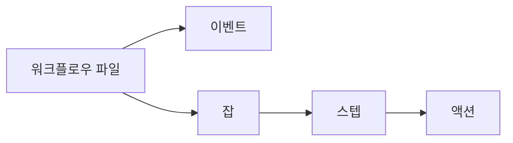

# 🚀 GitHub Actions 모노레포 가이드

**효율적인 멀티 서비스 CI/CD 파이프라인 구축을 위한 실전 가이드**


---

## 📋 **목차**

- [개요](#개요)
- [기본 개념](#-기본-개념)
- [모노레포 구조 분석](#-모노레포-구조-분석)
- [변경사항 기반 빌드](#-변경사항-기반-빌드)
- [고급 워크플로우 전략](#-고급-워크플로우-전략)
- [성능 최적화](#-성능-최적화)
- [실전 예제](#-실전-예제)
- [문제 해결](#-문제-해결)

---

## 🎯 개요

본 가이드는 모노레포 환경에서 GitHub Actions를 사용하여 효율적인 CI/CD 파이프라인을 구축하는 방법을 안내합니다. 

### **🔑 핵심 기능**
- 변경된 서비스만 선택적 빌드
- 캐시를 통한 빌드 시간 단축
- 매트릭스 전략을 활용한 병렬 처리
- ArgoCD와의 연동

---

## 🏗️ 기본 개념

### **🔄 GitHub Actions 핵심 컴포넌트**



### **📂 프로젝트 구조**
```
service/
  bubblepool/
    src/          # 소스 코드
    k8s/          # 쿠버네티스 매니페스트
    Dockerfile    # 도커파일
  guestbook/
    src/
    k8s/
    Dockerfile
```

---

## 🔍 변경사항 기반 빌드

### **1. paths-filter 액션 사용**

```yaml
name: Selective Build

on: [push]

jobs:
  check-changes:
    runs-on: ubuntu-latest
    outputs:
      bubblepool: ${{ steps.filter.outputs.bubblepool }}
      guestbook: ${{ steps.filter.outputs.guestbook }}
    steps:
    - uses: actions/checkout@v4
    - uses: dorny/paths-filter@v3
      id: filter
      with:
        filters: |
          bubblepool:
            - 'service/bubblepool/**'
          guestbook:
            - 'service/guestbook/**'

  build-bubblepool:
    needs: check-changes
    if: needs.check-changes.outputs.bubblepool == 'true'
    runs-on: ubuntu-latest
    steps:
      - uses: actions/checkout@v4
      - name: Build and Push
        run: |
          cd service/bubblepool
          docker build -t $ECR_REGISTRY/bubblepool:${{ github.sha }} .
          docker push $ECR_REGISTRY/bubblepool:${{ github.sha }}
```

### **2. 매트릭스 전략 활용**

```yaml
jobs:
  build:
    runs-on: ubuntu-latest
    strategy:
      matrix:
        service: [bubblepool, guestbook]
      fail-fast: false
    
    steps:
    - uses: actions/checkout@v4
    - name: Build ${{ matrix.service }}
      run: |
        cd service/${{ matrix.service }}
        docker build -t $ECR_REGISTRY/${{ matrix.service }}:${{ github.sha }} .
        docker push $ECR_REGISTRY/${{ matrix.service }}:${{ github.sha }}
```

---

## ⚡ 성능 최적화

### **1. Docker 레이어 캐싱**

```yaml
- name: Cache Docker layers
  uses: actions/cache@v3
  with:
    path: /tmp/.buildx-cache
    key: ${{ runner.os }}-buildx-${{ github.sha }}
    restore-keys: |
      ${{ runner.os }}-buildx-
```

### **2. 의존성 캐싱**

```yaml
- name: Cache node modules
  uses: actions/cache@v3
  with:
    path: service/bubblepool/node_modules
    key: ${{ runner.os }}-node-${{ hashFiles('service/bubblepool/package-lock.json') }}
```

---

## 🔧 문제 해결

### **1. 로그 확인**
```bash
# 워크플로우 실행 목록
gh run list

# 특정 실행 로그 확인
gh run view <run-id> --log
```

### **2. 디버깅 모드**
```yaml
env:
  ACTIONS_STEP_DEBUG: true
  ACTIONS_RUNNER_DEBUG: true
```

---

## 📚 추가 자료
- [GitHub Actions 공식 문서](https://docs.github.com/ko/actions)
- [모노레포 전략 가이드](https://monorepo.tools/)
- [Docker 빌드 최적화](https://docs.docker.com/develop/develop-images/dockerfile_best-practices/)

---

## 🎯 결론

GitHub Actions를 활용하면 모노레포 환경에서도 효율적인 CI/CD 파이프라인을 구축할 수 있습니다. 변경사항 기반 빌드와 캐싱 전략을 적절히 활용하면 빌드 시간을 크게 단축시킬 수 있습니다.

```yaml
핵심 포인트:
  ✅ 변경된 서비스만 빌드
  ✅ 캐싱으로 빌드 시간 단축
  ✅ 매트릭스 전략으로 병렬 처리
  ✅ 상세한 로그로 문제 해결 용이
```

이 가이드가 도움이 되셨다면 ⭐️를 눌러주세요!
