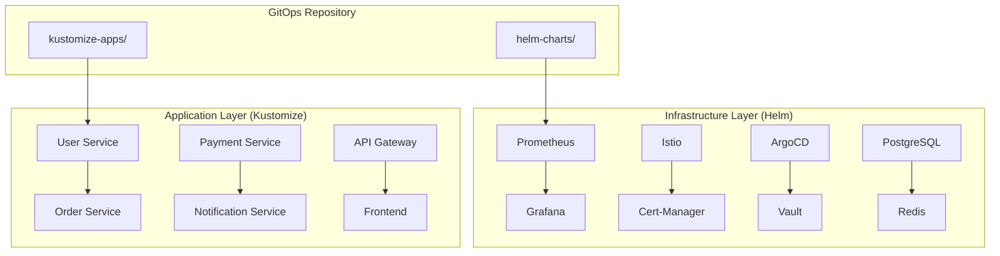

# Helm + Kustomize 혼용(Hybrid) 패턴 실전 가이드

## 개요

Helm과 Kustomize의 **혼용(Hybrid) 패턴**은 현업에서 점점 더 많이 사용되는 접근 방식입니다. 각 도구의 강점을 살려 **시스템 컴포넌트는 Helm**, **애플리케이션 설정은 Kustomize**로 관리하는 방식으로, 특히 GitOps(ArgoCD, FluxCD) 환경에서 매우 유용합니다.

## 핵심 아이디어

### **도구별 역할 분담**
- **Helm**: 복잡한 서드파티 애플리케이션 (DB, 모니터링, 인프라 컴포넌트)
- **Kustomize**: 비즈니스 애플리케이션 및 환경별 커스터마이징
- **GitOps**: 두 도구를 통합하여 선언적 배포 파이프라인 구축

### **장점**
- **복잡성 분리**: 인프라와 애플리케이션 관리 분리
- **재사용성**: Helm Chart의 패키지 관리 + Kustomize의 유연성
- **팀 협업**: 플랫폼 팀(Helm) vs 개발 팀(Kustomize) 역할 분담
- **GitOps 친화적**: 각각의 장점을 GitOps 워크플로우에 통합

## 현업 활용 사례

### **사례 1: 마이크로서비스 플랫폼**

#### **아키텍처 개요**


#### **디렉토리 구조**
```
gitops-repo/
├── infrastructure/           # Helm Charts
│   ├── monitoring/
│   │   ├── Chart.yaml
│   │   ├── values-dev.yaml
│   │   ├── values-staging.yaml
│   │   └── values-prod.yaml
│   ├── service-mesh/
│   │   ├── istio/
│   │   └── cert-manager/
│   ├── databases/
│   │   ├── postgresql/
│   │   └── redis/
│   └── security/
│       ├── vault/
│       └── external-secrets/
├── applications/            # Kustomize
│   ├── user-service/
│   │   ├── base/
│   │   │   ├── deployment.yaml
│   │   │   ├── service.yaml
│   │   │   ├── configmap.yaml
│   │   │   └── kustomization.yaml
│   │   └── overlays/
│   │       ├── dev/
│   │       │   ├── kustomization.yaml
│   │       │   └── replica-patch.yaml
│   │       ├── staging/
│   │       └── prod/
│   ├── order-service/
│   ├── payment-service/
│   └── frontend/
├── platform/               # Platform Config
│   ├── argocd-apps/
│   │   ├── infrastructure-apps.yaml
│   │   └── application-apps.yaml
│   └── policies/
│       ├── network-policies/
│       └── rbac/
└── scripts/                # Automation
    ├── deploy-infrastructure.sh
    ├── deploy-applications.sh
    └── validate-manifests.sh
```

#### **실제 구현 예시**

**Infrastructure (Helm) - Monitoring Stack**
```yaml
# infrastructure/monitoring/Chart.yaml
apiVersion: v2
name: monitoring-stack
description: Complete monitoring solution
version: 1.0.0
dependencies:
- name: kube-prometheus-stack
  version: 45.7.1
  repository: https://prometheus-community.github.io/helm-charts
- name: loki-stack
  version: 2.9.9
  repository: https://grafana.github.io/helm-charts

---
# infrastructure/monitoring/values-prod.yaml
kube-prometheus-stack:
  prometheus:
    prometheusSpec:
      retention: 30d
      storageSpec:
        volumeClaimTemplate:
          spec:
            storageClassName: gp3
            resources:
              requests:
                storage: 100Gi
  grafana:
    persistence:
      enabled: true
      size: 10Gi
    ingress:
      enabled: true
      hosts:
      - grafana.company.com

loki-stack:
  loki:
    persistence:
      enabled: true
      size: 50Gi
```

**Application (Kustomize) - User Service**
```yaml
# applications/user-service/base/deployment.yaml
apiVersion: apps/v1
kind: Deployment
metadata:
  name: user-service
  labels:
    app: user-service
spec:
  replicas: 3
  selector:
    matchLabels:
      app: user-service
  template:
    metadata:
      labels:
        app: user-service
    spec:
      containers:
      - name: user-service
        image: user-service:latest
        ports:
        - containerPort: 8080
        env:
        - name: DB_HOST
          value: postgresql.database.svc.cluster.local
        resources:
          requests:
            memory: "256Mi"
            cpu: "250m"
          limits:
            memory: "512Mi"
            cpu: "500m"

---
# applications/user-service/base/kustomization.yaml
apiVersion: kustomize.config.k8s.io/v1beta1
kind: Kustomization

resources:
- deployment.yaml
- service.yaml
- configmap.yaml

---
# applications/user-service/overlays/prod/kustomization.yaml
apiVersion: kustomize.config.k8s.io/v1beta1
kind: Kustomization

resources:
- ../../base

replicas:
- name: user-service
  count: 5

images:
- name: user-service
  newTag: v1.2.3

patchesStrategicMerge:
- resource-limits.yaml

configMapGenerator:
- name: user-service-config
  literals:
  - LOG_LEVEL=INFO
  - CACHE_TTL=3600
```

### **사례 2: 금융 서비스 회사**

#### **문제 상황**
- 복잡한 규제 요구사항과 다양한 환경 (dev, staging, prod, dr)
- 높은 보안 요구사항과 감사 추적성
- 다양한 팀 (플랫폼, 보안, 개발) 간 협업 필요

#### **해결책: 계층화된 Hybrid 접근**

```yaml
# platform/argocd-apps/infrastructure-apps.yaml
apiVersion: argoproj.io/v1alpha1
kind: Application
metadata:
  name: security-stack
  namespace: argocd
spec:
  project: infrastructure
  source:
    repoURL: https://github.com/company/platform-charts
    path: security
    targetRevision: main
    helm:
      valueFiles:
      - values-prod.yaml
      - secrets-prod.yaml
  destination:
    server: https://kubernetes.default.svc
    namespace: security
  syncPolicy:
    automated:
      prune: true
      selfHeal: true
    syncOptions:
    - CreateNamespace=true

---
apiVersion: argoproj.io/v1alpha1
kind: Application
metadata:
  name: banking-apps
  namespace: argocd
spec:
  project: applications
  source:
    repoURL: https://github.com/company/banking-apps
    path: overlays/prod
    targetRevision: main
    kustomize:
      images:
      - name: banking-api
        newTag: v2.1.3
      - name: payment-processor
        newTag: v1.8.7
  destination:
    server: https://kubernetes.default.svc
    namespace: banking
  syncPolicy:
    automated:
      prune: false  # 금융 서비스는 수동 승인
      selfHeal: false
```

### **사례 3: 스타트업 → 엔터프라이즈 전환**

#### **Phase 1 (스타트업)**: 모든 것을 Kustomize로
```
simple-app/
├── base/
│   ├── api/
│   ├── frontend/
│   ├── database/
│   └── monitoring/
└── overlays/
    ├── dev/
    └── prod/
```

#### **Phase 2 (성장기)**: 인프라 컴포넌트를 Helm으로 분리
```
growing-platform/
├── helm-charts/          # 복잡한 인프라
│   ├── monitoring/
│   ├── logging/
│   ├── security/
│   └── databases/
└── applications/         # 비즈니스 앱
    ├── api/
    ├── frontend/
    └── worker/
```

#### **Phase 3 (엔터프라이즈)**: 완전한 GitOps 플랫폼
```
enterprise-platform/
├── infrastructure/
│   ├── core/             # 핵심 인프라 (Helm)
│   ├── monitoring/       # 관측성 스택 (Helm)
│   ├── security/         # 보안 도구 (Helm)
│   └── databases/        # 데이터 계층 (Helm)
├── applications/
│   ├── customer-facing/  # 고객 서비스 (Kustomize)
│   ├── internal-tools/   # 내부 도구 (Kustomize)
│   └── data-processing/  # 데이터 파이프라인 (Kustomize)
├── platform/
│   ├── argocd/          # GitOps 설정
│   ├── policies/        # 보안 정책
│   └── rbac/           # 접근 제어
└── environments/
    ├── dev/
    ├── staging/
    ├── prod/
    └── dr/
```

## GitOps 통합 패턴

### **ArgoCD를 활용한 Hybrid 배포**

#### **Application of Applications 패턴**
```yaml
# platform/argocd/root-app.yaml
apiVersion: argoproj.io/v1alpha1
kind: Application
metadata:
  name: root-app
  namespace: argocd
spec:
  project: default
  source:
    repoURL: https://github.com/company/gitops-config
    path: platform/argocd/applications
    targetRevision: main
  destination:
    server: https://kubernetes.default.svc
    namespace: argocd
  syncPolicy:
    automated:
      prune: true
      selfHeal: true

---
# platform/argocd/applications/infrastructure.yaml
apiVersion: argoproj.io/v1alpha1
kind: Application
metadata:
  name: infrastructure
spec:
  project: infrastructure
  sources:
  - repoURL: https://github.com/company/helm-charts
    path: monitoring
    targetRevision: main
    helm:
      valueFiles:
      - $values/infrastructure/monitoring/values-prod.yaml
  - repoURL: https://github.com/company/gitops-config
    targetRevision: main
    ref: values
  destination:
    server: https://kubernetes.default.svc
    namespace: monitoring

---
# platform/argocd/applications/apps.yaml
apiVersion: argoproj.io/v1alpha1
kind: Application
metadata:
  name: ecommerce-apps
spec:
  project: applications
  source:
    repoURL: https://github.com/company/ecommerce-k8s
    path: overlays/prod
    targetRevision: main
    kustomize:
      images:
      - name: api-server
        newTag: v1.2.3
      - name: frontend
        newTag: v2.1.0
  destination:
    server: https://kubernetes.default.svc
    namespace: ecommerce
```

### **FluxCD를 활용한 Hybrid 배포**

```yaml
# infrastructure/monitoring/helmrelease.yaml
apiVersion: helm.toolkit.fluxcd.io/v2beta1
kind: HelmRelease
metadata:
  name: prometheus-stack
  namespace: monitoring
spec:
  interval: 10m
  chart:
    spec:
      chart: kube-prometheus-stack
      version: '45.7.1'
      sourceRef:
        kind: HelmRepository
        name: prometheus-community
        namespace: flux-system
  values:
    prometheus:
      prometheusSpec:
        retention: 30d
        storageSpec:
          volumeClaimTemplate:
            spec:
              storageClassName: gp3
              resources:
                requests:
                  storage: 100Gi
  dependsOn:
  - name: cert-manager
    namespace: cert-manager

---
# applications/api/kustomization.yaml
apiVersion: kustomize.toolkit.fluxcd.io/v1beta2
kind: Kustomization
metadata:
  name: api-prod
  namespace: flux-system
spec:
  interval: 5m
  path: "./overlays/prod"
  sourceRef:
    kind: GitRepository
    name: ecommerce-apps
    namespace: flux-system
  prune: true
  images:
  - name: api-server
    newTag: v1.2.3
  dependsOn:
  - name: infrastructure
    namespace: flux-system
```

## 실전 구현 가이드

### **1단계: 레포지토리 구조 설계**

```bash
# 레포지토리 생성 및 구조 설정
mkdir company-k8s && cd company-k8s

# Helm 기반 인프라 구조
mkdir -p infrastructure/{charts,environments}
mkdir -p infrastructure/charts/{monitoring,logging,security,databases}
mkdir -p infrastructure/environments/{dev,staging,prod}

# Kustomize 기반 애플리케이션 구조
mkdir -p applications/{api,frontend,worker}
for app in api frontend worker; do
  mkdir -p applications/$app/{base,overlays/{dev,staging,prod}}
done

# GitOps 플랫폼 설정
mkdir -p platform/{argocd,policies,rbac}
mkdir -p platform/argocd/{projects,applications,repositories}

# 자동화 스크립트
mkdir scripts
```

### **2단계: CI/CD 파이프라인 구성**

#### **Infrastructure Pipeline (Helm)**
```yaml
# .github/workflows/infrastructure.yml
name: Infrastructure Deployment
on:
  push:
    paths:
    - 'infrastructure/**'
    branches: [main]

jobs:
  lint-and-test:
    runs-on: ubuntu-latest
    steps:
    - uses: actions/checkout@v3
    
    - name: Setup Helm
      uses: azure/setup-helm@v3
      with:
        version: '3.12.0'
    
    - name: Lint Helm Charts
      run: |
        for chart in infrastructure/charts/*/; do
          echo "Linting $chart"
          helm lint "$chart"
          helm template test "$chart" --values "$chart/values.yaml"
        done
    
    - name: Security Scan
      run: |
        # Helm chart security scanning
        helm plugin install https://github.com/technosophos/helm-gpg
        for chart in infrastructure/charts/*/; do
          helm template "$chart" | kubesec scan -
        done

  deploy:
    needs: lint-and-test
    runs-on: ubuntu-latest
    if: github.ref == 'refs/heads/main'
    steps:
    - name: Deploy via ArgoCD
      run: |
        argocd app sync infrastructure-stack --prune
        argocd app wait infrastructure-stack --timeout 600
```

#### **Application Pipeline (Kustomize)**
```yaml
# .github/workflows/applications.yml
name: Application Deployment
on:
  push:
    paths:
    - 'applications/**'
    branches: [main]

jobs:
  validate:
    runs-on: ubuntu-latest
    steps:
    - uses: actions/checkout@v3
    
    - name: Setup Kustomize
      run: |
        curl -s "https://raw.githubusercontent.com/kubernetes-sigs/kustomize/master/hack/install_kustomize.sh" | bash
        sudo mv kustomize /usr/local/bin/
    
    - name: Validate Kustomize
      run: |
        for overlay in applications/*/overlays/*/; do
          echo "Validating $overlay"
          kustomize build "$overlay" | kubectl --dry-run=client apply -f -
        done
    
    - name: Security and Policy Check
      run: |
        for overlay in applications/*/overlays/prod/; do
          kustomize build "$overlay" | conftest verify --policy policies/
        done

  deploy:
    needs: validate
    runs-on: ubuntu-latest
    if: github.ref == 'refs/heads/main'
    steps:
    - name: Update Image Tags
      run: |
        # 자동으로 이미지 태그 업데이트
        cd applications/api/overlays/prod
        kustomize edit set image api-server:${{ github.sha }}
        git add . && git commit -m "Update API image to ${{ github.sha }}"
        git push
```

## 모범 사례 및 권장사항

### **도구 선택 기준**

#### **Helm을 사용해야 하는 경우**
- **복잡한 서드파티 애플리케이션**: Prometheus, Grafana, Istio, Vault
- **의존성이 많은 시스템**: 데이터베이스 클러스터, 메시징 시스템
- **조건부 로직이 필요한 경우**: 환경별 다른 리소스 생성
- **패키지 재사용성이 중요한 경우**: 여러 클러스터/환경에서 재사용

#### **Kustomize를 사용해야 하는 경우**
- **비즈니스 애플리케이션**: 마이크로서비스, API, 프론트엔드
- **환경별 설정 차이가 단순한 경우**: 이미지 태그, 레플리카 수, 환경변수
- **GitOps 워크플로우 중심**: 선언적 설정 관리
- **템플릿 복잡성을 피하고 싶은 경우**: 순수 YAML 선호

### **팀 협업 모델**

#### **역할 분담**
```
Platform Team (SRE/DevOps)
├── Helm Charts 관리
│   ├── 인프라 컴포넌트 설계
│   ├── 보안 정책 구현
│   └── 모니터링 스택 운영
└── GitOps 플랫폼 운영
    ├── ArgoCD/Flux 관리
    ├── CI/CD 파이프라인
    └── 클러스터 운영

Development Teams
├── Kustomize 애플리케이션 관리
│   ├── 비즈니스 로직 구현
│   ├── 환경별 설정 관리
│   └── 애플리케이션 배포
└── 애플리케이션 모니터링
    ├── 메트릭 정의
    ├── 알람 설정
    └── 대시보드 구성
```

### **문제 해결 가이드**

#### **일반적인 문제들**

**1. Helm과 Kustomize 간 리소스 충돌**
```bash
# 문제: 같은 리소스를 두 도구가 관리하려고 할 때
# 해결: 명확한 소유권 분리

# Helm이 관리하는 리소스에 annotation 추가
metadata:
  annotations:
    meta.helm.sh/release-name: monitoring-stack
    meta.helm.sh/release-namespace: monitoring

# Kustomize가 관리하는 리소스에 label 추가
metadata:
  labels:
    app.kubernetes.io/managed-by: kustomize
```

**2. GitOps 도구에서 Hybrid 배포 실패**
```yaml
# ArgoCD에서 Helm + Kustomize 동시 사용 시 문제
# 해결: 별도 Application으로 분리

# 올바른 예
---
apiVersion: argoproj.io/v1alpha1
kind: Application
metadata:
  name: infrastructure
spec:
  source:
    repoURL: https://github.com/company/helm-charts
    path: monitoring
---
apiVersion: argoproj.io/v1alpha1
kind: Application
metadata:
  name: applications
spec:
  source:
    repoURL: https://github.com/company/kustomize-apps
    path: overlays/prod
```

### **디버깅 명령어**

```bash
# Helm 릴리스 상태 확인
helm list -A
helm status <release-name> -n <namespace>
helm get values <release-name> -n <namespace>

# Kustomize 빌드 결과 확인
kustomize build overlays/prod/ | kubectl diff -f -

# ArgoCD 애플리케이션 상태 확인
argocd app list
argocd app get <app-name>
argocd app diff <app-name>

# 리소스 소유권 확인
kubectl get deploy -o yaml | grep -A5 -B5 "managed-by"
```

## 결론

Helm + Kustomize 혼용 패턴은 현대적인 Kubernetes 운영에서 각 도구의 장점을 최대한 활용할 수 있는 실용적인 접근 방식입니다. 

### **핵심 권장사항**

1. **명확한 역할 분담**: 인프라(Helm) vs 애플리케이션(Kustomize)
2. **GitOps 통합**: ArgoCD/Flux를 통한 선언적 배포
3. **팀 협업 모델**: 플랫폼 팀과 개발 팀의 책임 분리
4. **점진적 도입**: 기존 환경에서 단계적으로 전환
5. **모니터링 및 관측성**: 두 도구 모두에 대한 통합 모니터링

이러한 접근을 통해 복잡한 Kubernetes 환경에서도 효율적이고 안정적인 애플리케이션 배포 및 관리가 가능합니다.
