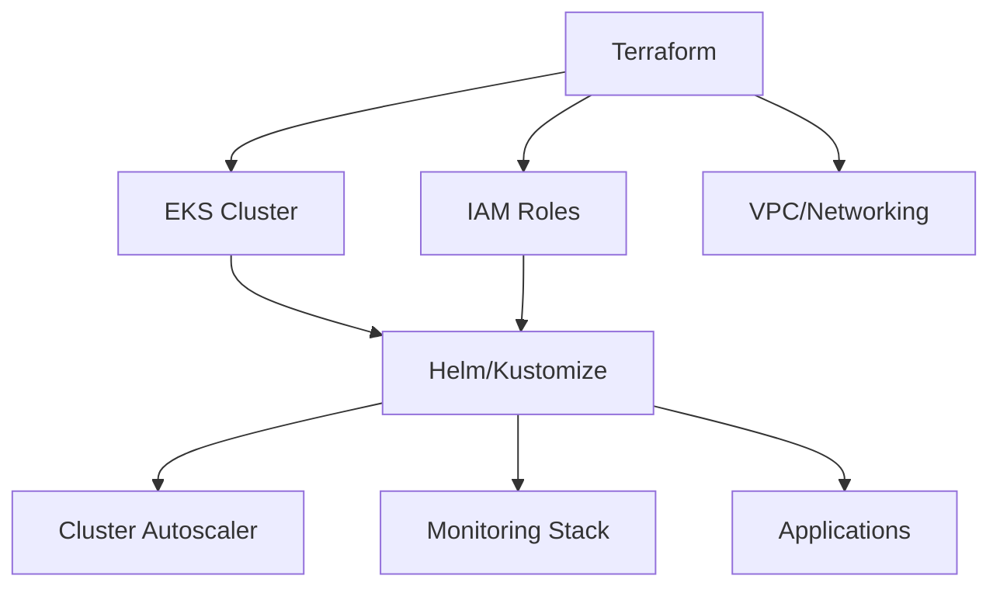

# Helm vs Kustomize 비교 가이드

## 개요

Kubernetes 애플리케이션 배포를 위한 두 가지 주요 도구인 **Helm**과 **Kustomize**를 상세히 비교하여, 프로젝트 요구사항에 맞는 최적의 선택을 할 수 있도록 안내합니다.

## 핵심 철학 차이

### **Helm: 템플릿 기반 패키지 관리**
- **패키지 매니저** 접근 방식
- **Go 템플릿** 엔진 사용
- **Chart** 단위로 애플리케이션 패키징
- **중앙화된 저장소** (Helm Hub, Artifact Hub)

### **Kustomize: 선언적 구성 관리**
- **구성 관리** 접근 방식
- **템플릿 없는** 순수 YAML
- **Base + Overlay** 패턴
- **Git 기반** 분산 관리

## 상세 비교표

| 특징 | Helm | Kustomize |
|------|------|-----------|
| **학습 곡선** | 가파름 (Go 템플릿 학습 필요) | 완만함 (YAML만 알면 됨) |
| **템플릿 엔진** | Go 템플릿 (강력함) | 없음 (순수 YAML) |
| **패키지 관리** | Chart 저장소 지원 | Git 저장소 기반 |
| **버전 관리** | Chart 버전 + App 버전 | Git 태그/브랜치 |
| **의존성 관리** | 자동 (Chart.yaml) | 수동 (Kustomization) |
| **조건부 로직** | 매우 강력 (if/else, range) | 제한적 (조건부 리소스) |
| **변수 처리** | Values 파일 + 템플릿 | Patch + 오버레이 |
| **롤백 지원** | 내장 (helm rollback) | Git 기반 |
| **드라이런** | 지원 (--dry-run) | 지원 (kubectl --dry-run) |
| **커뮤니티** | 대규모 (수천 개 Chart) | 중간 규모 |
| **Kubernetes 통합** | 외부 도구 | 내장 (kubectl -k) |
| **복잡성** | 높음 | 낮음 |
| **유연성** | 매우 높음 | 중간 |
| **재사용성** | 높음 (Chart 공유) | 중간 (Base 공유) |

## 실제 사용 예시 비교

### 1. **간단한 Nginx 배포**

#### **Helm 방식**
```yaml
# Chart.yaml
apiVersion: v2
name: nginx
version: 0.1.0
appVersion: "1.21"

# values.yaml
replicaCount: 1
image:
  repository: nginx
  tag: "1.21"
service:
  type: ClusterIP
  port: 80

# templates/deployment.yaml
apiVersion: apps/v1
kind: Deployment
metadata:
  name: {{ include "nginx.fullname" . }}
spec:
  replicas: {{ .Values.replicaCount }}
  template:
    spec:
      containers:
      - name: nginx
        image: "{{ .Values.image.repository }}:{{ .Values.image.tag }}"
        ports:
        - containerPort: 80

# 배포 명령
helm install my-nginx ./nginx -f values-prod.yaml
```

#### **Kustomize 방식**
```yaml
# base/deployment.yaml
apiVersion: apps/v1
kind: Deployment
metadata:
  name: nginx
spec:
  replicas: 1
  template:
    spec:
      containers:
      - name: nginx
        image: nginx:1.21
        ports:
        - containerPort: 80

# base/kustomization.yaml
resources:
- deployment.yaml
- service.yaml

# overlays/prod/kustomization.yaml
resources:
- ../../base
replicas:
- name: nginx
  count: 3
images:
- name: nginx
  newTag: 1.21.1

# 배포 명령
kubectl apply -k overlays/prod/
```

### 2. **복잡한 조건부 로직**

#### **Helm의 강점**
```yaml
# Helm 템플릿에서 복잡한 조건 처리
{{- if .Values.ingress.enabled }}
{{- if and .Values.ingress.className (not (hasKey .Values.ingress.annotations "kubernetes.io/ingress.class")) }}
  {{- $_ := set .Values.ingress.annotations "kubernetes.io/ingress.class" .Values.ingress.className}}
{{- end }}
{{- if semverCompare ">=1.19-0" .Capabilities.KubeVersion.GitVersion }}
apiVersion: networking.k8s.io/v1
{{- else if semverCompare ">=1.14-0" .Capabilities.KubeVersion.GitVersion }}
apiVersion: networking.k8s.io/v1beta1
{{- else }}
apiVersion: extensions/v1beta1
{{- end }}
kind: Ingress
metadata:
  name: {{ include "app.fullname" . }}
  {{- with .Values.ingress.annotations }}
  annotations:
    {{- toYaml . | nindent 4 }}
  {{- end }}
spec:
  {{- if and .Values.ingress.className (semverCompare ">=1.18-0" .Capabilities.KubeVersion.GitVersion) }}
  ingressClassName: {{ .Values.ingress.className }}
  {{- end }}
{{- end }}
```

#### **Kustomize의 제한**
```yaml
# Kustomize는 복잡한 조건부 로직 처리 어려움
# 대신 여러 오버레이로 분리해야 함

# overlays/ingress-nginx/kustomization.yaml
resources:
- ../../base
patchesStrategicMerge:
- ingress-nginx-patch.yaml

# overlays/ingress-alb/kustomization.yaml
resources:
- ../../base
patchesStrategicMerge:
- ingress-alb-patch.yaml
```

### 3. **환경별 설정 관리**

#### **Helm 방식**
```yaml
# values-dev.yaml
replicaCount: 1
image:
  tag: "dev-latest"
ingress:
  enabled: true
  hosts:
    - host: app-dev.company.com
resources:
  limits:
    memory: "256Mi"

# values-prod.yaml
replicaCount: 3
image:
  tag: "1.2.3"
ingress:
  enabled: true
  hosts:
    - host: app.company.com
  tls:
    - secretName: app-tls
resources:
  limits:
    memory: "512Mi"

# 배포
helm install app-dev ./app -f values-dev.yaml
helm install app-prod ./app -f values-prod.yaml
```

#### **Kustomize 방식**
```yaml
# overlays/dev/kustomization.yaml
resources:
- ../../base
namePrefix: dev-
replicas:
- name: app
  count: 1
images:
- name: app
  newTag: dev-latest
patchesStrategicMerge:
- dev-patch.yaml

# overlays/prod/kustomization.yaml
resources:
- ../../base
namePrefix: prod-
replicas:
- name: app
  count: 3
images:
- name: app
  newTag: 1.2.3
patchesStrategicMerge:
- prod-patch.yaml

# 배포
kubectl apply -k overlays/dev/
kubectl apply -k overlays/prod/
```

## 사용 사례별 권장사항

### **Helm을 선택해야 하는 경우**

#### ✅ **복잡한 애플리케이션**
```yaml
# 예: 마이크로서비스 스택
dependencies:
  - name: postgresql
    version: "12.x.x"
    repository: "https://charts.bitnami.com/bitnami"
    condition: postgresql.enabled
  - name: redis
    version: "17.x.x"
    repository: "https://charts.bitnami.com/bitnami"
    condition: redis.enabled
  - name: elasticsearch
    version: "19.x.x"
    repository: "https://charts.bitnami.com/bitnami"
    condition: elasticsearch.enabled
```

#### ✅ **다양한 배포 옵션**
```yaml
# values.yaml에서 다양한 설정 조합
deployment:
  strategy: RollingUpdate  # 또는 Recreate
  
storage:
  type: persistent  # 또는 emptyDir, hostPath
  size: 10Gi
  
monitoring:
  enabled: true
  prometheus: true
  grafana: true
  
security:
  networkPolicy: true
  podSecurityPolicy: true
  rbac: true
```

#### ✅ **패키지 재사용성**
```bash
# 공개 Chart 활용
helm repo add bitnami https://charts.bitnami.com/bitnami
helm install my-wordpress bitnami/wordpress

# 사내 Chart 저장소
helm repo add company-charts https://charts.company.com
helm install my-app company-charts/microservice
```

### **Kustomize를 선택해야 하는 경우**

#### ✅ **단순한 애플리케이션**
```yaml
# base/kustomization.yaml
resources:
- deployment.yaml
- service.yaml
- configmap.yaml

commonLabels:
  app: simple-web-app
  version: v1.0.0
```

#### ✅ **GitOps 워크플로우**
```yaml
# ArgoCD Application
spec:
  source:
    repoURL: https://github.com/company/k8s-manifests
    path: apps/web-app/overlays/prod
    targetRevision: HEAD
  syncPolicy:
    automated:
      prune: true
      selfHeal: true
```

#### ✅ **Kubernetes 네이티브 접근**
```bash
# kubectl 내장 지원
kubectl apply -k overlays/prod/
kubectl diff -k overlays/prod/
kubectl delete -k overlays/prod/
```

## 성능 및 리소스 사용량 비교

### **Helm**
```yaml
# Helm 릴리스 정보 저장 (Secret)
apiVersion: v1
kind: Secret
metadata:
  name: sh.helm.release.v1.my-app.v1
  namespace: default
type: helm.sh/release.v1
data:
  release: H4sIAAAAAAAC/+xVTW/bMAy...  # 압축된 릴리스 정보

# 메모리 사용량: 중간 (Tiller 제거 후 개선)
# 배포 속도: 중간 (템플릿 렌더링 시간)
```

### **Kustomize**
```yaml
# 추가 메타데이터 없음, 순수 Kubernetes 리소스만 생성
apiVersion: apps/v1
kind: Deployment
metadata:
  name: my-app
  labels:
    app.kubernetes.io/managed-by: kustomize

# 메모리 사용량: 낮음 (클라이언트 사이드 처리)
# 배포 속도: 빠름 (직접 YAML 적용)
```

## 팀 규모별 권장사항

### **소규모 팀 (1-5명)**
- **Kustomize 권장**
- 간단한 학습 곡선
- 빠른 시작 가능
- Git 기반 협업

### **중간 규모 팀 (5-20명)**
- **Helm 또는 Kustomize** (요구사항에 따라)
- 복잡성 vs 단순성 트레이드오프
- 팀 스킬셋 고려

### **대규모 팀 (20명+)**
- **Helm 권장**
- 표준화된 패키지 관리
- 중앙화된 Chart 저장소
- 역할 분리 (Chart 개발자 vs 사용자)

## 마이그레이션 가이드

### **Helm → Kustomize**

#### 1단계: Helm 템플릿 분석
```bash
# 현재 Helm 릴리스의 매니페스트 추출
helm get manifest my-app > current-manifests.yaml

# Values 파일 확인
helm get values my-app > current-values.yaml
```

#### 2단계: Base 리소스 생성
```bash
# 추출된 매니페스트를 Base로 변환
mkdir -p kustomize/base
# 템플릿 변수 제거하고 고정값으로 변경
# {{ .Values.replicaCount }} → 3
```

#### 3단계: Overlay 생성
```yaml
# overlays/prod/kustomization.yaml
resources:
- ../../base

replicas:
- name: my-app
  count: 3

images:
- name: my-app
  newTag: v1.2.3
```

### **Kustomize → Helm**

#### 1단계: Chart 구조 생성
```bash
helm create my-app
rm -rf my-app/templates/*
```

#### 2단계: 템플릿 변환
```yaml
# Kustomize YAML을 Helm 템플릿으로 변환
# 고정값을 템플릿 변수로 변경
replicas: {{ .Values.replicaCount }}
image: "{{ .Values.image.repository }}:{{ .Values.image.tag }}"
```

#### 3단계: Values 파일 생성
```yaml
# values.yaml
replicaCount: 3
image:
  repository: my-app
  tag: v1.2.3
```

## 현재 프로젝트 적용 권장사항

### **Cluster Autoscaler 배포 비교**

#### **현재 Terraform 방식**
```hcl
# 장점: 인프라와 통합 관리
# 단점: Kubernetes 리소스 관리 복잡
resource "kubernetes_deployment" "cluster_autoscaler" {
  # HCL로 Kubernetes 리소스 정의
}
```

#### **Helm 방식으로 전환**
```bash
# 장점: 표준화된 Chart, 쉬운 업그레이드
# 단점: 추가 도구 학습 필요
helm repo add autoscaler https://kubernetes.github.io/autoscaler
helm install cluster-autoscaler autoscaler/cluster-autoscaler \
  --set autoDiscovery.clusterName=my-cluster \
  --set awsRegion=ap-northeast-2
```

#### **Kustomize 방식으로 전환**
```yaml
# 장점: 간단함, GitOps 친화적
# 단점: 표준 Chart 없음, 직접 관리 필요
# overlays/prod/kustomization.yaml
resources:
- ../../base
images:
- name: cluster-autoscaler
  newTag: v1.28.2
```

### **권장 하이브리드 접근**



1. **Terraform**: 인프라 프로비저닝
2. **Helm**: 복잡한 시스템 컴포넌트 (Prometheus, Grafana)
3. **Kustomize**: 애플리케이션 배포

## 결론 및 선택 가이드

### **Helm을 선택하세요 - 다음 경우에**
- ✅ 복잡한 애플리케이션 스택
- ✅ 다양한 환경 설정 필요
- ✅ 패키지 재사용성 중요
- ✅ 커뮤니티 Chart 활용
- ✅ 강력한 템플릿 기능 필요
- ✅ 롤백 기능 중요

### **Kustomize를 선택하세요 - 다음 경우에**
- ✅ 단순한 애플리케이션
- ✅ GitOps 워크플로우 사용
- ✅ Kubernetes 네이티브 접근 선호
- ✅ 빠른 학습 곡선 필요
- ✅ 템플릿 복잡성 회피
- ✅ 순수 YAML 선호

### **하이브리드 접근을 고려하세요**
- 🔄 인프라: Terraform
- 🔄 시스템 컴포넌트: Helm
- 🔄 애플리케이션: Kustomize
- 🔄 GitOps: ArgoCD/Flux

### **최종 권장사항**

| 프로젝트 특성 | 권장 도구 | 이유 |
|--------------|----------|------|
| **스타트업/소규모** | Kustomize | 빠른 시작, 간단함 |
| **엔터프라이즈** | Helm | 표준화, 거버넌스 |
| **마이크로서비스** | Helm | 복잡한 의존성 관리 |
| **단순 웹앱** | Kustomize | 오버엔지니어링 방지 |
| **GitOps 중심** | Kustomize | Git 네이티브 |
| **패키지 재사용** | Helm | Chart 생태계 |

---

**작성일**: 2025-07-25  
**버전**: 1.0  
**작성자**: CGLee
