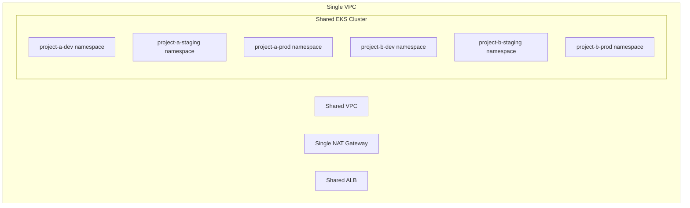
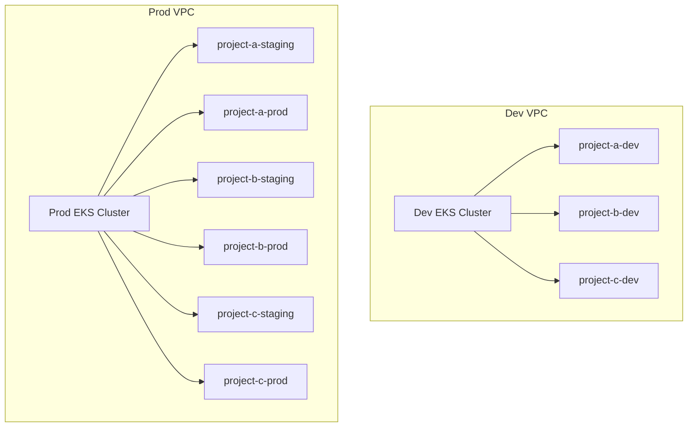
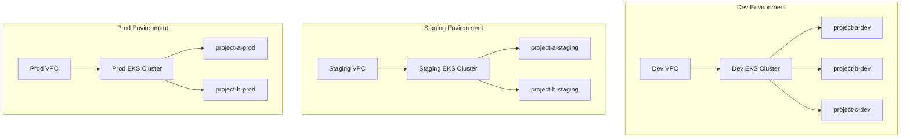
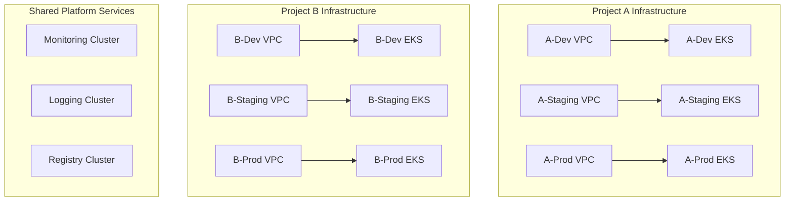

# 멀티 프로젝트 환경별 아키텍처 가이드

## 개요

조직의 성장 단계와 프로젝트 수에 따른 최적의 인프라 아키텍처를 제시합니다. 비용, 복잡도, 보안, 관리 편의성을 종합적으로 고려한 단계별 접근법을 설명합니다.

---

## 📈 성장 단계별 아키텍처

### 🌱 **Phase 1: 스타트업 (1-2개 프로젝트)**

#### 아키텍처: **단일 클러스터 + 네임스페이스 분리**



#### 특징
- **비용**: 최소 (~$200-300/월)
- **관리 복잡도**: 낮음
- **보안 수준**: 기본
- **확장성**: 제한적

#### 구현 구조
```
platform/aws/ap-northeast-2/terraform-codes/
└── environments/
    └── shared/
        ├── vpc.tf
        ├── eks.tf
        └── terraform.tfvars
```

#### 네임스페이스 전략
```yaml
# 네임스페이스 구조
project-a-dev
project-a-staging  
project-a-prod
project-b-dev
project-b-staging
project-b-prod
shared-monitoring
shared-logging
```

#### 장점
- ✅ 최소 비용으로 시작 가능
- ✅ 단순한 관리 구조
- ✅ 빠른 MVP 구축
- ✅ 리소스 효율적 활용

#### 단점
- ⚠️ 환경간 완전 격리 불가
- ⚠️ 리소스 경합 가능성
- ⚠️ 보안 위험도 증가
- ⚠️ 확장성 제한

---

### 🌿 **Phase 2: 성장기 (3-5개 프로젝트) - 하이브리드 접근법**

#### 아키텍처: **환경별 분리 + 프로젝트 공유**



#### 특징
- **비용**: 중간 (~$400-600/월)
- **관리 복잡도**: 중간
- **보안 수준**: 좋음
- **확장성**: 좋음

#### 구현 구조
```
platform/aws/ap-northeast-2/terraform-codes/
└── environments/
    ├── dev/
    │   ├── vpc.tf
    │   ├── eks.tf
    │   └── terraform.tfvars
    └── prod-shared/
        ├── vpc.tf
        ├── eks.tf
        └── terraform.tfvars
```

#### 네임스페이스 전략
```yaml
# Dev 클러스터
project-a-dev
project-b-dev
project-c-dev
monitoring-dev
logging-dev

# Prod 클러스터  
project-a-staging
project-a-prod
project-b-staging
project-b-prod
project-c-staging
project-c-prod
monitoring-prod
logging-prod
```

#### 장점
- ✅ 개발 환경 완전 격리
- ✅ 운영 환경 안정성
- ✅ 비용 효율성 유지
- ✅ 단계적 확장 가능

#### 단점
- ⚠️ 운영 클러스터 장애 시 영향 큼
- ⚠️ 프로젝트간 리소스 경합

---

### 🌳 **Phase 3: 스케일업 (6-10개 프로젝트)**

#### 아키텍처: **환경별 완전 분리**



#### 특징
- **비용**: 높음 (~$800-1200/월)
- **관리 복잡도**: 높음
- **보안 수준**: 매우 좋음
- **확장성**: 매우 좋음

#### 구현 구조
```
platform/aws/ap-northeast-2/terraform-codes/
└── environments/
    ├── dev/
    │   ├── vpc.tf
    │   ├── eks.tf
    │   └── terraform.tfvars
    ├── staging/
    │   ├── vpc.tf
    │   ├── eks.tf
    │   └── terraform.tfvars
    └── prod/
        ├── vpc.tf
        ├── eks.tf
        └── terraform.tfvars
```

#### 장점
- ✅ 환경별 완전 격리
- ✅ 최고 수준 보안
- ✅ 독립적 확장 가능
- ✅ 장애 격리

#### 단점
- ⚠️ 높은 인프라 비용
- ⚠️ 복잡한 관리 구조
- ⚠️ 운영 오버헤드 증가

---

### 🏢 **Phase 4: 엔터프라이즈 (10+ 프로젝트)**

#### 아키텍처: **프로젝트별 클러스터 분리**



#### 특징
- **비용**: 매우 높음 ($2000+/월)
- **관리 복잡도**: 매우 높음
- **보안 수준**: 최고
- **확장성**: 무제한

#### 구현 구조
```
platform/aws/ap-northeast-2/terraform-codes/
├── projects/
│   ├── project-a/
│   │   ├── dev/
│   │   ├── staging/
│   │   └── prod/
│   ├── project-b/
│   │   ├── dev/
│   │   ├── staging/
│   │   └── prod/
└── shared-services/
    ├── monitoring/
    ├── logging/
    └── registry/
```

#### 장점
- ✅ 완전한 프로젝트 격리
- ✅ 독립적 예산 관리
- ✅ 최고 수준 보안
- ✅ 무제한 확장성

#### 단점
- ⚠️ 매우 높은 비용
- ⚠️ 복잡한 운영
- ⚠️ 전문 인력 필요

---

## 🎯 단계별 전환 전략

### **Phase 1 → Phase 2 전환 시점**
- 프로젝트 수: 3개 이상
- 팀 수: 5개 이상
- 보안 요구사항 증가
- 개발 환경 안정성 필요

### **Phase 2 → Phase 3 전환 시점**
- 프로젝트 수: 6개 이상
- 팀 수: 10개 이상
- 규정 준수 요구사항
- 운영 환경 격리 필요

### **Phase 3 → Phase 4 전환 시점**
- 프로젝트 수: 10개 이상
- 대규모 조직 (100명+)
- 엄격한 보안 요구사항
- 독립적 예산 관리 필요

---

## 💰 비용 분석

### 월간 예상 비용 (최소 구성 기준)

| Phase | 프로젝트 수 | EKS 클러스터 | 월 예상 비용 | 프로젝트당 비용 |
|-------|-------------|-------------|-------------|----------------|
| **Phase 1** | 1-2개 | 1개 | $200-300 | $150/프로젝트 |
| **Phase 2** | 3-5개 | 2개 | $400-600 | $120/프로젝트 |
| **Phase 3** | 6-10개 | 3개 | $800-1200 | $133/프로젝트 |
| **Phase 4** | 10+개 | 프로젝트별 | $2000+ | $200+/프로젝트 |

### 비용 구성 요소
- **EKS 제어 평면**: $73/월/클러스터
- **워커 노드**: $50-200/월/노드
- **네트워킹**: $20-50/월/VPC
- **스토리지**: $10-100/월
- **데이터 전송**: $10-50/월

---

## 🛡️ 보안 고려사항

### Phase별 보안 수준

| 보안 요소 | Phase 1 | Phase 2 | Phase 3 | Phase 4 |
|-----------|---------|---------|---------|---------|
| **네트워크 격리** | 네임스페이스 | VPC 분리 | 완전 분리 | 완전 분리 |
| **IAM 분리** | 기본 | 환경별 | 완전 분리 | 프로젝트별 |
| **Secret 관리** | K8s Secret | External Secrets | HSM | 전용 HSM |
| **네트워크 정책** | 기본 | 환경별 | 엄격한 정책 | 최고 수준 |
| **감사 로깅** | 기본 | 중앙화 | 완전 감사 | 규정 준수 |

---

## 📊 성능 고려사항

### 리소스 할당 전략

#### Phase 1: 공유 리소스
```yaml
resources:
  requests:
    cpu: 100m
    memory: 128Mi
  limits:
    cpu: 500m
    memory: 512Mi
```

#### Phase 2: 환경별 리소스
```yaml
# Dev 환경
resources:
  requests:
    cpu: 50m
    memory: 64Mi
  limits:
    cpu: 200m
    memory: 256Mi

# Prod 환경
resources:
  requests:
    cpu: 200m
    memory: 256Mi
  limits:
    cpu: 1000m
    memory: 1Gi
```

#### Phase 3+: 전용 리소스
```yaml
# 프로덕션 워크로드
resources:
  requests:
    cpu: 500m
    memory: 512Mi
  limits:
    cpu: 2000m
    memory: 2Gi
```

---

## 🔧 구현 로드맵

### 현재 프로젝트 권장: **Phase 2 (하이브리드 접근법)**

#### 1단계: 현재 dev 환경 안정화
```bash
# 현재 dev 환경 테스트 및 최적화
cd platform/aws/ap-northeast-2/terraform-codes/environments/dev
terraform plan
terraform apply
```

#### 2단계: prod-shared 환경 구축
```bash
# 새로운 prod-shared 환경 생성
mkdir -p platform/aws/ap-northeast-2/terraform-codes/environments/prod-shared
# Terraform 코드 작성
```

#### 3단계: ArgoCD 환경별 설정
```bash
# staging, prod 브랜치별 ArgoCD 설정
# 네임스페이스 분리 구현
```

#### 4단계: 모니터링 및 최적화
```bash
# 성능 모니터링
# 비용 최적화
# 보안 강화
```

---

## 📈 확장 계획

### 단기 목표 (3개월)
- [ ] Phase 2 하이브리드 아키텍처 구현
- [ ] dev, staging, prod 환경 분리
- [ ] 기본 모니터링 설정

### 중기 목표 (6개월)
- [ ] 프로젝트 수 증가에 따른 네임스페이스 확장
- [ ] 고급 보안 정책 적용
- [ ] 성능 최적화

### 장기 목표 (12개월)
- [ ] Phase 3 전환 검토
- [ ] 멀티 리전 확장
- [ ] 완전 자동화 구현

---

## 🎯 결론

**현재 프로젝트에는 Phase 2 (하이브리드 접근법)을 강력히 권장합니다.**

### 선택 이유
1. **비용 효율성**: 완전 분리 대비 50% 비용 절약
2. **적절한 격리**: 개발과 운영 환경 분리
3. **확장성**: 향후 Phase 3로 자연스러운 전환
4. **학습 곡선**: 관리 가능한 복잡도
5. **현실적**: 현재 팀 규모에 적합

