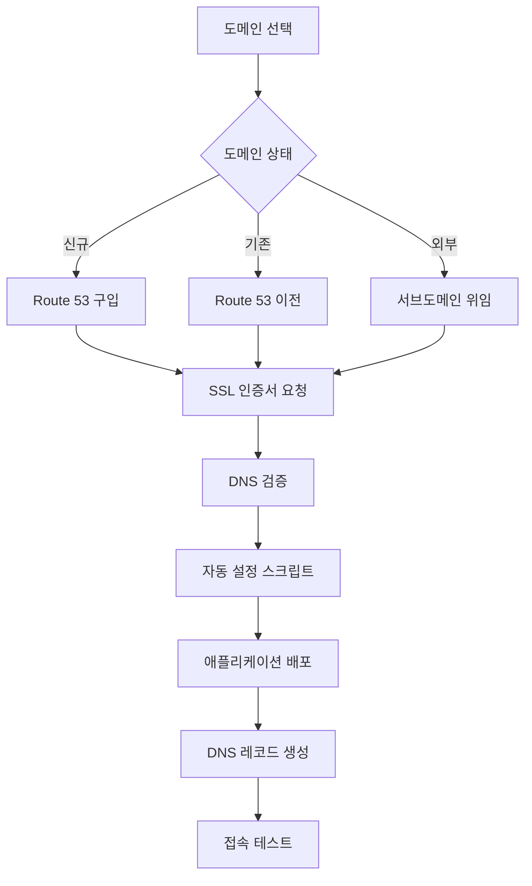

# 🌐 AWS 도메인 설정 가이드

GitOps 플랫폼에서 사용할 도메인을 설정하는 완전한 가이드입니다.

## 📋 **개요**

AWS에서 도메인을 설정하는 방법은 3가지가 있습니다:

| 방법 | 설명 | 권장도 | 비용 |
|------|------|--------|------|
| **옵션 1** | Route 53으로 새 도메인 구입 | ⭐⭐⭐ | $12-50/년 |
| **옵션 2** | 기존 도메인을 Route 53으로 이전 | ⭐⭐ | 무료 (이전비용 없음) |
| **옵션 3** | 외부 도메인 + Route 53 DNS | ⭐ | $0.50/월 |

## 🛒 **옵션 1: Route 53으로 새 도메인 구입 (권장)**

### **1단계: 도메인 구입**

```bash
# AWS CLI로 도메인 검색
aws route53domains check-domain-availability --domain-name myproject.com --region us-east-1

# 도메인 구입 (예시)
aws route53domains register-domain \
  --domain-name myproject.com \
  --duration-in-years 1 \
  --admin-contact file://contact-info.json \
  --registrant-contact file://contact-info.json \
  --tech-contact file://contact-info.json \
  --region us-east-1
```

### **2단계: SSL 인증서 발급**

```bash
# ACM에서 SSL 인증서 요청
aws acm request-certificate \
  --domain-name myproject.com \
  --subject-alternative-names "*.myproject.com" \
  --validation-method DNS \
  --region ap-northeast-2

# 인증서 ARN 확인
aws acm list-certificates --region ap-northeast-2
```

### **3단계: DNS 검증 완료**

ACM 콘솔에서 DNS 검증 레코드를 Route 53에 추가하거나 자동으로 설정합니다.

## 🔄 **옵션 2: 기존 도메인을 Route 53으로 이전**

### **1단계: 호스팅 영역 생성**

```bash
# Route 53 호스팅 영역 생성
aws route53 create-hosted-zone \
  --name myexistingdomain.com \
  --caller-reference $(date +%s)
```

### **2단계: 네임서버 변경**

```bash
# 네임서버 정보 확인
aws route53 get-hosted-zone --id /hostedzone/Z123456789 \
  --query 'DelegationSet.NameServers'
```

기존 도메인 등록기관에서 네임서버를 Route 53 네임서버로 변경합니다.

### **3단계: SSL 인증서 발급**

옵션 1의 2단계와 동일합니다.

## 🌐 **옵션 3: 외부 도메인 + Route 53 DNS**

### **1단계: 서브도메인용 호스팅 영역 생성**

```bash
# dev 서브도메인용 호스팅 영역 생성
aws route53 create-hosted-zone \
  --name dev.myexternaldomain.com \
  --caller-reference $(date +%s)
```

### **2단계: 외부 DNS에 NS 레코드 추가**

외부 도메인 관리 패널에서 `dev.myexternaldomain.com`을 Route 53 네임서버로 위임합니다.

## 🔧 **자동 설정 스크립트 사용**

도메인과 SSL 인증서가 준비되면 자동 설정 스크립트를 사용할 수 있습니다:

```bash
# 스크립트 실행 권한 부여
chmod +x docs/AWS_Domain_Setup.md

# 도메인 설정 적용
./docs/AWS_Domain_Setup.md myproject.com arn:aws:acm:ap-northeast-2:123456789:certificate/abcd-1234
```

## 📋 **단계별 진행 순서**

### **전체 플로우**



### **1. 도메인 준비**

```bash
# 도메인 구입 또는 설정 완료 후
echo "도메인: myproject.com"
echo "SSL 인증서 ARN: arn:aws:acm:ap-northeast-2:123456789:certificate/abcd-1234"
```

### **2. GitOps 설정 업데이트**

```bash
# 자동 설정 스크립트 실행
./docs/AWS_Domain_Setup.md myproject.com arn:aws:acm:ap-northeast-2:123456789:certificate/abcd-1234
```

### **3. 애플리케이션 배포**

```bash
# EKS 클러스터 배포 (아직 안했다면)
cd platform/aws/ap-northeast-2/terraform-codes
./scripts/deploy.sh

# ArgoCD 설치
cd ../../../../management/argo-cd
./scripts/setup.sh

# 애플리케이션 배포
kubectl apply -f applications/projects/dev-apps.yaml
```

### **4. DNS 레코드 생성**

```bash
# ALB가 생성될 때까지 대기 (2-3분)
kubectl get ingress -n bubblepool-dev -w

# DNS 레코드 자동 생성
./scripts/setup-dns.sh
```

### **5. 접속 확인**

```bash
# SSL 인증서 확인
curl -I https://bubblepool-dev.myproject.com
curl -I https://guestbook-dev.myproject.com

# 브라우저에서 접속
echo "BubblePool: https://bubblepool-dev.myproject.com"
echo "GuestBook: https://guestbook-dev.myproject.com"
```

## 🔍 **문제 해결**

### **일반적인 문제들**

#### **1. SSL 인증서 검증 실패**
```bash
# 인증서 상태 확인
aws acm describe-certificate --certificate-arn arn:aws:acm:ap-northeast-2:123:certificate/abc --region ap-northeast-2

# DNS 검증 레코드 확인
aws route53 list-resource-record-sets --hosted-zone-id Z123456789
```

#### **2. DNS 전파 지연**
```bash
# DNS 전파 확인
nslookup bubblepool-dev.myproject.com
dig bubblepool-dev.myproject.com

# 전파 대기 (최대 48시간, 보통 10분)
```

#### **3. ALB 생성 실패**
```bash
# ALB Controller 로그 확인
kubectl logs -n kube-system -l app.kubernetes.io/name=aws-load-balancer-controller

# Ingress 상태 확인
kubectl describe ingress bubblepool-ingress -n bubblepool-dev
```

#### **4. 권한 오류**
```bash
# AWS 자격증명 확인
aws sts get-caller-identity

# Route 53 권한 확인
aws route53 list-hosted-zones
```

## 💰 **비용 예상**

### **Route 53 비용**
- **호스팅 영역**: $0.50/월
- **DNS 쿼리**: $0.40/백만 쿼리 (처음 10억 쿼리)
- **도메인 등록**: $12-50/년 (도메인에 따라 다름)

### **ACM SSL 인증서**
- **공인 인증서**: **무료** (AWS 리소스와 함께 사용시)

### **ALB 비용**
- **ALB**: $16.43/월 (항상 실행)
- **LCU**: $5.84/월 (낮은 트래픽 기준)

### **총 예상 비용**
- **월간**: 약 $23-25
- **연간**: 약 $290-320 (도메인 갱신 포함)

## 📚 **참고 자료**

### **AWS 문서**
- [Route 53 개발자 가이드](https://docs.aws.amazon.com/route53/)
- [ACM 사용자 가이드](https://docs.aws.amazon.com/acm/)
- [ALB Controller 가이드](https://kubernetes-sigs.github.io/aws-load-balancer-controller/)

### **유용한 명령어**

```bash
# Route 53 호스팅 영역 목록
aws route53 list-hosted-zones

# SSL 인증서 목록
aws acm list-certificates --region ap-northeast-2

# 도메인 등록 상태 확인
aws route53domains get-domain-detail --domain-name myproject.com --region us-east-1

# DNS 레코드 확인
aws route53 list-resource-record-sets --hosted-zone-id Z123456789
```

## 🎯 **다음 단계**

도메인 설정이 완료되면:

1. **모니터링 설정**: Prometheus, Grafana 대시보드
2. **보안 강화**: WAF, Security Groups 추가
3. **성능 최적화**: CloudFront CDN 설정
4. **백업 전략**: Route 53 설정 백업
5. **멀티 환경**: staging, prod 환경 확장

---

**💡 팁: 처음 설정할 때는 옵션 1 (Route 53 신규 도메인)을 권장합니다. 설정이 가장 간단하고 AWS 서비스 간 통합이 매끄럽습니다.** 