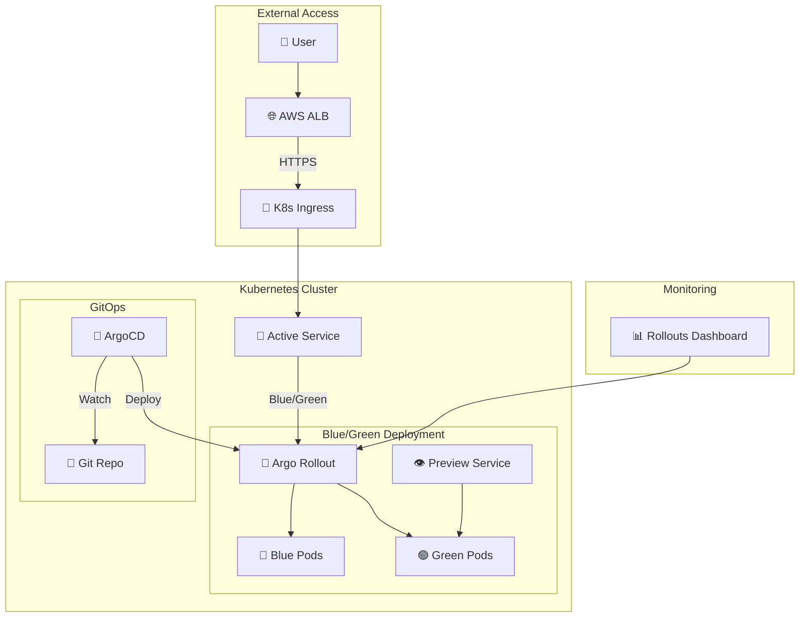

# 🫧 BubblePool Application

**Argo Rollouts Blue/Green 배포 기반 Cloud-Native 애플리케이션**


## 📋 **개요**

BubblePool은 Argo Rollouts를 활용한 고급 배포 전략(Blue/Green, Canary)을 구현한 데모 애플리케이션입니다. 

### **🎯 주요 특징**
- **✅ Argo Rollouts**: Blue/Green 배포 전략
- **🔄 GitOps**: ArgoCD 연동 자동 배포
- **🌐 HTTPS**: AWS ACM 인증서 기반 보안 통신
- **📊 모니터링**: 배포 상태 실시간 추적
- **🚀 무중단 배포**: 트래픽 손실 없는 업데이트

---

## 🏗️ **아키텍처**



---

## 🚀 **빠른 시작**

### **1. 전체 배포 (한번에 적용)**

```bash
# 1. 개발 환경 배포
kubectl apply -k service/bubblepool/k8s/overlays/dev

# 2. 배포 상태 확인
kubectl argo rollouts get rollout bubblepool-rollout -n bubblepool-dev

# 3. 웹 대시보드 접속
open https://rollouts-dev.barodream.com/rollouts/
```

### **2. Blue/Green 배포 테스트**

```bash
# 새 버전 배포 (이미지 변경)
kubectl argo rollouts set image bubblepool-rollout \
  -n bubblepool-dev \
  bubblepool=nginx:1.23-alpine

# 배포 진행 상황 실시간 확인
kubectl argo rollouts get rollout bubblepool-rollout \
  -n bubblepool-dev --watch

# 수동 프로모션 (Blue → Green 전환)
kubectl argo rollouts promote bubblepool-rollout \
  -n bubblepool-dev
```

---

## 📁 **프로젝트 구조**

```
service/bubblepool/
├── README.md                          # 📖 이 문서
├── src/                               # 🔧 소스코드 (향후 확장)
└── k8s/                               # ☸️ Kubernetes 매니페스트
    ├── base/                          # 📦 기본 리소스
    │   ├── rollout.yaml               # 🎯 Argo Rollout 정의
    │   ├── service.yaml               # 🔄 Active Service
    │   ├── service-preview.yaml       # 👁️ Preview Service
    │   ├── analysis-template.yaml     # 📊 분석 템플릿 (옵션)
    │   └── kustomization.yaml         # 📋 Base 설정
    └── overlays/                      # 🌍 환경별 설정
        └── dev/                       # 🔧 개발 환경
            ├── namespace.yaml         # 📂 네임스페이스
            ├── ingress.yaml           # 🌐 HTTPS 인그레스
            ├── rollout-patch.yaml     # 🔧 Dev 환경 패치
            └── kustomization.yaml     # 📋 Dev 설정
```

---

## ⚙️ **설정 상세**

### **🎯 Rollout 전략 (Blue/Green)**

```yaml
# Blue/Green 배포 설정
strategy:
  blueGreen:
    activeService: bubblepool         # 활성 트래픽
    previewService: bubblepool-preview # 미리보기 서비스
    autoPromotionEnabled: false       # 수동 승인
    scaleDownDelaySeconds: 30         # 정리 지연 시간
```

### **🌐 도메인 및 SSL**

| 환경 | 도메인 | 용도 | SSL |
|------|--------|------|-----|
| **Dev** | `bubblepool-dev.barodream.com` | 활성 서비스 | ✅ AWS ACM |
| **Preview** | 내부 서비스 | Blue/Green 테스트 | ✅ 클러스터 내 |

### **📊 모니터링 대시보드**

- **URL**: https://rollouts-dev.barodream.com/rollouts/
- **네임스페이스**: `bubblepool-dev`
- **Rollout**: `bubblepool-rollout`

---

## 🔧 **운영 가이드**

### **💻 주요 명령어**

```bash
# 📊 상태 확인
kubectl argo rollouts get rollout bubblepool-rollout -n bubblepool-dev
kubectl argo rollouts list rollouts -n bubblepool-dev

# 🚀 배포 관리
kubectl argo rollouts set image bubblepool-rollout -n bubblepool-dev bubblepool=<new-image>
kubectl argo rollouts promote bubblepool-rollout -n bubblepool-dev  # 승인
kubectl argo rollouts abort bubblepool-rollout -n bubblepool-dev    # 중단
kubectl argo rollouts retry bubblepool-rollout -n bubblepool-dev    # 재시도

# 🔍 히스토리 확인
kubectl argo rollouts history rollout bubblepool-rollout -n bubblepool-dev
kubectl argo rollouts undo bubblepool-rollout -n bubblepool-dev     # 롤백
```

### **🐛 트러블슈팅**

<details>
<summary><strong>🔧 일반적인 문제 해결</strong></summary>

#### **1. Rollout이 Degraded 상태**
```bash
# 원인 확인
kubectl describe rollout bubblepool-rollout -n bubblepool-dev

# Service selector 문제인 경우
kubectl get service bubblepool -n bubblepool-dev -o yaml | grep selector -A 5
```

#### **2. 이미지 Pull 실패**
```bash
# Pod 상태 확인
kubectl get pods -n bubblepool-dev
kubectl describe pod <pod-name> -n bubblepool-dev
```

#### **3. 인그레스 접속 불가**
```bash
# ALB 상태 확인
kubectl get ingress -n bubblepool-dev
kubectl describe ingress bubblepool-ingress -n bubblepool-dev

# DNS 확인
nslookup bubblepool-dev.barodream.com
```

</details>

---

## 🎮 **배포 시나리오 예제**

### **🟢 시나리오 1: 정상 Blue/Green 배포**

```bash
# 1. 현재 상태 확인
kubectl argo rollouts get rollout bubblepool-rollout -n bubblepool-dev

# 2. 새 버전 배포
kubectl argo rollouts set image bubblepool-rollout \
  -n bubblepool-dev \
  bubblepool=nginx:1.23-alpine

# 3. Preview 서비스에서 테스트
kubectl port-forward svc/bubblepool-preview -n bubblepool-dev 8080:80
# http://localhost:8080 접속하여 테스트

# 4. 테스트 통과 시 승인
kubectl argo rollouts promote bubblepool-rollout -n bubblepool-dev

# 5. 결과 확인
kubectl argo rollouts get rollout bubblepool-rollout -n bubblepool-dev
```

### **🔴 시나리오 2: 문제 발생 시 롤백**

```bash
# 1. 문제가 있는 배포 중단
kubectl argo rollouts abort bubblepool-rollout -n bubblepool-dev

# 2. 이전 버전으로 롤백
kubectl argo rollouts undo rollout bubblepool-rollout -n bubblepool-dev

# 3. 상태 확인
kubectl argo rollouts get rollout bubblepool-rollout -n bubblepool-dev
```

---

## 🔗 **관련 리소스**

| 리소스 | 링크 | 설명 |
|--------|------|------|
| **Argo Rollouts** | [공식 문서](https://argoproj.github.io/argo-rollouts/) | 고급 배포 전략 |
| **Kustomize** | [공식 문서](https://kustomize.io/) | Kubernetes 설정 관리 |
| **ArgoCD** | [프로젝트 페이지](../../../management/argo-cd/) | GitOps 플랫폼 |
| **Rollouts Dashboard** | https://rollouts-dev.barodream.com | 배포 모니터링 |

---

## 📈 **확장 계획**

### **🎯 단기 계획**
- [ ] **Canary 배포** 전략 추가
- [ ] **메트릭 기반 자동 승인** (Prometheus 연동)
- [ ] **알림 시스템** (Slack/Discord)

### **🚀 장기 계획**
- [ ] **멀티 클러스터** 배포
- [ ] **A/B 테스트** 프레임워크
- [ ] **성능 테스트** 자동화

---

## 👥 **기여하기**

1. **Fork** 이 저장소
2. **Feature branch** 생성 (`git checkout -b feature/amazing-feature`)
3. **변경사항 커밋** (`git commit -m 'Add some amazing feature'`)
4. **브랜치에 Push** (`git push origin feature/amazing-feature`)
5. **Pull Request** 생성

---

## 📄 **라이센스**

이 프로젝트는 **MIT 라이센스** 하에 배포됩니다. 자세한 내용은 `LICENSE` 파일을 참조하세요.

---

## 📞 **지원**

- **📧 이메일**: [admin@barodream.com](mailto:admin@barodream.com)
- **💬 슬랙**: `#devops-support`
- **📋 이슈**: [GitHub Issues](https://github.com/chulgil/terraform/issues)

---

<div align="center">

**🚀 Made with ❤️ using Argo Rollouts & Kubernetes**

[](https://argoproj.github.io/argo-rollouts/)
[](https://kubernetes.io/)
[](https://www.gitops.tech/)

</div> 