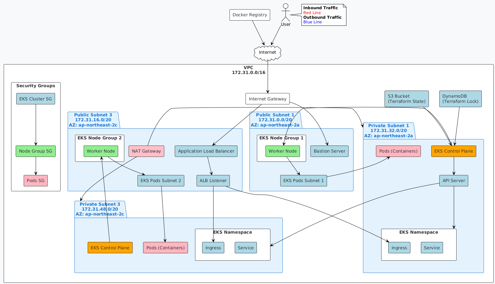

# AWS EKS 개발 환경 (Dev Environment) 

이 문서는 Terraform으로 구축된 AWS EKS 개발 환경의 구조, 구성 요소 및 유지보수 가이드를 제공합니다.

## 프로젝트 구조

```
environments/dev/
├── backend.tf        # Terraform 원격 상태 저장소 설정
├── main.tf           # 주요 리소스 모듈 호출
├── outputs.tf        # 출력값 정의
├── variables.tf      # 변수 정의
└── versions.tf       # 프로바이더 설정
```

## 인프라 아키텍처



### 주요 구성요소

1. **VPC**
   - CIDR: `10.0.0.0/16`
   - DNS 지원: 활성화
   - DNS 호스트명: 활성화

2. **서브넷**
   - **퍼블릭 서브넷 (2개)**
     - `10.0.1.0/24` (ap-northeast-2a)
     - `10.0.2.0/24` (ap-northeast-2b)
   - **프라이빗 서브넷 (3개)**
     - `10.0.4.0/24` (ap-northeast-2a)
     - `10.0.5.0/24` (ap-northeast-2b)
     - `10.0.6.0/24` (ap-northeast-2c)

3. **인터넷 게이트웨이 (IGW)**
   - 퍼블릭 서브넷에 연결되어 인터넷 접근 제공

4. **NAT 게이트웨이**
   - 각 퍼블릭 서브넷에 배치
   - 프라이빗 서브넷의 인스턴스가 인터넷에 접근할 수 있도록 지원

5. **Bastion 호스트**
   - 퍼블릭 서브넷에 배치
   - SSH 접속(포트 22)만 허용
   - Amazon Linux 2023 AMI 사용

6. **EKS 클러스터**
   - Kubernetes 버전: 1.33
   - 컨트롤 플레인: 프라이빗 서브넷에 배치
   - 노드 그룹: 
     - 인스턴스 타입: t3.medium
     - 노드 수: 최소 1, 최대 3, 희망 2
     - AMI 타입: AL2023_x86_64_STANDARD

7. **ALB Controller**
   - 애플리케이션 로드 밸런서와 인그레스 관리

8. **Certificate Manager**
   - SSL/TLS 인증서 관리

## 모듈 구성

### VPC 모듈

VPC, 서브넷, 라우팅 테이블, IGW, NAT 게이트웨이 등의 네트워크 리소스를 생성합니다.

```hcl
module "vpc" {
  source = "../../modules/vpc"
  
  environment = var.environment
  vpc_cidr = var.vpc_cidr
  public_subnet_cidrs = var.public_subnet_cidrs
  private_subnet_cidrs = var.private_subnet_cidrs
  region = var.region
  
  common_tags = local.common_tags
}
```

### IAM 모듈

AWS 리소스 접근을 위한 IAM 역할과 정책을 생성합니다.

```hcl
module "iam" {
  source = "../../modules/iam"

  environment = var.environment
  common_tags = local.common_tags
}
```

### EKS 모듈

EKS 클러스터, 노드 그룹, 클러스터 역할 등을 생성합니다.

```hcl
module "eks" {
  source = "../../modules/eks"

  environment = var.environment
  cluster_name = "${var.environment}-eks-cluster"
  subnet_ids = concat(module.vpc.public_subnet_ids, module.vpc.private_subnet_ids)
  private_subnet_ids = module.vpc.private_subnet_ids
  
  kubernetes_version = var.kubernetes_version
  instance_types = var.instance_types
  ami_type = var.ami_type
  
  desired_size = var.desired_size
  max_size = var.max_size
  min_size = var.min_size
  
  region = var.region
  service_ipv4_cidr = var.service_ipv4_cidr
  vpc_id = module.vpc.vpc_id
  
  common_tags = local.common_tags
  tags = merge(
    local.common_tags,
    {
      "kubernetes.io-cluster-${var.environment}-eks-cluster" = "shared"
    }
  )
}
```

### Bastion 모듈

SSH 접속을 위한 Bastion 호스트를 생성합니다.

```hcl
module "bastion" {
  source = "../../modules/bastion"

  environment = var.environment
  vpc_id = module.vpc.vpc_id
  public_subnet_ids = module.vpc.public_subnet_ids
  instance_type = var.bastion_instance_type
  key_name = var.bastion_key_name
  common_tags = local.common_tags
  
  depends_on = [module.vpc]
}
```

### ALB Controller 모듈

인그레스 컨트롤러와 관련 IAM 역할을 구성합니다.

```hcl
module "alb_controller" {
  source = "../../modules/alb-controller"

  cluster_name = module.eks.cluster_name
  oidc_provider_arn = module.eks.oidc_provider_arn
  vpc_id = module.vpc.vpc_id
  region = var.region
  common_tags = local.common_tags
  
  depends_on = [
    module.eks,
    module.vpc
  ]
}
```

## 유지보수 가이드

### 사전 준비사항

1. AWS CLI 설치 및 구성
2. Terraform 설치 (v1.0.0 이상)
3. kubectl 설치
4. AWS 계정 및 적절한 권한

### 초기 설정

```bash
# 프로젝트 디렉토리로 이동
cd /Users/r00360/Dev/devops/terraform/terraform-codes/environments/dev

# Terraform 초기화
terraform init
```

### 인프라 배포

```bash
# 인프라 변경사항 계획 확인
terraform plan

# 인프라 배포
terraform apply
```

### 단계별 배포 (권장)

노드 그룹 생성 실패 등의 문제를 피하기 위해 단계별 배포를 권장합니다:

```bash
# 1단계: EKS 클러스터 배포
terraform apply -target=module.eks

# 2단계: 나머지 리소스 배포
terraform apply
```

### kubeconfig 설정

```bash
aws eks update-kubeconfig --region ap-northeast-2 --name dev-eks-cluster
```

### 리소스 삭제

```bash
# 전체 인프라 삭제
terraform destroy

# 특정 리소스만 삭제
terraform destroy -target=module.alb_controller
```

### 변수 수정

환경 설정을 변경하려면 `variables.tf` 파일의 기본값을 수정하거나 다음과 같이 변수를 전달하세요:

```bash
terraform apply -var="desired_size=3" -var="max_size=5"
```

또는 `terraform.tfvars` 파일을 생성하여 변수를 설정할 수 있습니다:

```
# terraform.tfvars 예시
desired_size = 3
max_size = 5
```

### 새로운 리소스 추가

새 모듈이나 리소스를 추가하려면:

1. 적절한 모듈 생성 또는 기존 모듈 수정
2. `main.tf`에 모듈 호출 추가
3. 필요한 변수를 `variables.tf`에 추가
4. 필요한 출력값을 `outputs.tf`에 추가

### 문제 해결

1. **EKS 노드 그룹 생성 실패**
   - CloudWatch 로그 확인: `/aws/eks/dev-eks-cluster/cluster`
   - IAM 역할 및 정책 확인
   - 서브넷 및 보안 그룹 설정 확인

2. **리소스가 이미 존재한다는 오류**
   - 수동으로 리소스 삭제 또는 Terraform 상태로 가져오기:
     ```bash
     terraform import 'module.eks.aws_iam_instance_profile.node' dev-eks-cluster-node-instance-profile
     terraform import 'module.iam.aws_iam_role_policy_attachment.cluster-AmazonEKSClusterPolicy' dev-eks-cluster-role/arn:aws:iam::aws:policy/AmazonEKSClusterPolicy
     terraform import 'module.iam.aws_iam_role_policy_attachment.cluster-AmazonEKSServicePolicy' dev-eks-cluster-role/arn:aws:iam::aws:policy/AmazonEKSServicePolicy
     terraform import 'module.iam.aws_iam_role_policy_attachment.node-AmazonEKSWorkerNodePolicy' dev-eks-node-group-role/arn:aws:iam::aws:policy/AmazonEKSWorkerNodePolicy
     terraform import 'module.iam.aws_iam_role_policy_attachment.node-AmazonEKS_CNI_Policy' dev-eks-node-group-role/arn:aws:iam::aws:policy/AmazonEKS_CNI_Policy
     terraform import 'module.iam.aws_iam_role_policy_attachment.node-AmazonEC2ContainerRegistryReadOnly' dev-eks-node-group-role/arn:aws:iam::aws:policy/AmazonEC2ContainerRegistryReadOnly
     ```

3. **OIDC 제공자 오류**
   - 인증서 관련 구성 확인


### aws 명령어

- 시작 템플릿 확인

```bash
aws ec2 describe-launch-templates --query "LaunchTemplates[*].[LaunchTemplateName, LaunchTemplateId]" --output table
```
------------------------------------------------------------------------------
|                           DescribeLaunchTemplates                          |
+---------------------------------------------------+------------------------+
|  dev-eks-cluster-nodes-20250718090030002300000001 |  lt-086966c39ed0448a0  |
|  dev-eks-cluster-nodes-2025072107594890240000000a |  lt-055838df7938b9359  |
|  eks-b6cc17e6-3a72-9c32-02b2-6175774d3b0d         |  lt-0e0764b9a8c3fd2d2  |
+---------------------------------------------------+------------------------+

- 시작 템플릿 사용 중인지 확인

```bash
# EKS 노드 그룹에서 사용 중인 시작 템플릿 확인
aws eks describe-nodegroup --cluster-name dev-eks-cluster --nodegroup-name dev-eks-cluster-node-group --query "nodegroup.launchTemplate"

# Auto Scaling 그룹에서 사용 중인 시작 템플릿 확인
aws autoscaling describe-auto-scaling-groups --query "AutoScalingGroups[?contains(LaunchTemplate.LaunchTemplateName, 'dev-eks-cluster')].{ASGName:AutoScalingGroupName,LaunchTemplate:LaunchTemplate}"

# EC2 인스턴스에서 사용 중인 시작 템플릿 확인
aws ec2 describe-instances --query "Reservations[*].Instances[?LaunchTemplate].{InstanceId:InstanceId,LaunchTemplateName:LaunchTemplate.LaunchTemplateName}" --output table
```

- 시작 템플릿 버전 확인
```bash
aws ec2 describe-launch-template-versions --launch-template-id lt-055838df7938b9359 --query "LaunchTemplateVersions[*].{VersionNumber:VersionNumber,DefaultVersion:DefaultVersion}"
```

- 시작 템플릿 삭제
```bash
aws ec2 delete-launch-template --launch-template-id "템플릿_ID"
```

### 시작 템플릿 버전 관리 동작 방식

1. **새 버전 생성**: Terraform으로 `apply`를 하면 AWS는 동일한 시작 템플릿 이름에 새 버전을 생성합니다.

2. **버전 관리**: 
   - 각 `apply`마다 버전 번호가 증가합니다 (v1, v2, v3...)
   - 기본적으로 최신 버전이 "Default Version"으로 표시됩니다

3. **사용 중인 리소스의 영향**:
   - 이미 실행 중인 인스턴스는 영향을 받지 않습니다 (자신이 시작된 버전 계속 사용)
   - 새로 생성되는 인스턴스는 기본적으로 "Default Version"을 사용합니다
   - 노드 그룹이 특정 버전을 명시적으로 참조하고 있다면 해당 버전을 계속 사용합니다

4. **권장하는 해결 방법**:
   - 노드 그룹 삭제
   - 시작 템플릿 삭제
   - Terraform 상태에서 관련 리소스 제거
   - 수정된 user data로 다시 적용


## 참고 문서

- [AWS EKS 공식 문서](https://docs.aws.amazon.com/eks/latest/userguide/what-is-eks.html)
- [Terraform 공식 문서](https://www.terraform.io/docs)
- [ALB Controller 문서](https://kubernetes-sigs.github.io/aws-load-balancer-controller/latest/)
